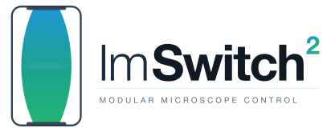

<div align="center">

<!-- TODO: replace with a project logo (e.g. docs/images/logo.svg).  Suggested width: 320 px. -->
<a href="#"></a>

<!-- 80-second tour.  Leave the bare URL below exactly as it is: an uploaded attachment URL is
     the only form GitHub expands into a player.  Wrapping it in a markdown link leaves a link,
     and a <video> tag is stripped by the README sanitizer.  The same film is committed at
     docs/images/imswitch2-demo.mp4; its 1080p master is in docs/promo/20s-demo/video-v6/
     (that tree is not tracked). -->

https://github.com/user-attachments/assets/5744edc2-409e-4802-b06e-1972b8335a37

<sub>An 80-second tour — widefield, confocal/STED, and a custom super-resolution setup, all from one configuration.</sub>

**Modular, configuration-driven microscope control — built for safety, testability, and AI-assisted development.**

[](https://doi.org/10.21105/joss.03394)
[](https://www.python.org/downloads/)
[](https://www.gnu.org/licenses/gpl-3.0)
<!-- TODO: once CI is public, add:
[](https://github.com/<org>/<repo>/actions/workflows/ci.yml)
[](https://imswitch.readthedocs.io)
[](https://codecov.io/gh/<org>/<repo>)
-->

<!-- TODO: hero screenshot of the GUI in action.  Suggested: 1200×680 px, docs/images/hero.png. -->

</div>

---

Imswitch2 is a Python application for flexible, modular microscope control. It supports a wide range of hardware — cameras, lasers, stages, DAQ cards, rotation mounts, pulse generators — through a configuration-driven manager system. **Switching hardware means editing a JSON file, not the code.**

This is a clean-slate continuation of the [ImSwitch](https://github.com/ImSwitch/ImSwitch) project, focused on safety, maintainability, and AI-assisted development under strict human oversight.

<!-- TODO: short "what does it look like" screenshot row.  Suggested: 3 widget thumbnails side-by-side
     (Laser / Scan / Recording), each ~300×220 px.  These can be regenerated automatically with
     `python tools/screenshot_widgets.py` (see docs/how-to/auto-screenshots.rst). -->

---

## Features

<table>
<tr>
<td width="50%" valign="top">

**42+ hardware managers out of the box** — sCMOS cameras, photon counters, lasers, piezo stages, motorized rotators, FLIM time taggers, SLMs, microcontroller pulse generators.

**Pluggable architecture** — every device type has an abstract base; adding a new driver is one new file + one entry in your setup JSON.

**Hardware-free dev mode** — every manager has a documented mock fallback so you can develop, test, and configure without any device plugged in.

</td>
<td width="50%" valign="top">

**Backend-agnostic pulse generation** — drive lasers from a Swabian Pulse Streamer, a Teensy microcontroller, or future NI / FPGA backends through one common ABC.

**AI-assisted development workflow** — agents are first-class contributors with clear guardrails, isolated branches, and mandatory human review.

**First-class documentation** — Sphinx site with per-device JSON reference, task-oriented how-to guides, and a full architecture map.

</td>
</tr>
</table>

<!-- TODO: feature-collage image.  Suggested: 4-panel screenshot (Laser widget, Scan widget,
     Recording widget, napari viewer with live image), each panel ~450×300 px.
     Path: docs/images/auto/feature-collage.png — regenerated by tools/screenshot_widgets.py. -->

---

## Quick start

> Requires **Python 3.10+** and **PyQt5**.  Windows / macOS / Linux all supported.

```bash
# 1. Clone and install (core install — UI + file I/O, no hardware drivers)
git clone https://github.com/<your-fork>/Imswitch2.git
cd Imswitch2
pip install -e .

# 2. Launch
python -m imswitch
```

Imswitch2 creates `~/ImSwitchConfig/` on first launch and opens a setup-picker dialog.  Pick one of the bundled example setups (e.g. `example_no_hardware.json`) to see the UI without any device connected.

For real hardware:

```bash
pip install -e ".[hardware]"   # NI-DAQ, Lantz, pyVISA
pip install -e ".[full]"       # also napari, OpenCV, vispy
```

<!-- TODO: setup-picker dialog screenshot.  Suggested 900×500 px.
     Path: docs/images/auto/setup-picker.png — regenerated by tools/screenshot_widgets.py. -->

---

## Documentation

The full documentation lives under [`docs/`](docs/) and is rendered with [Sphinx](https://www.sphinx-doc.org/).

| Where | What you'll find |
|---|---|
| [`docs/installation.rst`](docs/installation.rst) | Installation, dependencies, platform notes |
| [`docs/gui.rst`](docs/gui.rst) | GUI tour with annotated screenshots |
| [`docs/scripting.rst`](docs/scripting.rst) | Scripting / API reference |
| [`docs/devices/`](docs/devices/) | **Per-device JSON config reference** — every manager, every field, with defaults |
| [`docs/how-to/`](docs/how-to/) | **Task-oriented guides** — wire a Teensy, add a backend, port a driver, auto-screenshot widgets |
| [`docs/design/ARCHITECTURE.md`](docs/design/ARCHITECTURE.md) | Full architecture map (managers, controllers, signal flow, startup) |
| [`docs/design/plans/`](docs/design/plans/) | Integration plans (active + historical) |

### Build the docs locally

```bash
# One-off — install the doc toolchain
pip install sphinx sphinx-rtd-theme

# Build the HTML site
cd docs
sphinx-build -b html . _build/html

# Open it in your browser
#   macOS:    open _build/html/index.html
#   Linux:    xdg-open _build/html/index.html
#   Windows:  start _build/html/index.html
```

For a live-reloading dev server while editing docs:

```bash
pip install sphinx-autobuild
sphinx-autobuild docs docs/_build/html
# → serves at http://127.0.0.1:8000 and rebuilds on save
```

### Regenerate screenshots

All widget screenshots under `docs/images/auto/` are produced by a single script that launches Imswitch2 with the `example_no_hardware.json` setup and grabs each dock individually:

```bash
python tools/screenshot_widgets.py
```

See [`docs/how-to/auto-screenshots.rst`](docs/how-to/auto-screenshots.rst) for details and CI integration notes.

---

## Hardware support

Imswitch2 ships managers for **42+ devices** across five categories. Every manager has its JSON config field-by-field documented under [`docs/devices/`](docs/devices/).

<table>
<tr>
<td width="20%" align="center"><b>Detectors</b><br/>13 managers</td>
<td>Hamamatsu, Thorlabs TSI (Zelux/Kiralux/Quantalux), Photometrics, Basler, Daheng (GXPIPY), The Imaging Source, Raspberry Pi Cam, ESP32-Cam, Jetson, Swabian Time Tagger (FLIM), APD, PMT, generic OpenCV — see <a href="docs/devices/detectors.rst"><code>detectors.rst</code></a></td>
</tr>
<tr>
<td align="center"><b>Lasers</b><br/>14 managers</td>
<td>Cobolt (Lantz + direct serial variants), MPB, CoolLED, AAA AOTF, NI-DAQ analog, PulseStreamer, Teensy/Arduino pulse generator, ESP32 LED, LED matrix, Lantz-compatible, python-microscopy — see <a href="docs/devices/lasers.rst"><code>lasers.rst</code></a></td>
</tr>
<tr>
<td align="center"><b>Positioners</b><br/>12 managers</td>
<td>NI-DAQ analog (piezo / galvo), Physik Instrumente, Thorlabs Kinesis MLS203, Thorlabs BSC203, Piezoconcept Z (×2), Jena Z-piezo, Märzhäuser SCAN, Leica DMI, SmarACT, SQUID, mock — see <a href="docs/devices/positioners.rst"><code>positioners.rst</code></a></td>
</tr>
<tr>
<td align="center"><b>Rotators</b><br/>3 managers</td>
<td>Standa, Thorlabs Kinesis K10CR1, Thorlabs Elliptec ELL14/ELL14K (multidrop bus) — see <a href="docs/devices/rotators.rst"><code>rotators.rst</code></a></td>
</tr>
<tr>
<td align="center"><b>Other</b></td>
<td>NI-DAQ (scan + IO), Pulse Streamer, Teensy pulse generator, SLMs, recording (HDF5 / TIFF / Zarr), microscope stands (Leica DMI), ESP32 / SQUID / GRBL boards via RS232.</td>
</tr>
</table>

> **Don't see your hardware?** Adding a new driver is one file plus one JSON entry — see [`docs/how-to/port-from-third-party.rst`](docs/how-to/port-from-third-party.rst) for the canonical recipe, and [`docs/adding-device-support.rst`](docs/adding-device-support.rst) for the abstract-base reference.

---

## Configuration

Imswitch2 reads all hardware configuration from `~/ImSwitchConfig/`:

```
~/ImSwitchConfig/                  (Linux / macOS)
Documents\ImSwitchConfig\          (Windows)
  ├── config/
  │   └── imcontrol_options.json   # active setup filename + recording folder
  └── imcontrol_setups/
      └── my_microscope.json       # hardware definition
```

A GUI editor is included for building setup files without writing JSON by hand.
Open it from a running ImSwitch under **Tools > Edit hardware configuration...**,
or standalone without starting the microscope:

```bash
python utility_scripts/imswitch_config_editor.py
```

<!-- TODO: config editor screenshot, docs/images/auto/config-editor.png.  Suggested 1000×600 px.
     Regenerated by tools/screenshot_widgets.py. -->

The editor loads built-in templates for every supported manager, lets you add and configure devices visually, and saves valid JSON directly into `imcontrol_setups/`.

### Minimal setup file

A two-device setup (one webcam, one Cobolt laser, no DAQ):

```json
{
  "detectors": {
    "Camera": {
      "managerName": "AVManager",
      "managerProperties": {
        "cameraListIndex": 0,
        "avcam": { "exposure": 100, "gain": 1 }
      },
      "analogChannel": null,
      "digitalLine": null,
      "forAcquisition": true
    }
  },
  "lasers": {
    "561 nm": {
      "managerName": "Cobolt0601NewLaserManager",
      "managerProperties": { "digitalPorts": ["COM4"] },
      "analogChannel": null,
      "digitalLine": null,
      "wavelength": 561,
      "valueRangeMin": 0,
      "valueRangeMax": 200
    }
  },
  "availableWidgets": ["Settings", "View", "Recording", "Image", "Laser"]
}
```

For per-field reference for every other manager's JSON shape, see [`docs/devices/`](docs/devices/).

---

## Project structure

```
Imswitch2/
├── imswitch/                       # Main package
│   ├── imcontrol/                  # Hardware control module
│   │   ├── model/managers/         # One manager class per device type
│   │   ├── controller/             # Widget controllers + CommunicationChannel
│   │   ├── view/                   # Qt widgets + napari viewer
│   │   └── _data/user_defaults/    # Example setup files
│   ├── imcommon/                   # Shared framework (Qt layer, signals, logging)
│   ├── improcess/                  # Post-acquisition processing module (was: imreconstruct)
│   └── imscripting/                # Scripting console module
├── utility_scripts/                # Config editor GUI + device templates
├── tools/                          # Maintenance scripts (screenshots, codegen, …)
├── docs/                           # Sphinx site (architecture, how-tos, device ref)
└── .github/workflows/              # CI pipeline
```

Deep dive: [`docs/design/ARCHITECTURE.md`](docs/design/ARCHITECTURE.md).

<!-- TODO: architecture diagram.  Suggested 1100×600 px, docs/images/architecture.svg.
     Source: docs/imswitch_architecture_map.svg (export to PNG for README). -->

---

## AI agent workflow

Imswitch2 uses AI agents as development assistants under strict human oversight:

```
GitHub Issue → Agent plans → Isolated branch/worktree → Tests → PR → Human review → Merge
```

- All agent code changes require human review — **no automatic merges**.
- Red-zone files (hardware timing, laser control, DAQ) require explicit maintainer approval.
- Agents work in isolated branches or worktrees; parallel agents don't share state.
- Every claim in the docs is grounded in source code — agents are explicitly forbidden from inventing fields, defaults, or vendor library calls.

See [`AGENTS.md`](AGENTS.md) for the full rules and templates.

---

## Contributing

Contributions are very welcome — code, docs, hardware support, bug reports, use-case studies, all of it.

- See [`CONTRIBUTING.md`](CONTRIBUTING.md) for the workflow and code-style expectations.
- Project governance: [`GOVERNANCE.md`](GOVERNANCE.md).
- Community standards: [`CODE_OF_CONDUCT.md`](CODE_OF_CONDUCT.md).

Quick ways to help:

- Try Imswitch2 on your microscope and file a setup recipe.
- Report bugs with reproducible JSON setups attached.
- Improve docs — especially per-device cards under [`docs/devices/`](docs/devices/).
- Port a driver from a sibling project (see [`docs/how-to/port-from-third-party.rst`](docs/how-to/port-from-third-party.rst)).

---

## Citation

If you use Imswitch2 in your research, please cite the original ImSwitch JOSS paper:

```bibtex
@article{Casas-Moreno2021,
  doi       = {10.21105/joss.03394},
  url       = {https://doi.org/10.21105/joss.03394},
  year      = {2021},
  publisher = {The Open Journal},
  volume    = {6},
  number    = {64},
  pages     = {3394},
  author    = {Xavier Casas Moreno and Staffan Al-Kadhimi and Jonatan Alvelid and Andreas Bodén and Ilaria Testa},
  title     = {ImSwitch: Generalizing microscope control in Python},
  journal   = {Journal of Open Source Software}
}
```

---

## Acknowledgments & third-party code

Imswitch2 is a fork of [ImSwitch](https://github.com/ImSwitch/ImSwitch), and
builds on a lot of other people's work — vendored code (with its licences),
projects we modelled our behaviour on (Fiji/ImageJ, Picasso, napari), and the
papers behind the methods we implement.

**See [`ACKNOWLEDGMENTS.md`](ACKNOWLEDGMENTS.md)** for the full list, and
[`licenses/`](licenses/) for third-party licence texts.

Parts of Imswitch2 were written with AI assistance, and standard
image-processing routines have a limited number of sensible implementations —
so some code may resemble other projects' even where it was written
independently. **If you believe your project is an uncredited source, please
[open an issue](https://github.com/Imswitch2/Imswitch2/issues).** We will add
the attribution, or relicense or remove the code if there is a licence
conflict.

---

## License

GNU General Public License v3.0 — see [`LICENSE`](LICENSE).

Third-party components retain their own licences — see
[`ACKNOWLEDGMENTS.md`](ACKNOWLEDGMENTS.md) and [`licenses/`](licenses/).
