*******
Widgets
*******

This page walks through the ImControl widgets, grouped by what they are
for rather than by where they sit in the window.  Where a widget has a
workflow of its own — advanced scanning, tiling — it is introduced here
and the task itself is covered in depth on its own page.  For what the
module is and what else it can do, see :doc:`imcontrol`; for the
shortcuts and state-saving that apply across every module, see
:doc:`working-in-imswitch2`.

.. note::

   The screenshots on this page live under ``docs/images/auto/`` and
   are regenerated by ``python tools/screenshot_widgets.py``.  Each
   image is captured headlessly from the live ImSwitch2 widget code,
   so this page stays in sync with the actual UI.  See
   :doc:`how-to/auto-screenshots`.

Detector Settings
=================

This section interacts with the different detectors of the system —
either cameras or point detectors.  The user has access to parameters
such as subarray size (the field-of-view on a camera), the set of ROIs
available (which can be updated in real time by saving the current
ROI), trigger type, exposure time, and so on.  The parameters shown
depend on the detector selected, and additional ones can be exposed by
the corresponding ``DetectorManager``.

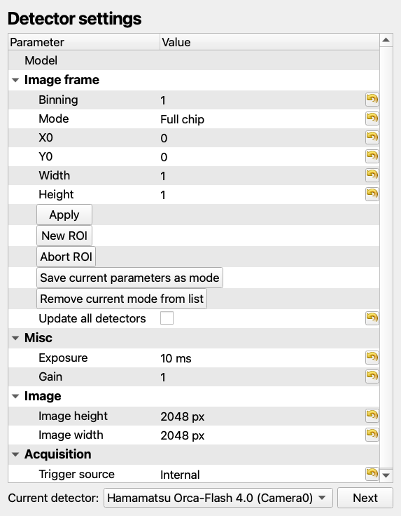

Recording and data storage
==========================

Either during a scan or in free-running mode, the recording section
collects images from the selected detectors and saves them.

**Detector(s) to capture** chooses what is recorded: *Current detector at
start*, or, on setups with more than one detector, *All acquisition
detectors* or *Specific detector(s)*.  With several detectors, **Save
recordings in a single file** writes them into one file instead of one file
per detector.

Recording modes:

* **Number of frames** – save a fixed frame count.
* **Time (s)** – save for a fixed duration.
* **Camera timelapse** – one frame at a time from a camera, the given number
  of frames spaced by **Interval [s]**.  Scan-driven detectors are refused.
* **Scan once** – record one scan; the recording ends when the scan does.
* **Timelapse scan** – repeat the scan the given number of times, waiting
  **Freq [s]** after each scan before starting the next.
* **Run until STOP** – record until you press **REC** again (the default).

Both timelapse modes save each timepoint to its own file unless **Save all
timepoints in a single file** is ticked.  A single-file timelapse needs HDF5
or Zarr; with TIFF it is refused.  Either way ImProcess's **Time lapse**
reconstructor opens the whole lapse as one stack from any one of its files
(see :ref:`improcess-time-lapse`).

How **REC** relates to the scan depends on the setup:

* **With a** ``Scan`` **widget** (the NI-DAQ scan panel in any of its
  variants), **Scan once** + **REC** arms the recording *and* starts that
  scan.  Do not press the scan widget's own start button as well.
* **Without one** (standalone scan panels such as the TriggerScope or
  LightSheet widgets), **REC** only arms the recording.  Start the scan you
  want from its own widget; the recording takes its frame count and scan
  dimensions from that scanner.  If the recording cannot be armed for it, the
  scan does not start and the reason is logged.

**Timelapse scan** is started by the recording itself.  On a setup with more
than one scan widget that can drive a recording, pick the scanner in the
**Scan source** control that appears below the mode.  The choice is
remembered between sessions, but it is never made for you: while the control
still reads *Select scan source...* the recording is refused rather than
defaulting to a scanner, since that scanner's hardware would actually be
driven.

**File format** (recordings) and **Snap format** (single images) offer HDF5,
TIFF and Zarr, each written with OME metadata; every user-interactable
parameter (laser power, scan parameters, …) is stored alongside the images.
When ImProcess is loaded, **Rec save mode** can also keep a recording in
memory for reconstruction, with or without saving it to disk.

Single images can also be saved after a scan via the **Snap** button —
this is typical when working with point detectors as in confocal or
STED imaging.

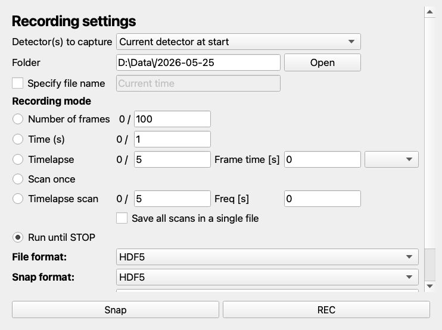

The output folder is not remembered between sessions.  With
``recording.includeDateInOutputFolder`` on (the default) it is rebuilt from
today's date every time ImSwitch2 starts, and it is created on demand when a
recording or snapshot is saved, so it does not have to exist beforehand.

When a recording cannot keep up
-------------------------------

Frames pass through a writer queue on their way to disk.  When a recording
is armed, the log estimates for each detector how many frames that queue can
hold.  If the disk falls behind and the queue fills, the acquisition loop
waits; the log says so the moment it starts waiting, repeats every few
seconds while it continues, and says when it resumes.  The queue sizes are
set under **Tools → Memory limits…** (see :ref:`improcess-memory-limits`).

A detector that delivers no frame for ten seconds, or for three of its own
frame intervals if that is longer (a camera with a 30 s exposure, say), is
treated as stalled and the recording fails.  A recording that ends early is
marked ``stopped_early`` in its ``recording:completion_outcome`` attribute
rather than ``complete``, and frames a detector delivered beyond the planned
count are counted in ``recording:discarded_frames``.

.. _session-notes:

Session notes
-------------

**Tools → Session notes…** opens a free-text editor whose contents are
written into the metadata of every recording and snapshot saved from then
until ImSwitch2 is closed.  It is the place for what no widget captures —
"measured 10 mW in the BFP for the 405 laser", which coverslip batch is on
the stage, that the 561 line was misbehaving after lunch.

The note applies to recordings *started after* it was written: a recording
snapshots the shared attributes when it begins.  The editor is modeless, so
it can stay open while an experiment runs, and every keystroke takes effect
immediately — there is no Apply button to forget.  Scripts can set the same
text with ``api.imcontrol.setSessionNote(...)``.

Where the note ends up depends on the format:

* **HDF5** and **Zarr** — ``metadata/notes/session`` beside the rest of the
  recording's attributes, and in the embedded OME-XML for HDF5.
* **OME-TIFF** — the OME ``Description`` of the image, which is what Fiji
  shows under *Image ▸ Show Info* and what OMERO imports as the image
  description.  The other shared attributes go into a map annotation in the
  same OME-XML.

"Session" means until ImSwitch2 is closed: the note is deliberately not saved
with the rest of the widget state, because a note about this morning's
alignment would be a lie tomorrow.

BF timelapse widget
-------------------

Meant for slow brightfield timelapses on a Leica DMi stand: every
**Interval (s)** it opens the stand's transmitted-light shutter, has the
Recording widget take a snap, and closes the shutter again.

The panel needs a ``microscopeStand`` section (see :doc:`devices/stands`) and
the ``Recording`` widget, which takes and saves the snaps in its own folder and
**Snap format**.  ``BFTimelapse`` has no default dock position: it appears only
when the setup's ``widgetLayout`` places it, as well as ``availableWidgets``
listing it (see :doc:`setupinfo-reference`).

**Start** begins the series and becomes **Stop**.  The interval must be a whole
number of seconds, and the first image is taken one interval after **Start**,
not at once.

.. warning::

   BF timelapse currently takes no images.  Each tick calls a
   ``setTLshutter`` method that the stand manager does not provide, so it fails
   with an error in the log before anything is snapped.

Data visualization
==================

ImSwitch2 uses `napari <https://napari.org/>`_ for live visualization
of detector frames.  Both point detectors and cameras are supported,
with good multi-channel rendering out of the box.  Multiple cameras
and point detectors can run simultaneously.  During a scan, point-detector
images are redrawn as lines arrive, at a limited rate.

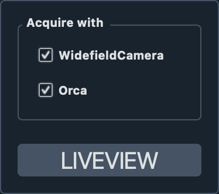

Choosing which detectors acquire
--------------------------------

Setups with more than one detector show an **Acquire with** box above the
LIVEVIEW button: one checkbox per detector, all ticked by default.  With a
single detector there is nothing to choose between, so the box is hidden.

Unticking a detector leaves it out of live view **and** out of scans.  That is
how you stop paying for a detector you are not reading — an unused point
detector still costs a counter task, a share of the scan's readout and its
slice of every recorded file.

The change lands at the earliest moment that is safe:

* **Free-running detectors** (cameras) are reseeded immediately: the live view
  drops or picks up the detector as soon as you click.
* **Scan-driven detectors** (APD, PMT, Time Tagger) that the running scan is
  currently using change at that scan's **next iteration** instead of
  mid-frame.  Until then the checkbox shows what you asked for in *italics*,
  so it is visibly a request rather than the current state.

Deselection is a preference, not a veto.  A detector that a **recording,
workflow or event modality is actively using keeps running** even when
unticked — silently dropping it would corrupt an acquisition already in
progress.  In the other direction, a detector whose last stop failed is
quarantined: it is excluded from scans no matter what is ticked, and stays
excluded for the rest of the session — the stop is only retried at shutdown,
so recovering it means restarting ImSwitch2.

Viewer tools
------------

Drawing and reference tools for the image viewer.  ``ViewerTools`` in
``availableWidgets`` loads the panel, by default in the left column below
*Image Controls*; it draws on the viewer of the ``Image`` panel, which has to
be listed too.

One tool is active at a time, and choosing any tool, **Pan** included, clears
what the previous one drew:

* **Pan** — pan and zoom the image; nothing is drawn.
* **Rectangle ROI** and **Line** — draw a rectangle or a line on the viewer's
  *Viewer Tools* layer.  Only the latest rectangle and the latest line are
  kept.  They are what the Line Profile panel measures.
* **Crosshair** — each click in the viewer places a yellow crosshair across the
  whole view at that point, replacing the previous one.
* **Grid** — five horizontal and five vertical yellow lines at 1/4, 3/8, 1/2,
  5/8 and 3/4 of the largest visible image, so the middle lines cross at its
  centre.  The grid is placed when the button is pressed and does not follow
  later changes of the image.

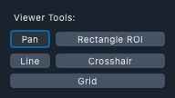

Line profile
------------

Plots the intensity along a line, or the mean projections of a rectangle,
drawn with the Viewer Tools panel.  ``LineProfile`` in ``availableWidgets``
loads it, by default below *Viewer Tools* in the left column; list
``ViewerTools`` and ``Image`` as well.

* With **Line** active, the plot is the intensity sampled along the line
  against distance in pixels.  **Width (n)** averages *n* samples taken across
  the line, weighted towards the line itself (Gaussian weights, σ = *n*/4);
  use odd values.
* With **Rectangle ROI** active, the plot shows two curves against distance
  from the rectangle's edge: *x* (red), the mean of each column, and *y*
  (green), the mean of each row.

The profile is taken from the layer selected in napari's layer list, or from
the first visible image when no image layer is selected, so on a setup with
several detectors select the one to measure.  The plot is recalculated when a
line or rectangle is drawn and when **Width (n)** changes, not with every new
frame: draw the shape again to update it.

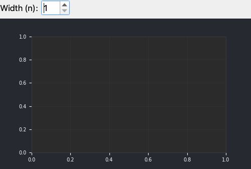

FLIM lifetime histogram
-----------------------

Shows, for a FLIM detector, the distribution of the lifetimes fitted per
pixel, or the photon-arrival decay summed over the image.  It is meant for the
Swabian Time Tagger (``SwabianTimeTaggerManager``, see
:doc:`devices/detectors`), whose frames hold one lifetime per pixel in
nanoseconds; pixels below the manager's ``min_counts_per_pixel`` are left out.

``FLIMHist`` in ``availableWidgets`` loads the panel (*FLIM Lifetime
Histogram*).  It follows the detector selected in the Detector Settings panel.

* **Live update** — redraw with every incoming frame.  Unticked, the panel
  ignores frames.
* **Mode:** — **Lifetime dist.** is a histogram of the per-pixel lifetimes,
  with the mean marked by a red line.  **Decay** plots the photon-arrival
  histogram summed over all valid pixels, with the red line at the global
  lifetime fitted with the manager's ``fit_method``.
* **Bins:**, **Min (ns):** and **Max (ns):** — the binning of the lifetime
  histogram.  They take effect with the next frame and do not apply to the
  decay.
* **Accumulate** — in lifetime mode, pool the final image of every scan
  completed since the box was ticked instead of showing the current one.  The
  histogram is then redrawn when a scan ends; unticking empties the pool.

The label on the right gives the number of valid pixels and their mean
lifetime, or, in decay mode, the global lifetime and the photon count.

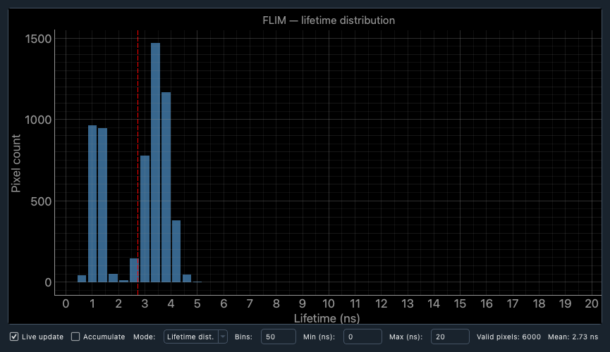

Hardware control
================

These widgets drive the physical hardware.  The main ones are the
laser widget, scanning widget, tiling widget, positioner widget,
focus-lock widget, and SLM widget.  Which widgets appear is controlled by the
``availableWidgets`` list in your setup JSON — see
:doc:`imcontrol-setups`.

Laser widget
------------

There are two typical use modes: **offline** (driven only by the
buttons and sliders in the widget) and **triggered** by an acquisition
card controlled by the scanning widget.  In the latter case, set the powers
here and tick the laser in the scan widget's TTL list: when the scan starts it
hands every ticked laser's gate to the scan and locks its on/off button for
the run.  The power stays editable during the scan.

**Presets** store the current power of every laser under a name in the setup
file: **Save as…** creates one, **Load selected** applies it, **Save to
selected** overwrites it, and **More…** clears the selection or deletes the
selected preset.

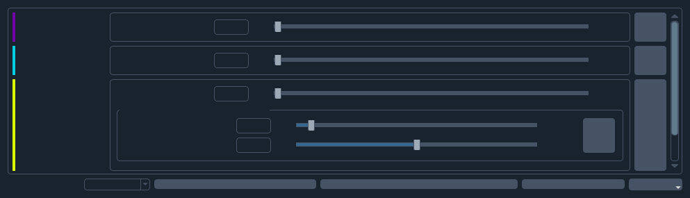

SLM widget
----------

The SLM widget controls the phase masks applied to the laser line
incident on a spatial light modulator.  It is configured to control
two simultaneous phase masks per beam (e.g. to shape a STED beam into
overlaid donut + tophat for 3D-STED) but can be re-programmed for
other beam-shaping schemes.  You can pick a mask type per side
(donut, tophat, gaussian, half/quad/hex/split alignment patterns),
adjust mask position, and tune Zernike-polynomial aberration-correction
coefficients (tip/tilt, defocus, spherical, vertical/horizontal coma,
vertical/oblique astigmatism — more can be added).  Parameters are saved
to and loaded from JSON files in the ``imcontrol_slm`` folder of the user
directory (``ImSwitchConfig``, see :doc:`imcontrol-setups`), one per objective (``info_oil.json``, ``info_glyc.json``); pick
the objective first, as saving and loading refuse *No objective*.

The SLM panel only appears if the setup's ``widgetLayout`` places ``"SLM"``:
without a ``widgetLayout``, listing it in ``availableWidgets`` creates no
panel.

.. warning::

   The SLM widget cannot load at the moment.  Its controller drives the
   single-SLM manager, which ImControl no longer creates (it builds the
   manager of the ``slms`` section instead), so a setup whose layout places
   ``"SLM"`` stops ImControl from loading.  Use the Multi-SLM widget below.

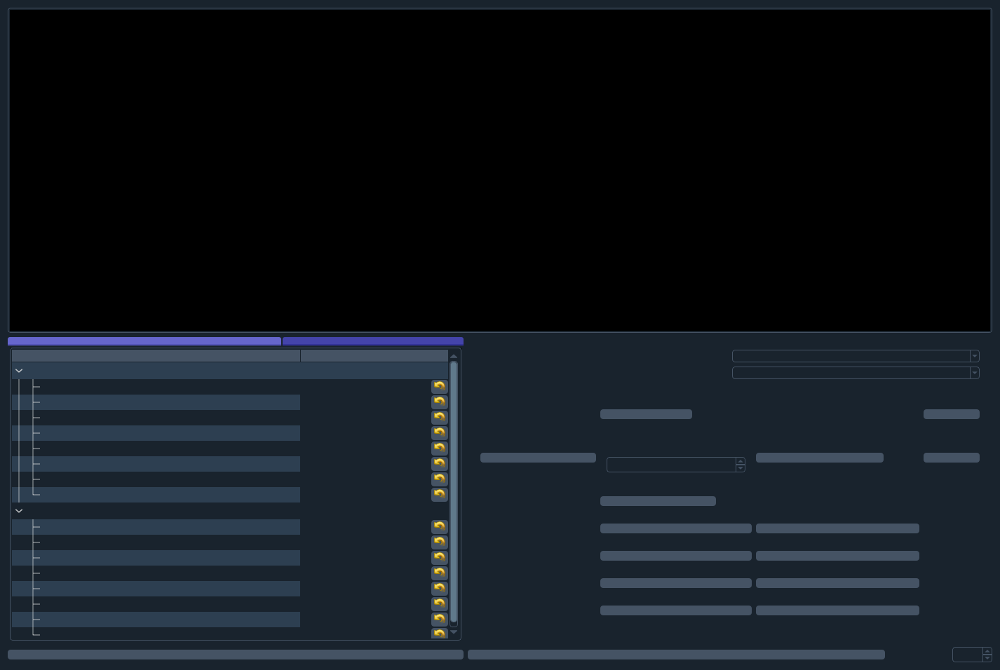

Multi-SLM widget
----------------

Drives any number of spatial light modulators, one tab each, from the setup
file's ``slms`` section.  It supersedes the SLM widget, which reads the
singular ``slm`` section and drives a single SLM with fixed left and right
masks and per-objective JSON parameter files.  This widget instead splits each
SLM into ``nSections`` section tabs (or one *Full SLM* tab), builds patterns
from a pattern library, adds computer-generated holograms, and keeps named
HDF5 configurations per SLM.  Unlike ``SLM``, ``SLMs`` in ``availableWidgets``
gets a panel without a ``widgetLayout``.  This widget needs each SLM's
``serial_number`` and a ``widgetOptions.patterns`` list (see
:doc:`setupinfo-reference`): without either, the panel fails to build and
ImControl does not load.

Across the top: **Connect to SLM** (USB SLMs only), the **Config:** list —
choosing an entry loads it and sends its stored pattern to the SLM —
**Update Config**, which overwrites the selected configuration after listing
the changes, and **More** (**Save as...**, **Rename config...**,
**Duplicate config...**, **Delete config**, **Set as startup config**,
**Open config folder**).  Configurations live in
``imcontrol_slm/configs/<serial_number>`` in the user directory; the startup
configuration is written into the setup file and sent to the SLM when
ImSwitch2 starts.

**SLM Preview** shows the pattern sent.  Each section tab (double-click to
rename it) has:

* **General** — **Wavelength (nm)**, which also selects that wavelength's
  flatness-correction image and 2π value, **Pupil Radius (px)**, **Center
  Offset X (px)** and **Center Offset Y (px)**.
* **Patterns** — those listed in ``widgetOptions.patterns`` (``vortex``,
  ``top_hat``, ``half_moon_x``, ``linear_phase``, …), each with a checkbox
  and its parameters.
* **Aberrations** — Zernike coefficients in wavelengths, used when **Apply
  aberrations correction** is ticked.
* **CGH Pattern** — a weighted Gerchberg–Saxton hologram of a multi-focus
  target (**Compute CGH**, used when **Use CGH** is ticked), refinable from a
  detector frame under **Feedback**.
* **Correction** — **Apply correction pattern** and **Apply 2π value
  correction**.

Edits reach the SLM 0.8 s after the last change.  A setup mode that includes
the SLMs loads the configuration it names.  The widget has no scripting
functions.

Focus lock widget
-----------------

The focus-lock widget runs a reflection-based focus lock.  A laser
beam is reflected off the cover slip in total internal reflection and
detected on a camera; sample movement along z maps to lateral
displacement of the spot.  The widget tracks the spot centroid and
drives a PI controller against the connected z-positioner to
counter-act drift.  **Lock** holds the spot at the position it has when
pressed; **kp** and **ki** are the PI gains, **Two foci** handles a double
reflection, and **Pause during scans** (on by default) suspends the lock while
a scan drives the focus axis.  **From (µm)** / **To (µm)** and **Calib** run a
calibration of spot position against Z, **See calib** shows the curve, and
**Camera Dialog** opens the focus camera's settings.

A status label shows the lock state: *Locked*, *Suspended (scan)*
while a scan owns the focus axis, *Reacquiring…* while it waits for the focus
signal to return after the scan, and *Lock lost after scan* if it does not.
How a scan decides whether it conflicts with the lock is described in
:ref:`focuslock-scan-arbitration`.

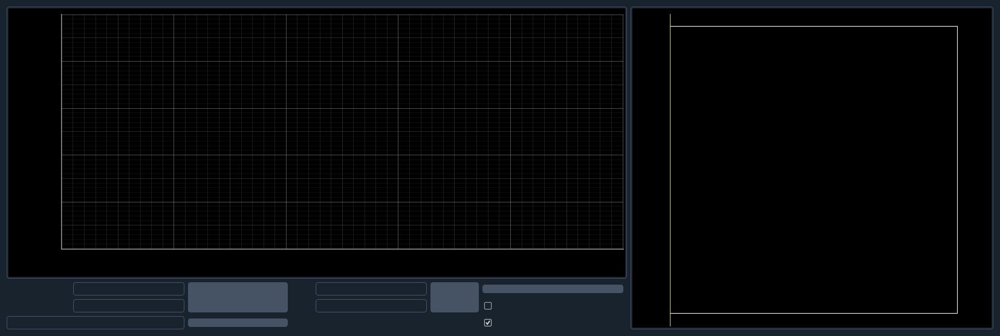

Autofocus widget
----------------

Finds focus by stepping a Z positioner through a range around its current
position, taking a camera frame at each step and moving to the sharpest one.
Sharpness is the variance of the image gradient; a parabola is fitted through
the values and the stage goes to its peak, or to the sharpest step if the fit
has no peak, always within the searched range.

``Autofocus`` in ``availableWidgets`` loads the panel.  It needs an
``autofocus`` section in the setup file naming the ``camera`` and the
``positioner``, which must have a ``Z`` axis (see :doc:`setupinfo-reference`);
without it the panel loads but its button does nothing.  ``settleTimeMs``
(default 150) is the wait after each move before the frame is taken.  The
sharpness is computed over the whole frame: the ``frameCrop*`` and
``updateFreq`` keys that section requires are not read by this widget.

**Autofocus** runs one search over **Focus search range (nm)** in steps of
**Stepsize (nm)** and reads *Focusing...* until it is done; the plot then shows
sharpness (*Contrast*) against Z (*Motion*).  Both values are passed to the positioner in its own unit,
which is µm on most stages, whatever the labels say: the defaults, 100 and 10,
sweep 100 µm in 10 µm steps.  The camera view beside the plot and the
**Position (µm)** field are not connected to anything.

A search cannot start while a scan is running, and a scan that starts during a
search cancels it and leaves Z where the scan found it.  A search that fails
for any other reason puts Z back where it started.  Scripts can run the same
search with ``api.imcontrol.autoFocus(rangez, resolutionz)``, which returns
before the search has finished.

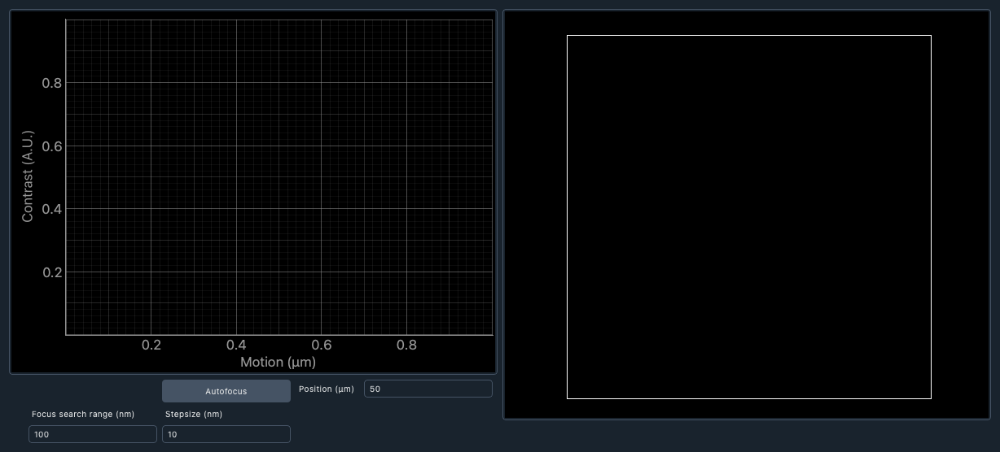

Positioner widget
-----------------

A "positioner" is any scanning device that can be moved either during
a scan or via this widget.  The widget shows current positions and
provides step controls; the scripting module exposes the same
functions for automated routines.

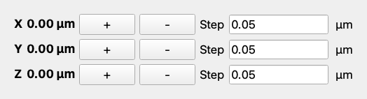

BSC203 stage widget
-------------------

Drives a Thorlabs BSC203 three-axis stepper controller (the NanoMax stage)
directly: absolute moves, velocities, homing and a stop button.  It
complements the Positioner widget, which moves the same stage in relative
steps.

The panel is loaded by ``BSC203`` in ``availableWidgets`` and docks in the
right-hand column as *BSC203 Stage*.  It controls the positioner named exactly
``BSC203``, whose ``managerName`` is ``BSC203StageManager`` (see
:doc:`devices/positioners`); if there is no such entry, or the controller did
not connect, the panel is greyed out.

* **X/Y velocity [um/s]** sets the speed of the X and Y axes together,
  **Z velocity [um/s]** that of Z (0–2000, starting at 300).  A value applies
  when you press Enter or leave the field.
* Under **Set absolute position [um]**, enter **X**, **Y** and **Z** and press
  **Move to pos**.  Each target is clamped to ``0``–``travelRangeUm``.
* **Stop movement** halts all three axes immediately.
* **X position [µm]**, **Y position [µm]** and **Z position [µm]** are read
  from the controller ten times a second.
* **Home all motors** asks for confirmation, then drives every axis to its
  end-stop, which becomes position 0.  ImSwitch2 does not respond until homing
  has finished (at most two minutes).

The widget has no scripting functions of its own.

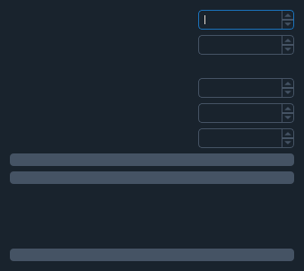

Rotator widget
--------------

Turns motorized rotation mounts, such as wave plates.  It is loaded by
``Rotator`` in ``availableWidgets``, docks in the right-hand column, and shows
one block per entry of the setup file's ``rotators`` section (see
:doc:`devices/rotators`).

Each block shows the mount's name and current angle, and:

* **+** and **-** turn it by **Step** degrees; **Abs** turns it to
  **Position** degrees.
* **Set zero** makes the current angle 0.
* The speed field (in mrpm, 100 by default) with **Set speed** sets the
  rotation speed; **Start move** starts continuous rotation in one direction
  and **Stop move** stops it.

**Set zero**, **Set speed**, **Start move** and **Stop move** exist only for
Standa mounts (``StandaRotatorManager``); on Kinesis and Elliptec mounts they
log an error and do nothing.  Saved widget state keeps each mount's step and
speed, never its angle.

Scripts can turn a mount to an angle with
``api.imcontrol.moveAbs(name, angle)``.

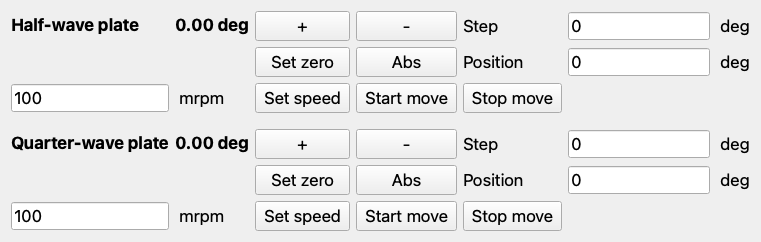

Rotation scan widget
--------------------

Steps the polarization through a list of angles during a scan, one angle per
frame, by turning every mount in ``rotators`` (for example a half- and a
quarter-wave plate) to calibrated positions.  It is loaded by
``RotationScan`` in ``availableWidgets`` and docks in the right-hand column as
*RotationScan*.

A calibration maps each polarization angle to a position of every mount.
**Calibrate polarization** asks, in the grey field, for linear polarization at
0° (horizontal), 10°, … up to 250°; at each prompt, set the mounts with the
Rotator widget and press **Save, next position**.  At present the first
**Save, next position** fails with a ``TypeError`` in the log, so a new
calibration cannot be recorded from the widget.  **Calibration file** lists
the calibrations in the ``imcontrol_rotscan`` folder of the user directory as
they were when ImSwitch2 started; **Load calibration** loads the selected
one.

**Pol. rotation start**, **Pol. rotation step** and **Pol. rotation stop**
give the angles, stopping before the stop value (0, 10, …, 170 with the
defaults).  **Activate during scan** (then reading **Inactivate**) turns the
mounts to the first angle; start the scan from the scan widget.  After each
frame the next angle is loaded into every mount's sync-in settings, and the
mount moves there on the next pulse at its synchronization input, which the
widget does not generate.  This needs Standa mounts, and only point detectors
(APD, PMT, Time Tagger) report frames for it.  The widget disarms when the
scan ends; without a loaded calibration it refuses to arm.  At present
disarming does not stop the per-frame stepping, so later point-detector frames
keep loading angles into the mounts' sync-in settings.

Under **Manual Scan**, **Start manual scan** turns the mounts to the first
angle, shown as **Pol. position**, and **+** / **-** step through the list.

Scripts can use ``api.imcontrol.loadCalibration(path)`` (the file path without
``.json``), ``changeRotationParameters([step, start, stop])`` (as strings) and
``activateRotScan(True)``.

Flip mirror widget
------------------

Switches motorized two-position flip mounts (Thorlabs MFF101/MFF102) and can
tie one mirror to another so that it follows it.

The panel is loaded by ``FlipMirror`` in ``availableWidgets`` and docks in the
right-hand column as *Flip Mirrors*.  It shows one row per entry of the setup
file's ``flipMirrors`` section (see :doc:`setupinfo-reference`); without that
section it shows only its header.

* **Name** is the entry's name in the setup file.
* **State** has two buttons, labelled with the entry's ``state_names``
  (``0`` and ``1`` if it has none); the highlighted one is the current
  position.
* **Follow** and **Master** link mirrors: choose a mirror under **Master** and
  tick **Follow**.  The mirror moves at once to the master's position, then
  moves whenever the master does, and its own **State** buttons are disabled.
  Links are one level deep — a follower cannot be a master, and a master
  cannot follow.
* The last column reads *OK*, *Disconnected* or *Error*.  **Reset**, at the top
  of that column, closes and reopens every mirror's connection and brings the
  followers back in line with their masters.

Apart from an entry's ``initial_state``, nothing moves when ImSwitch2 starts:
a mirror found in a different position from the saved state is only reported
in the log, and links are not restored.  A setup mode that includes the flip
mirrors does move them and restores the links (see
:doc:`working-in-imswitch2`).

Scripts can use ``api.imcontrol.move_flip(name, state)``,
``set_link(follower, master)`` (``None`` unlinks), ``get_flip_state(name)``
and ``reset_connections()``.

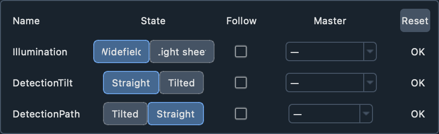

Stand widget (Leica DMI8)
-------------------------

Switches a Leica DMI8 stand between widefield fluorescence and confocal
scanning and chooses its filter cube.  The panel is headed **Leica DMI8
Control**.

It is loaded by ``LeicaStand`` in ``availableWidgets`` and sits at the top of
the left-hand column as *Stand*.  It needs a ``microscopeStand`` section using
``LeicaDMIStandManager``, with the private Leica DMI hardware interface
installed (see :doc:`devices/stands`).  With no stand, the mock stand, or a
stand that did not connect, the panel stays greyed out.

* **FLUO** (widefield with LED illumination, as its tooltip says) moves the
  cube chosen under **Cube:** into place, sets the incident-light field
  diaphragm, selects the camera port and opens the incident-light shutter
  0.8 s later.
* **CS** (for MoNaLISA imaging) moves the cube named ``EMP_BF`` into place if
  the stand lists one, selects the camera port and sets the magnification
  changer to its scan position.
* **Cube:** lists the names in ``managerProperties.availableCubes`` except
  ``EMP_BF``.  In FLUO a new choice turns the turret at once; in CS it is kept
  for the next switch to FLUO.
* **Port:** *Left* sets the magnification changer to its scan position,
  *Right* to 1×.
* **F2** toggles between FLUO and CS (action ``leica.toggleMode``; see
  :doc:`working-in-imswitch2` to rebind it).

The FLUO/CS choice can be part of a setup mode.  Applying the mode switches
only FLUO/CS, not the cube or port; ImSwitch2 does not switch the stand when
it starts.  The widget has no scripting functions.

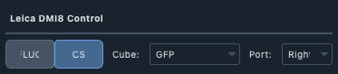

Correction collar widget
------------------------

Meant to set the motorized correction collar of a Leica glycerol objective
(STED WHITE motCORR) through the microscope stand.  It is loaded by
``MotCorr`` in ``availableWidgets``, docks in the right-hand column as
*Motorized Correction Collar*, and sends its value to the stand configured
under ``microscopeStand`` (see :doc:`devices/stands`).

The panel, **Glycerol motCorr [%]** with **Range: 0-100%**, has a vertical
slider from 0 to 100 and a text field; moving the slider, or typing a value
and pressing Enter, sends the collar position in percent.

The widget currently fails to build: it calls ``setSingleStep(0.1)`` on the
slider, and Qt accepts only whole numbers there.  ImControl does not skip a
panel that fails, so listing ``MotCorr`` in ``availableWidgets`` stops the
whole ImControl module from loading; it shows a load error instead.  Leave it
out until this is fixed.

Scanning widget
---------------

This module drives systems that need scanning to acquire an image.
The reference implementation targets NI-DAQ cards but can be
generalized to other DAQs.  Your setup file declares the analog and
digital lines connected to each instrument; a ``ScanDesigner`` generates
the analog scanner waveforms and a ``TTLCycleDesigner`` the digital ones.
Modality-specific designers can be plugged in by subclassing them (both
derive from the abstract ``SignalDesigner``).

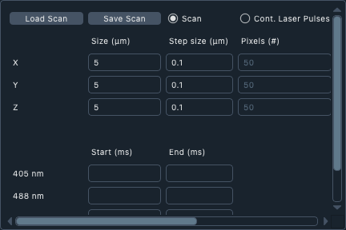

Four widget variants exist — ``Base``, ``PointScan``, ``MoNaLISA`` and
``Advanced`` — selected by ``scan.scanWidgetType`` in the setup JSON; see
:doc:`setupinfo-reference`.

Controls shared by the variants
~~~~~~~~~~~~~~~~~~~~~~~~~~~~~~~

Every variant has one row per positioner with ``forScanning: true``: **Size
(µm)**, **Step size (µm)**, **Center (µm)** and the resulting **Pixels (#)**.
The dimension selectors on the right set which positioner is the first (pixel),
second (line) and third (slice) scan axis; a positioner not chosen for any
dimension is moved to its **Center** before the scan starts.  **Run Scan**
starts one scan and is greyed out while it runs; with **Repeat** ticked the scan
starts again each time it ends, until **Repeat** is unticked.  **Save Scan** and
**Load Scan** write and read the panel's settings as a JSON file, by default in
the ``imcontrol_scans`` folder of the user directory.

The ``Base`` panel adds a **Start (ms)** / **End (ms)** pair for each TTL device
(every laser or detector with a ``digitalLine``): when, within each pixel's
**Dwell (ms)**, that device is switched on and off.  Comma-separated values give
several pulses per pixel; a device with an empty pair is left out of the pulse
programme.  **Cont. Laser Pulses** plays the pulse programme over and over with
the scanners standing still (their fields are greyed out) until **Scan** is
selected again.

Scripts can do the same with ``api.imcontrol.runScan()``,
``saveScanParamsToFile(...)`` and ``loadScanParamsFromFile(...)``.

Point-scan variant
~~~~~~~~~~~~~~~~~~

``"scanWidgetType": "PointScan"``, paired with ``GalvoScanDesigner`` and
``PointScanTTLCycleDesigner`` (as in ``example_sted.json``), is the panel for
galvo point scanning with point detectors, as in confocal and STED.  It differs
from ``Base`` in three ways:

* **Dwell time (ms)** starts at 0.02 ms rather than 10 ms, and two rig delays
  sit below it, both in microseconds: **Phase delay (µs)**, the galvo's
  response lag by which the detector readout is shifted, and **D3 step delay
  (µs)**, the settling time before each slice of a 3-D scan.  Both start from
  ``phase_delay`` and ``d3step_delay`` in ``scan.scanDesignerParams`` when the
  setup file sets them; the panel's saved state takes precedence.
* The Start/End times are replaced by **Line steps**: for each TTL device a row
  of checkboxes, as many as **#Line steps**, and an **Axis** selector.  With
  **Axis** at *None* the device is on for the whole scan if its first box is
  ticked and off otherwise.  With **Axis** set to a scanned positioner, the
  on/off pattern of the boxes repeats along that positioner's axis — pixel by
  pixel on the first dimension, line by line on the second, slice by slice on
  the third.  Two lasers with opposite two-step patterns on the line axis
  therefore take alternate lines.  Each line is still scanned once; to scan the
  same line repeatedly with different devices, use the ``Advanced`` variant.
* There is no **Cont. Laser Pulses** mode.

Scripts can set the geometry with ``api.imcontrol.changeScanSize(...)``,
``changeScanCenterPos(...)`` and ``changed3StepDelayPar(...)``.

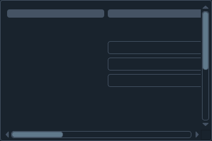

MoNaLISA variant
~~~~~~~~~~~~~~~~

``"scanWidgetType": "MoNaLISA"`` (``BetaScanDesigner`` with
``BetaTTLCycleDesigner``, like ``Base``) keeps everything the ``Base`` panel has,
including the Start/End pulse table and **Cont. Laser Pulses**, and adds:

* A plot beside the pulse table showing one dwell period of the pulse
  programme, each laser in the colour of its wavelength.
* **Axial Scan**: ticking **XZ** and/or **YZ** makes a 2-D XY scan continue
  with an XZ and/or a YZ section through one point of it.  A **Z** row appears
  for the axial **Size**, **Step size** and **Center**, and **Center
  localization** picks the point: *Manual* uses the pixel coordinates typed
  under **Center Coordinates**; *Maxima* fits a Gaussian and *Minima* a donut
  to the image in the Bead reconstruction tool and fills those coordinates in.
  **Show** marks the point on that image.  If no centre is found, or none
  arrives within 3 s, the axial sections are skipped.  The axial scan needs
  positioners named ``X``, ``Y`` and ``Z``, and *Maxima* / *Minima* need the
  ``BeadRec`` widget.

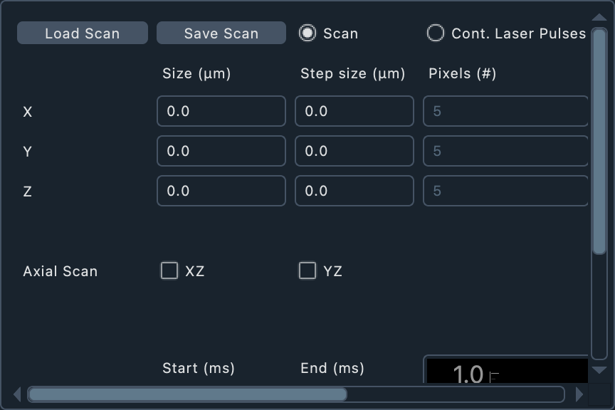

Advanced scanning: line steps
~~~~~~~~~~~~~~~~~~~~~~~~~~~~~

The ``Advanced`` variant (paired with ``"TTLCycleDesigner":
"AdvancedScanTTLCycleDesigner"``) adds **line steps**: the same physical line
is scanned several times in a row, with a different set of devices enabled on
each pass, before the slow axis advances.

**#Line repeats** sets how many passes each line gets.  Ticking **Line program
devices** shows the per-repeat enable matrix — one checkbox per device per
step — so a two-colour point scan enables the first laser on step 1 and the
second on step 2.

Because the passes are interleaved *line by line* rather than frame by frame,
the resulting channels are acquired within microseconds of each other at the
same position: they stay co-registered even if the sample drifts, which a
frame-sequential two-colour scan cannot promise.  The cost is proportional —
``N`` line steps take ``N`` times as long and produce ``N`` times the data.

Ticking **Advanced Line Program** exposes per-device, per-step control *within*
each pixel's dwell time:

* **Start(s)** / **End(s)** (ms, comma-separated) — one or more pulse windows
  inside the dwell time.  A device with no windows is simply on for the whole
  pixel.  The **Timing windows** / **Sequence builder** selector switches
  between typing the windows directly and building them as a table of ordered
  segments; switching modes converts what you already entered.
* **Lock-Master** / **Lock-with:** — edit one device's program and have the
  locked devices follow it, instead of retyping the same windows.
* **Power Level (%)** — a per-step power for lasers that have an analog
  channel, held constant across each pass.
* **Intra-pixel positioners movement** — reserved positioner timing/offset
  metadata. The current built-in scan designers save and restore these fields
  but do not apply them to a stage or galvo waveform; do not rely on this
  control for hardware movement.

**Dwell time (ms)** is the time spent per pixel; the widget shows the resulting
**Dead time** so you can see how much of each pixel is not being used.
**Delay [sampl.] D2** is the galvo's response lag, by which the detector
readout is delayed, and **D3** the settling time before each slice step of a 3-D scan.  Both
are entered in microseconds, whatever the D2 label says, and start from
``phase_delay`` / ``d3step_delay`` in ``scan.scanDesignerParams`` of the setup
file.  **Plot** previews the generated waveforms, with **include TTL** to
overlay the device gating.

With point detectors, a line-step scan produces one frame per scan holding all
steps, saved as ``(T, C, Y, X)`` with one channel per step.  The PMT's live
view shows the steps summed into one image, but its recordings keep them as
separate channels, as the APD's do — see :doc:`devices/detectors`.

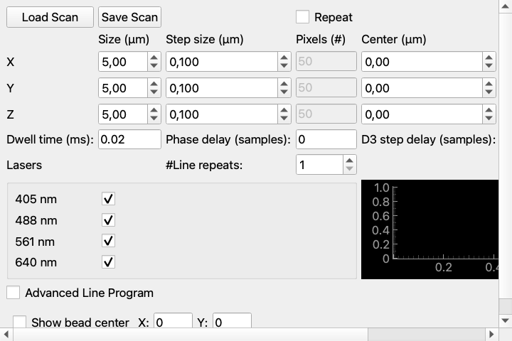

See :doc:`advanced-scanning` for the exact pixel-count convention, Sequence
Builder timing semantics, galvo setup requirements, scan-size guards and the
Advanced Scan + Recording workflow.

Tiling widget
-------------

Covers an area larger than one field of view by driving the stage through a
square spiral, acquiring one tile at each stop and stitching them into a
single overview as the run proceeds.  The overview is live: clicking it
drives the stage, and it is what cell targeting operates on.

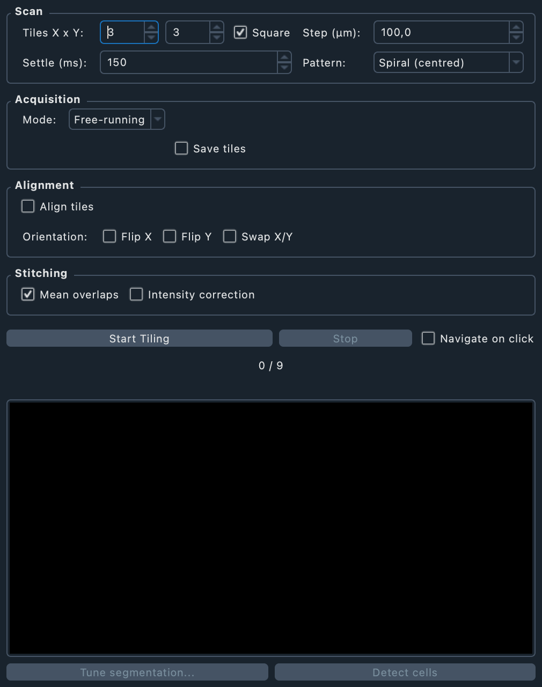

See :doc:`tiling` for the controls in detail, cell detection, illumination
correction, multi-detector runs, the saved output and the controller API.

TriggerScope panels
-------------------

These panels drive a TriggerScope board over its serial line.  A panel uploads
its parameters — pulse times, positions, and the TTL line and DAC channel of
each device — and the board runs the scan on its own, reporting when it is done.

**Setup.**  Each panel is loaded by its key in ``availableWidgets`` and has a
default dock.  The setup file needs a ``triggerScope`` section naming the board's
RS-232 device, and a ``scan`` section with ``"scanWidgetType": "TriggerScope"``
whose designer keys still name valid designers, although these panels do not use
them.  That type has no ``Scan`` panel, so leave ``Scan`` out of
``availableWidgets`` (see :doc:`setupinfo-reference`).  Scan axes are
positioners with ``forScanning: true``, an ``analogChannel`` of the form
``"Triggerscope/DAC<n>"`` and, in ``managerProperties``, a ``conversionFactor``
(µm per volt), ``minVolt`` and ``maxVolt``.  A laser the panel switches, or a
camera whose line it programs, needs a ``digitalLine`` of the form
``"Triggerscope/TTL<n>"``; without one the scan stops with an error naming that
key.

**Running.**  Times are in milliseconds.  Positions are in micrometres and are
converted to volts with ``conversionFactor``; the raster, pLS-RESOLFT,
galvo-detection, LS-XY-RESOLFT and pLS-RESOLFT multicolour panels refuse a scan
that would leave ``minVolt`` / ``maxVolt``.  **Run Scan** uploads the parameters
and starts the board, and stays greyed out until the scan ends; the lasers it
uses are locked in the Laser widget meanwhile.  The board has no abort command,
so a run that has started always finishes; a stop only prevents what would
follow it.  **Save Scan** and **Load Scan** default to the ``imcontrol_scans``
folder of the user directory.

**Recording.**  **REC** arms a recording that binds to the panel whose **Run
Scan** is pressed next; a **Timelapse scan** uses the Recording widget's **Scan
source**.  Every panel but the raster has **Auto-start REC**, which starts a
recording when the scan is started from the panel itself (not by the Recording
widget or a script), and **Auto-stop REC**, which stops it when the run ends.  In
the RESOLFT-family panels one run gives **Time lapse timepoints** × **Cycle scan
steps** × **RO scan steps** frames, time points outermost and RO steps
innermost.  With a recording armed, the scan does not start unless all three are
at least 1; the panels open with them at 0.

Scripts start a panel with ``api.imcontrol.runScan(source='<key>')``, the key
being its ``availableWidgets`` name.

Raster scan
~~~~~~~~~~~

``TriggerScopeRaster`` (dock *TriggerScope Raster Scan*) is a point-by-point
raster run by the board, and the TriggerScope panel the Bead reconstruction tool
can follow.

Each scanning positioner has a row with **Size (µm)**, **Step size (µm)** and
the resulting **Steps (#)**.  The dimension selectors order the axes, and every
scanning positioner is sent to the board as a dimension; there is no *None*.
There is no centre field either: each axis starts from where it currently is.
**Dwell (ms)** is the time per pixel.  The **Start (ms)** / **End (ms)** rows set
a pulse window within the dwell for each TTL device, previewed in the plot
beside them, but only the row that starts earliest is sent to the board, on that
device's TriggerScope line.  At each start the log states the window used,
notes that the current firmware pulses TTL lines 0–3 together in it, and warns
if a triggered camera's exposure plus readout is longer than the dwell, in which
case the camera drops triggers.

**Repeat** starts the scan again each time it finishes.  While a scan runs,
**Stop after scan** ends the repeats once the board finishes the current scan;
the button then reads **Force stop / disarm**, which ends the scan in ImSwitch2
and disarms the lasers, although the board may still be scanning.

A scan recording expects one frame per pixel of the first two axes from each
detector that has a Start/End row.  Scripts can use
``api.imcontrol.saveScanParamsToFile(...)`` and ``loadScanParamsFromFile(...)``.

pLS-RESOLFT scan
~~~~~~~~~~~~~~~~

``TriggerScopePLSR`` (dock *TriggerScope pLS-RESOLFT*, panel title
*pLS-RESOLFT scanner*) runs the board's pLS-RESOLFT programme.  The left column
sets the pulse sequence in milliseconds — **On-pulse time**, **Off-pulse time**
and **RO-pulse time**, the delay after each, **Delay before on-pulse (in
consecutive cycles)** and **Delay after DAC step** — and **On laser**, **Off
laser** and **Read-out laser** choose the lasers that fire them.

The right column moves the **RO scan device**: **RO scan resting position**,
**RO scan start** and **RO scan step size** (µm) and **RO scan steps**, plus the
**Cycle scan** start, step size and steps, which apply to the same device — the
cycle-scan selector is disabled and the RO device is always used.  **Time lapse
timepoints** and **Time lapse delay (sec)** complete the programme; the frame
count is given above.

**Camera used for detection** lists every detector.  The board triggers the
camera on a fixed line of its own, so this programs nothing: it tells a scan
recording which detector receives those triggers, and a scan recording of a
camera is refused until it is set.

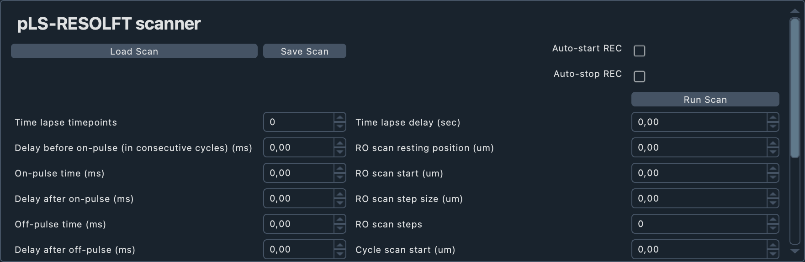

pLS-RESOLFT with galvo detection
~~~~~~~~~~~~~~~~~~~~~~~~~~~~~~~~

``TriggerScopeGalvoDetection`` (dock *TriggerScope Galvo Detection*, panel title
*pLS-RESOLFT scanner galvo detection*) is the pLS-RESOLFT panel with one more
axis: **scan detection device** selects a second positioner, and **Galvo scan
first position**, **Galvo scan second position** and **Galvo scan third
position** (µm) set three positions for it, converted with that device's own
``conversionFactor``.  The pulse sequence, RO and cycle scans and **Camera used
for detection** (every detector listed, nothing programmed) work as in the
pLS-RESOLFT panel, and a scan recording expects the same frame count.

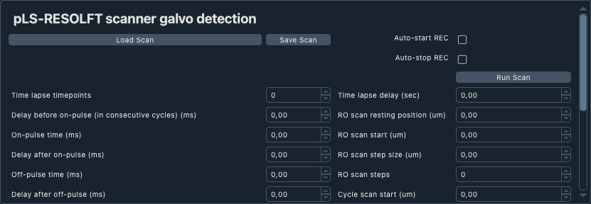

LS-XY-RESOLFT scan
~~~~~~~~~~~~~~~~~~

``TriggerScopeLSXYR`` (dock *TriggerScope LS-XY-RESOLFT*) adds an X/Y raster to
the pLS-RESOLFT programme: a **Raster X scan device** and a **Raster Y scan
device**, each with a start and step size (µm) and a number of steps, converted
with that device's own ``conversionFactor``.  A scan recording expects the
pLS-RESOLFT frame count times **Raster X scan steps** × **Raster Y scan steps**.
The log warns that such a recording declares only its frame count, not the
order of its frames, because the firmware's loop order has not been
established.

This panel programs the camera's line into the board, so the device chosen in
**Camera used for detection** needs a ``Triggerscope/TTL<n>`` line.  The list
offers every laser and detector that has a ``digitalLine``; pick the camera, as
a scan recording refuses anything that is not a detector.

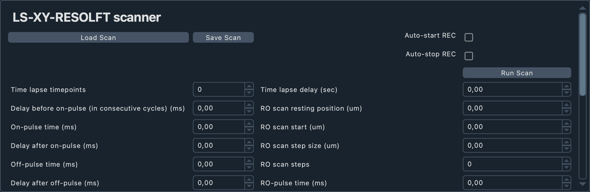

pLS-RESOLFT multicolour scan
~~~~~~~~~~~~~~~~~~~~~~~~~~~~

``TriggerScopePLSRMulticolor`` (dock *TriggerScope pLS-RESOLFT Multicolor*; its
panel title reads *pLS-RESOLFT scanner*, the same as the single-colour panel)
extends the pLS-RESOLFT programme with two more lasers, **Laser 2** and **Laser
3**, each with an on-time and a delay after it, and a **Multicolor scan device**
with a first, second and third position.  Those positions are in
micrometres, whatever the **(V)** in their labels says: they are converted with
the multicolour device's own ``conversionFactor``.

This panel programs the camera's line into the board, so **Camera used for
detection** offers only detectors that have a ``digitalLine``, and that line
must be a ``Triggerscope/TTL<n>`` for the scan to run.  The EtSnouty widget
starts this panel for its event-triggered acquisitions.

Light-sheet multicolour scan
~~~~~~~~~~~~~~~~~~~~~~~~~~~~

``LightSheetMulticolor`` (dock *Light-Sheet Multicolor*, panel title
*pLS-multicolor*) runs the board's multicolour programme.  The lasers chosen as
**Laser 1** to **Laser 5** each have a **Laser <n> on time (ms)** and a **Delay
after Laser <n> (ms)** field, and a **Multicolor scan device** has a first and a
second position.  The RO scan, cycle scan and time-lapse fields, and the frame
count, are those of the pLS-RESOLFT panel.

The camera's line is programmed into the board, so the device chosen in
**Camera used for detection** needs a ``Triggerscope/TTL<n>`` line.  The list
offers every laser and detector with a ``digitalLine``; pick the camera, as a
scan recording refuses anything that is not a detector.  The same programme is
also available as a mode of the combined **TriggerScope Scan** panel.

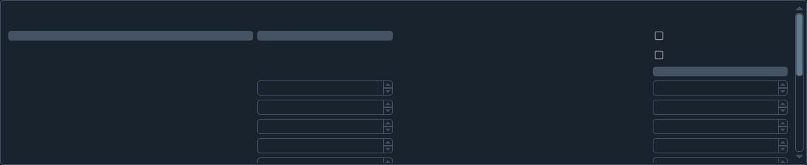

TriggerScope Scan (combined panel)
~~~~~~~~~~~~~~~~~~~~~~~~~~~~~~~~~~

``TriggerScopeScan`` (dock *TriggerScope Scan*) holds the light-sheet
multicolour and pLS-RESOLFT multicolour panels behind one **Scan type**
selector (*Light-Sheet Multicolor*, *pLS-RESOLFT Multicolor*), with a single set
of **Load Scan**, **Save Scan**, **Run Scan**, **Auto-start REC** and
**Auto-stop REC** controls.  **Run Scan** runs the type on show, and **Save
Scan** / **Load Scan** act on that type only; the panel's remembered state keeps
both.  When the EtSnouty widget starts a scan it switches the panel to
*pLS-RESOLFT Multicolor* first.

In both types **Camera used for detection** offers every laser and detector that
has a ``digitalLine``, and the chosen camera needs a ``Triggerscope/TTL<n>``
line.

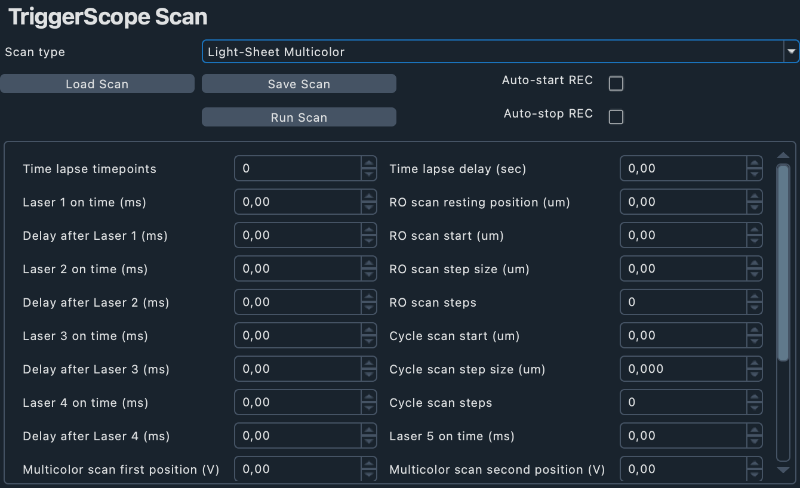

Well plate widget
-----------------

A map of a 96-well plate (rows A–H, columns 1–12), intended for moving the
stage from well to well.  ``WellPlate`` in ``availableWidgets`` loads it
(*Well Plate*); the plate is drawn when the setup has a positioner with
``forPositioning`` set (see :doc:`devices/positioners`).  Clicking a well does
not move the stage yet: it only writes the well's name to the debug log.

.. warning::

   Do not enable this panel on a working microscope yet.  When ImSwitch2
   closes, it moves every axis of every positioner to 0.  Its script methods
   (``movePositioner``, ``getPositionerNames`` and five more) also have the
   same names as the Positioner widget's, so a setup that lists both
   ``WellPlate`` and ``Positioner`` fails to load ImControl.

Setup modes widget
------------------

Saves named *setup modes*, each a snapshot of a chosen subset of the widgets
(laser powers, scan settings, flip mirrors, …), and applies one on demand.
How modes differ from saved widget states, and why applying one drives
hardware, is explained in :doc:`working-in-imswitch2`.  ``SetupModes`` in
``availableWidgets`` loads the panel.

Choosing a mode in **Mode:** applies it at once, as the warning icon beside the
title says.  The reload button applies the selected mode again, **Update Mode**
re-saves it from the current state of the components it includes, and the
information button opens an inspector listing every mode.  **More** holds
**Save as...** (where you pick the components to include), renaming,
duplicating and deleting, a keyboard shortcut per mode, the laser-power warning
under **Safety settings...**, and **Open modes folder**; each mode is a JSON
file in ``ImSwitchConfig/imcontrol_setup_modes``.

Scripts can do the same with ``api.imcontrol.listSetupModes()`` and
``api.imcontrol.loadSetupMode(name)``, whether or not the panel is loaded.

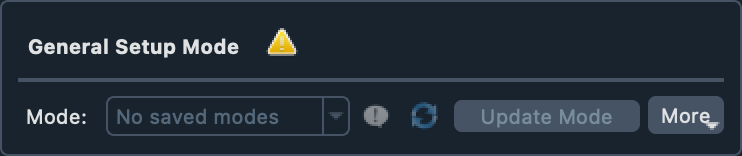

Setup status widget
-------------------

A panel written for one light-sheet setup: it switches between widefield and
tilted light-sheet illumination and detection by moving three flip mirrors,
and drives a rotation stage and an Elliptec slider.  The mirrors are
hard-coded as Thorlabs APT devices on ``COM6``, ``COM5`` and ``COM11`` (the
``thorlabs_apt_device`` package must be installed), the cameras as ``Orca``
(tilted) and ``WidefieldCamera`` (straight), and the stage and slider as
``rs232devices`` entries named ``rotationStage`` and ``elliptecSlider``.  On
other hardware, use the Setup Modes and Flip Mirror widgets instead.

``SetupStatus`` in ``availableWidgets`` loads it.  If the package is missing or
the mirrors cannot be opened, the whole panel is disabled; without
``rotationStage`` only the rotation-stage controls are.  When it loads, it
moves the mirrors to straight widefield.

* **Set position (deg) of rotation stage** moves the stage when the value is
  entered; **Set jog step size (deg)** with **<<** and **>>** jogs it.  The
  current angle is shown below.
* The hot keys listed in the panel apply a configuration and update **Current
  illumination config:** and **Current detection config:** — **F1** straight
  widefield, **F2** tilted light sheet, **F5**/**F6** illumination only,
  **F9**/**F10** detection only.  Setting the detection also shows only that
  camera's image.  Keys **1**–**4** move the Elliptec slider to positions 0–3.
  The keys work only while the panel has keyboard focus: click it first.

Event-triggered imaging
=======================

The event-triggered widgets wait for something to happen and then image it
properly.  A fast detector, usually a widefield camera, images the sample
continuously and an analysis pipeline you write examines every frame.  When the
pipeline reports an event, the widget pauses the fast imaging and runs the slow
high-resolution acquisition — a scan centred on the event for EtSTED and
EtMonalisa, a light-sheet scan for EtSnouty — then resumes detection if
**Endless** is ticked, or stops.

The three widgets share these controls:

* **Fast detector** (any acquisition detector) and **Fast laser**.  Detection
  does not need live view to be running.
* **Experiment mode** — *Experiment* acquires.  *TestVisualize* only runs the
  pipeline: detections are marked with red crosses on the image and the
  pipeline's analysis image is shown in a separate window.  *TestValidate*
  also, a few frames after each detection, saves the raw and analysed frames as
  snapshots (``…_snap_raw``, ``…_snap_ana``) in the Recording widget's folder
  and **Snap format**.  Neither test mode acquires.
* **Load pipeline** loads the pipeline chosen beside it and adds a field for
  each of its parameters.
* **Unlock softlock** clears the flag that makes the widget skip frames while
  the pipeline is busy, should a failure leave it set.

A pipeline is a Python file in the widget's ``analysis_pipelines`` folder that
defines a function with the file's name.  Its first five arguments are ``img``
(the new frame), ``prev_frames`` (up to ten earlier frames), ``binary_mask``
(or ``None``), ``testmode`` and ``exinfo`` (what the previous call returned
there, ``None`` at start); any further arguments become numeric fields.  It
returns ``(coords, exinfo)``, plus an analysis image when ``testmode`` is true;
``coords`` has one row of fast-detector pixel coordinates per event and is
empty when there is none.  Only the first event is acquired, and the first few
frames after each start or resume never trigger.  Pipelines are imported once
per session: after editing one, restart ImSwitch2.

After each event scan or validation, a text log (timings, event coordinates,
pipeline parameters) goes to the widget's logs folder.

To switch setup modes (see :doc:`working-in-imswitch2`) as it runs, set
``smartMicroscopyModeSwitchingEnabled`` for the workflow (``EtSTED``,
``EtMonalisa`` or ``EtSnouty``) and map its roles in ``smartMicroscopyModes``:
``scouting`` before detection starts, ``event`` before each slow acquisition,
``resume`` (if mapped, else ``scouting``) before detection restarts, and
``idle`` (if mapped) on stop.  Arming is then refused while ``scouting`` or
``event`` is unmapped; see :doc:`setupinfo-reference`.  None of the three
widgets has a scripting API.

EtSTED widget
-------------

Event-triggered STED: a widefield camera watches for events and each one is
imaged by a point scan centred on it.  List ``EtSTED`` in ``availableWidgets``;
it needs the ``scan`` section (see :ref:`setupinfo-scan`) and the ``Scan``
widget, whose scan it re-centres and runs.  The optional ``etSTED`` section
(``swapXY``, ``invertX``, ``invertY``; see :doc:`setupinfo-reference`) flips the
event coordinates before the transform.  Its files live in ``imcontrol_etsted``
in the user directory (``ImSwitchConfig``, see :doc:`imcontrol-setups`), its
logs in ``recordings/logs_etsted``.

Before pressing **Initiate etSTED**:

* Set up the scan in the Scan widget and press **Load scan parameters**; the
  box below summarises it.  The event becomes the centre of the scan's first
  two axes, so the scan needs at least two.
* Choose a **Transform pipeline** and **Transform coefficients** (see
  :ref:`below <et-transform-calibration>`); both are needed in every mode.
* **Scan type** — *ScanWidget* runs the loaded scan itself, greying out the
  Scan widget while armed, and saves the result as the Recording widget's
  **Snap** would.  *RecordingWidget* re-centres the Scan widget and starts a
  recording with the Recording widget's settings.
* **Record binary mask** averages ten fast-detector frames, smooths them by
  **Bin. smooth (px)** and thresholds them at **Bin. threshold (int.)**.  The
  mask is shown in the analysis window and passed to the pipeline for the rest
  of the session; it is not saved.
* **Set update period** sets how often, in ms, ImSwitch2 polls every streaming
  detector, live view included.
* **Fast scan axis shift** offsets the fast-axis centre by an amount computed
  from the pixel size and dwell time, with coefficients fixed in the code.

The fast laser is on while detecting and off during the scan.  In
*Experiment* mode the frames before each event are saved as a ``…_snap_raw``
snapshot.  The status label shows *Idle*, *Arming*, *Detecting*, *Triggered*,
*Scanning* or *Error*, with a message beside it; **Unlock softlock** appears
only on *Error*.  While armed (the button then reads **Stop**) the setup
controls are locked.

**Update period - Laser delay feature (ms)**, **Use laser delay feature**,
**Number of slow frames** and **Time between slow frames (s)** have no effect:
nothing reads them.

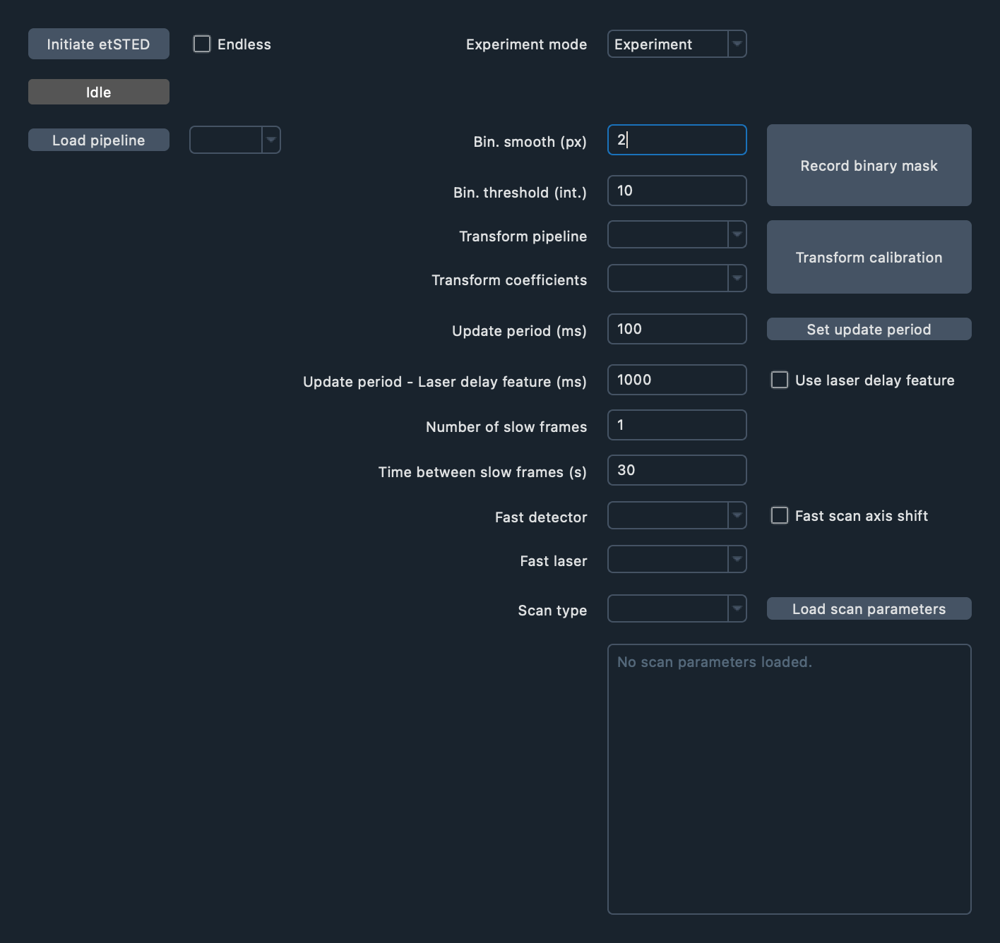

EtMonalisa widget
-----------------

The EtSTED workflow for event-triggered MoNaLISA on a Leica stand: detection in
the stand's fluorescence (widefield) mode, then a scan of the event in its
confocal-scanning mode.  List ``EtMonalisa`` in ``availableWidgets``.  Like
EtSTED it needs the ``scan`` section and the ``Scan`` widget, and for
*Experiment* mode a ``microscopeStand`` (see :doc:`devices/stands`).  Its files
live in ``imcontrol_etmonalisa`` in the user directory, its logs in
``recordings/logs_etmonalisa``.

In *Experiment* mode it switches the stand itself: fluorescence mode with the
incident-light shutter open before detection, confocal-scanning mode before
each scan, and fluorescence mode again before detection resumes, waiting a
second after each switch.  With setup-mode switching enabled for
``EtMonalisa`` it leaves the stand alone, so its ``scouting`` and ``event``
modes must include the **Stand** (``LeicaStand``) state.  Without a
``microscopeStand`` section, arming in *Experiment* mode fails unless mode
switching is enabled.

The controls work as in EtSTED, with these differences:

* there is no status label, so failures appear only in the log;
* **Unlock softlock** is always shown;
* the scan parameters are checked at the first event rather than when arming;
* the ``etSTED`` coordinate flags do not apply;
* **Transform coefficients** lists files in folder order, not newest first;
* the four unused EtSTED fields are absent.

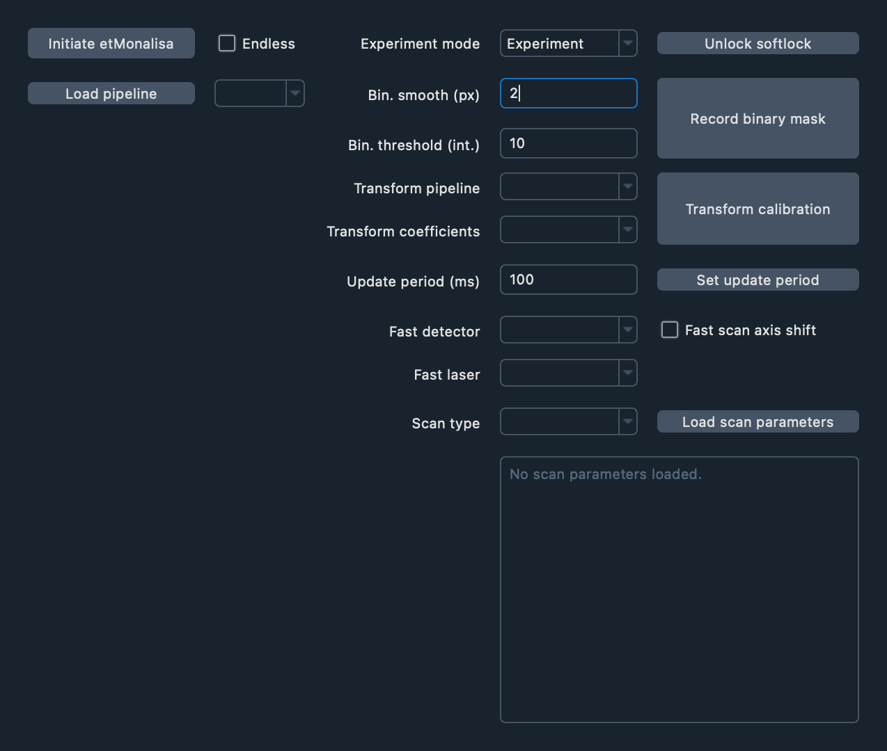

EtSnouty widget
---------------

Event-triggered light-sheet imaging on the Snouty setup: a widefield camera
watches for events and each one triggers a pLS-RESOLFT multicolour light-sheet
scan.  The scan is not positioned on the event and there is no coordinate
transform: it runs with the parameters of the **TriggerScope pLS-RESOLFT
Multicolor** (``TriggerScopePLSRMulticolor``) or **TriggerScope Scan**
(``TriggerScopeScan``) widget, one of which must be loaded.  List ``EtSnouty``
in ``availableWidgets``.  Without setup-mode switching it selects the
*Widefield imaging* and *Light sheet imaging* configurations of the **Setup
Status** widget (``SetupStatus``), which must then be loaded too.  Its files
live in ``imcontrol_etsnouty`` in the user directory (or in
``$IMSWITCH_ETSNOUTY_ROOT``), its logs in ``recordings/logs_et``.

At an event it switches to light-sheet imaging, turns the fast laser on and
starts the scan, then saves the result as the Recording widget's **Snap**
would.  Press **Load pipeline** before **Initiate etSnouty**: unlike EtSTED, it
does not load the pipeline itself.

* **Use Widefield camera frameRate** — unticked (the default), EtSnouty clocks
  the camera itself: every **Update period (ms)** it turns the fast laser on,
  waits 0.5 s, reads one frame and turns the laser off.  Ticked, the pipeline
  takes every frame the camera streams and the period is not used.
* **Record binary mask** shows a frame with a red rectangle.  Place the
  rectangle over the region to watch and press the button again, now **Save and
  load**, to use it as the mask and save it as ``.npy``.  **Load binary mask**,
  **Clear binary mask** and **Show binary mask** (a red overlay on a fresh
  frame) manage it.
* **Save pipeline parameters** / **Load pipeline parameters** store the
  parameter fields in an INI file.
* **Test Mode** runs the pipeline in test mode whatever the experiment mode and
  saves every analysed and raw frame as PNG in ``recordings/logs_et/frames``.
* The value beside **Fast laser, power(mW)** is never applied; set the power in
  the Laser widget.

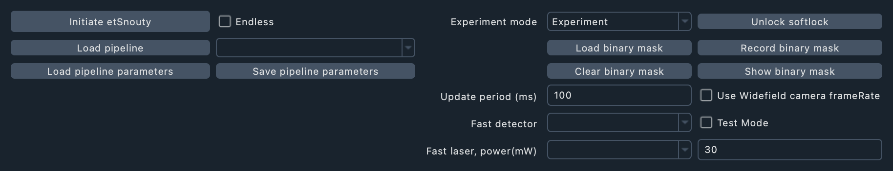

.. _et-transform-calibration:

Transform calibration window
----------------------------

**Transform calibration** in the EtSTED or EtMonalisa widget opens a window
that fits the coordinate transform from beads imaged by both modalities: a
third-order polynomial (20 coefficients) from positions in the fast detector's
image to scan positions.

#. **Load low-res calibration image** and **Load high-res calibration image**
   each open an HDF5 file: a widefield and a scan image of the same beads.  The
   low-resolution image is shown transposed.
#. Mark the same beads in both viewers, in the same order: points in
   ``lo_points`` on the left and ``hi_points`` on the right.  The fit needs at
   least ten pairs.  Alternatively, **Auto-detect & match beads** finds and
   pairs the beads itself (again at least ten), fills both point layers and
   reports the number matched and the fit residual beside the button.
#. **Save calibration** fits the polynomial to the pairs and saves the
   coefficients as a date-stamped ``.csv`` in ``transform_pipelines``, which
   **Transform coefficients** then offers; the points and coefficients also go
   to the logs folder as JSON.  Red crosses (``transf_points``) show where the
   fit places each low-resolution bead on the high-resolution image.
#. **Reset coordinates** clears all three point layers.

.. warning::

   Loading an HDF5 file saved by ImSwitch2 currently fails.  The window reads
   the image and its pixel size (``element_size_um``) from the file's first
   top-level entry, which in ImSwitch2 files is the detector group, not the
   image.

The **Transform pipeline** is a Python file in ``transform_pipelines`` that
defines a function with the file's name, taking the event coordinates and the
20 coefficients and returning the scan position.  For the polynomial the
window fits:

.. code-block:: python

   # transform_pipelines/poly3.py
   from imswitch.imcontrol.model.EtSTEDTransformService import EtSTEDTransformService

   def poly3(coords, coefficients):
       return EtSTEDTransformService.poly_thirdorder_transform(coefficients, coords)

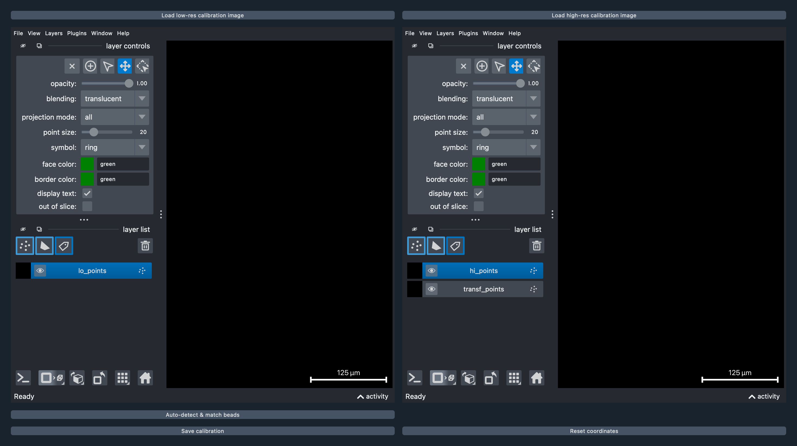

Alignment tools
===============

The alignment widgets do not control hardware — they perform on-the-fly
operations on incoming images to give feedback during alignment.
Listing them in ``availableWidgets`` enables/disables them.  New tools
can be added for other modalities.

Alignment line
--------------

Overlays a line at a given angle on the live image.

Axial alignment tool
--------------------

Lets the user pick a ROI and plots its mean value over time.

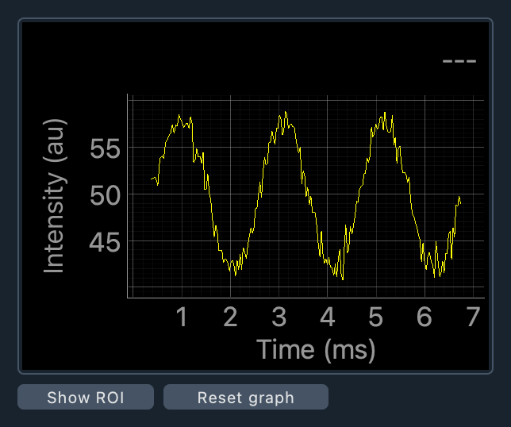

Rotational alignment tool
-------------------------

Similar to the axial tool but along a single axis (x or y).

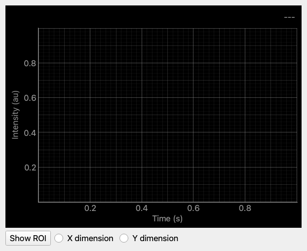

uLenses tool
------------

Displays an array of points with a user-defined periodicity on top of
the image.

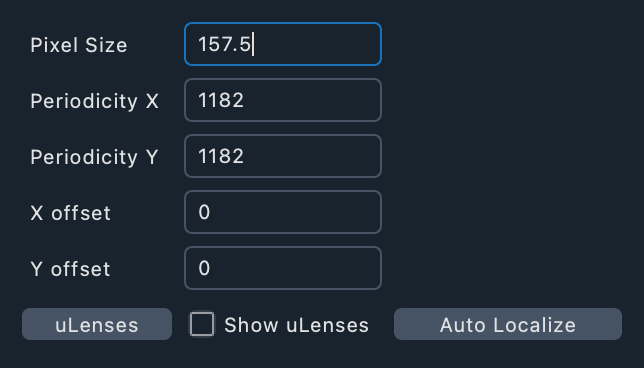

FFT tool
--------

Computes the Fourier transform of incoming frames in real time.

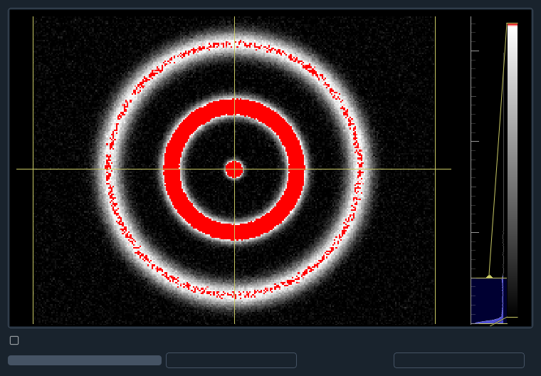

Bead reconstruction tool
------------------------

During a scan, integrates the camera signal inside a region (**Show ROI**)
at every scan step and builds an image with one pixel per step, typically
of a bead, to see the scanned beam's profile.  Tick **Run** to reconstruct during scans.
**Scale** resamples the result to the scan's pixel size, and **Rotate** (in
90° steps) with **Flip H** / **Flip V** corrects its orientation for the scan
direction.  **Save Rec** saves the displayed reconstruction as OME-TIFF
with its pixel size (one scan step, or the finer step once rescaled to
square pixels) and what BeadRec knew about the scan; **Load** opens TIFF
images into the list beside it, keeping the pixel size of a file BeadRec
saved (**Add Current**,
**Remove**, **Clear All**, **Save All**).  **Run fit** fits the model chosen
next to it (Gaussian, donut, exponential, sine, …) to the displayed image;
**Analysis Parameters** sets the fit options.

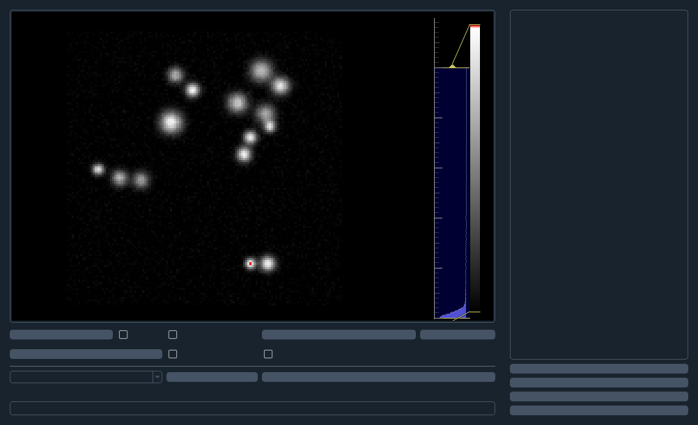

Scripting
=========

Two panels run Python inside ImControl.  For scripts that drive the
microscope, with the ``api`` object and an editor, use the ImScripting module
(see :doc:`scripting`).

Console
-------

A Python prompt inside the running ImSwitch2 (pyqtgraph's console), for quick
checks.  ``Console`` in ``availableWidgets`` loads it, by default at the bottom
of the left column.

Code typed at the ``>>>`` prompt runs in the ImSwitch2 process itself, on the
thread that draws the window, so a long command freezes the GUI until it
returns.  Its namespace starts empty: the ``api`` object that scripts receive
is not defined here.  **History** lists earlier commands; **Exceptions..**
opens pyqtgraph's panel for inspecting exceptions and their stack traces.

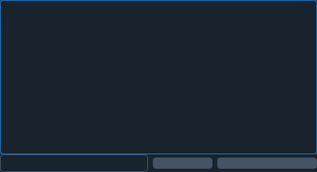

File watcher
------------

Runs the Python scripts that appear in a folder, one after another, so that
scripts can be queued from outside ImSwitch2 by copying files into it.
``Watcher`` in ``availableWidgets`` loads the *File Watcher* panel.  The
scripts are run by ImScripting, which has to be loaded too; each runs as if
started from its editor, with the same ``api`` (see :doc:`scripting`).

The panel starts on the folder set as ``watcher.outputFolder`` in
``imcontrol_options.json``, by default ``ImSwitchConfig/scripts`` (see
:doc:`imcontrol-setups`).  Change it with **Browse** rather than by typing in
the field, which is not picked up correctly.  The list shows the ``.py`` files
at the top level of the folder; double-clicking one opens it in the
application the system uses for Python files.

Ticking **Watch and run** runs every ``.py`` file already in the folder, then
checks every second for new ones and runs those as they appear, in no
guaranteed order.  **Each file is deleted once its script has finished**,
whether it succeeded or failed.  Starting a watched script stops any script
running in the ImScripting editor.  Unticking appends a ``log.json`` to the
folder with how long each script took.

.. warning::

   Give the watcher a folder of its own.  The default folder is also the one
   ImScripting's **File → Open…** and **Save as…** dialogs start in, and
   ticking **Watch and run** there runs and then deletes every script saved at
   its top level.

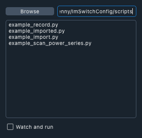
