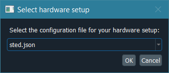

*******************************
Hardware control configurations
*******************************

ImSwitch2's hardware control module is designed to be flexible and
usable in a wide variety of microscopy setups.  In order to provide
this flexibility, hardware configurations are defined in JSON files
that are loaded when the hardware control module starts.

Setup files are loaded from the ``imcontrol_setups`` directory,
created inside your user config directory the first time the hardware
control module starts.  It is pre-populated with example setups.
The user directory is:

* ``%USERPROFILE%\Documents\ImSwitchConfig\`` on Windows
* ``~/ImSwitchConfig/`` on macOS / Linux

The first time you start the hardware control module you will be
prompted to select a setup file.  To switch later, use
**Tools → Pick hardware setup…** in the menu bar.

The choice is stored as ``setupFileName`` in
``ImSwitchConfig/config/imcontrol_options.json``; the prompt appears when
that file does not exist yet, or when the setup it names is missing.  The same
file holds the per-computer settings that are not part of any setup:

* ``recording.outputFolder`` and ``recording.includeDateInOutputFolder``:
  where recordings are saved, and whether a dated subfolder is added
  (default ``ImSwitchConfig/recordings``, with date)
* ``watcher.outputFolder``: the folder the **Watcher** panel starts on
  (default ``ImSwitchConfig/scripts``)
* ``memory.writerQueueMB`` (512), ``memory.perDetectorQueueMB`` (256) and
  ``memory.processingWorkingSetMB`` (1024): memory limits in MiB, editable
  with **Tools → Memory limits…** (see :ref:`improcess-memory-limits`)

.. tip::

   Don't want to hand-edit JSON?  Use the bundled visual setup editor.
   It shows typed fields for every manager's ``managerProperties``.

   From a running ImSwitch2, open it with
   **Tools → Edit hardware configuration…**.  It opens on the setup file
   this session is running and does not block the rest of the GUI, so the
   microscope stays usable while you edit.

   Without starting the microscope, from a source checkout:

   .. code-block:: bash

      python utility_scripts/imswitch_config_editor.py

   or from an installed copy:

   .. code-block:: bash

      python -c "from imswitch.imcontrol.view.configeditor import main; main()"

   To check a setup file for unknown managers and deprecated sections
   without starting anything:

   .. code-block:: bash

      python -m imswitch.imcontrol.model.plugins validate-setup my_setup.json

.. note::

   The hardware configuration is read once, when ImSwitch2 starts; there is
   no way to apply a changed setup file to a running session.  When you
   close the editor after saving changes to the setup this session is
   running — or after pressing **Set as Active Config** — ImSwitch2 offers
   to restart.  Accepting shuts the session down normally (widget states
   saved, hardware finalized) and then comes back up on the new
   configuration; it is not a forced relaunch that leaves devices as they
   stood.

   Editing some *other* setup file changes nothing about the running
   session, so nothing is asked.

How configurations are defined
==============================

Configurations are JSON.  Internally they are deserialized into Python
class instances (one per device type) when loaded.

A central concept in ImSwitch2 is the **device manager**.  A device
manager defines what kind of device you have and how ImSwitch2
communicates with it.  For example, to control a Hamamatsu camera you
declare a detector whose ``managerName`` is ``"HamamatsuManager"`` and
fill in its ``managerProperties``.  Each device must have a unique
name, given by its key in the JSON object.

The **complete per-manager reference** — every field, every default,
every required low-level dependency — lives in the per-category pages
under :doc:`devices/ <devices/detectors>`:

* :doc:`devices/detectors` — every ``DetectorManager``.
* :doc:`devices/lasers` — every ``LaserManager``.
* :doc:`devices/positioners` — every ``PositionerManager``.
* :doc:`devices/rotators` — every ``RotatorManager``.
* :doc:`devices/stands` — microscope stand integrations configured through ``microscopeStand``.

Some managers are not built in but come from separately installed device
plugins, and are named by an id such as ``"tis.camera-ic4"`` or
``"zhinst.lockin-demod"``; see :doc:`devices/plugins`.

For adding a *new* manager class (i.e. implementing one yourself), see
:doc:`adding-device-support`.

**Signal designers** — used when you build a scan — are similar.  In a
point-scanning setup, for example, you might select
``PointScanTTLCycleDesigner`` to generate the TTL signals for your
scan.  They are documented :ref:`below <signal-designers>`.

Minimal example: a single Cobolt 06-01 laser on COM11:

.. code-block:: json

   {
       "lasers": {
           "Cobolt405nm": {
               "managerName": "Cobolt0601LaserManager",
               "managerProperties": {
                   "digitalPorts": ["COM11"]
               },
               "valueRangeMin": 0,
               "valueRangeMax": 200,
               "wavelength": 405
           }
       },
       "availableWidgets": [
           "Laser"
       ]
   }

``digitalPorts`` is a property specific to ``Cobolt0601LaserManager``
— each manager defines its own keys.

Setup file specification
========================

Top-level shape:

.. autoclassconheader:: imswitch.imcontrol.view.guitools.ViewSetupInfo.ViewSetupInfo
   :no-index:
   :members:
   :inherited-members:

Per-device info classes
=======================

These ``Info`` classes describe the *generic* fields every entry in
the corresponding top-level dict accepts.  Manager-specific keys go
inside ``managerProperties`` and are documented in the per-category
pages linked above.

.. autoclassconheader:: imswitch.imcontrol.model.SetupInfo.DeviceInfo
   :members:

.. autoclassconheader:: imswitch.imcontrol.model.SetupInfo.DetectorInfo
   :members:
   :inherited-members:

.. autoclassconheader:: imswitch.imcontrol.model.SetupInfo.LaserInfo
   :members:
   :inherited-members:

.. autoclassconheader:: imswitch.imcontrol.model.SetupInfo.PositionerInfo
   :members:
   :inherited-members:

.. autoclassconheader:: imswitch.imcontrol.model.SetupInfo.RS232Info
   :members:
   :inherited-members:

.. autoclassconheader:: imswitch.imcontrol.model.SetupInfo.SLMInfo
   :members:
   :inherited-members:

.. autoclassconheader:: imswitch.imcontrol.model.SetupInfo.FocusLockInfo
   :members:
   :inherited-members:

.. autoclassconheader:: imswitch.imcontrol.model.SetupInfo.ScanInfo
   :members:
   :inherited-members:

.. autoclassconheader:: imswitch.imcontrol.model.SetupInfo.NidaqInfo
   :members:
   :inherited-members:

.. autoclassconheader:: imswitch.imcontrol.model.SetupInfo.SLMsInfo
   :members:
   :inherited-members:
   :exclude-members: wavelengthTableFile

.. autoclassconheader:: imswitch.imcontrol.model.SetupInfo.AutofocusInfo
   :members:

.. autoclassconheader:: imswitch.imcontrol.model.SetupInfo.TilingInfo
   :members:

.. autoclassconheader:: imswitch.imcontrol.model.SetupInfo.EtSTEDInfo
   :members:

.. autoclassconheader:: imswitch.imcontrol.model.SetupInfo.MicroscopeStandInfo
   :members:

.. autoclassconheader:: imswitch.imcontrol.model.SetupInfo.FlipMirrorInfo
   :members:

.. autoclassconheader:: imswitch.imcontrol.model.SetupInfo.TriggerScopeInfo
   :members:

.. autoclassconheader:: imswitch.imcontrol.model.SetupInfo.TeensyPulseInfo
   :members:

.. autoclassconheader:: imswitch.imcontrol.model.SetupInfo.PyroServerInfo
   :members:

.. autoclassconheader:: imswitch.imcontrol.model.SetupInfo.PulseStreamerInfo
   :members:

.. autoclassconheader:: imswitch.imcontrol.view.guitools.ViewSetupInfo.WidgetLayoutInfo
   :members:

.. autoclassconheader:: imswitch.imcontrol.view.guitools.ViewSetupInfo.ROIInfo
   :members:
   :inherited-members:

.. autoclassconheader:: imswitch.imcontrol.view.guitools.ViewSetupInfo.LaserPresetInfo
   :members:
   :inherited-members:

.. _Signal designers:

.. _signal-designers:

Signal designers
================

Signal designers translate high-level scan settings into the
analog/digital waveforms that drive scanners and modulate lasers.
They are selected via the ``scanDesigner`` / ``TTLCycleDesigner`` fields
of the ``scan`` section in your setup file, and each pair has to match the
``scanWidgetType`` (see :ref:`setupinfo-scan`).

Scan designers
--------------

.. autoclassconheader:: imswitch.imcontrol.model.signaldesigners.BetaScanDesigner.BetaScanDesigner

.. autoclassconheader:: imswitch.imcontrol.model.signaldesigners.GalvoScanDesigner.GalvoScanDesigner

TTL cycle designers
-------------------

.. autoclassconheader:: imswitch.imcontrol.model.signaldesigners.BetaTTLCycleDesigner.BetaTTLCycleDesigner

.. autoclassconheader:: imswitch.imcontrol.model.signaldesigners.PointScanTTLCycleDesigner.PointScanTTLCycleDesigner

.. autoclassconheader:: imswitch.imcontrol.model.signaldesigners.AdvancedScanTTLCycleDesigner.AdvancedScanTTLCycleDesigner
