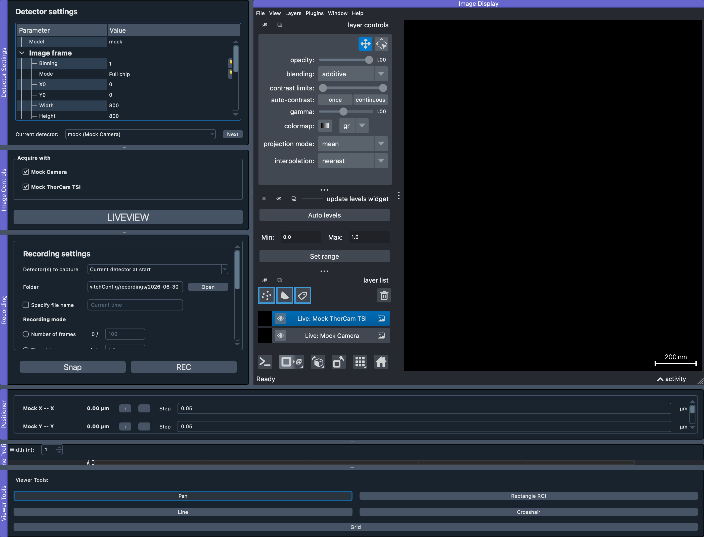

*********
ImControl
*********

``ImControl`` is the acquisition side of ImSwitch2: lasers, stages,
detectors, DAQ, scanning and recording.  It is the module that talks to
the microscope, and the one driven by a hardware setup file — see
:doc:`imcontrol-setups` and :doc:`setupinfo-reference` for the JSON
configuration behind it.

The capture above shows ImControl with a mock setup loaded: detector
settings, acquisition selection and recording on the left, the napari
image display in the middle, positioners and viewer tools along the
bottom.

The pages below cover that interface panel by panel, and the scanning,
tiling and z-stack acquisitions ImControl can run.  Driving the same
hardware from a script is covered under :doc:`scripting`.

.. toctree::
    :maxdepth: 1

    gui
    advanced-scanning
    tiling
    zstack-workflow
