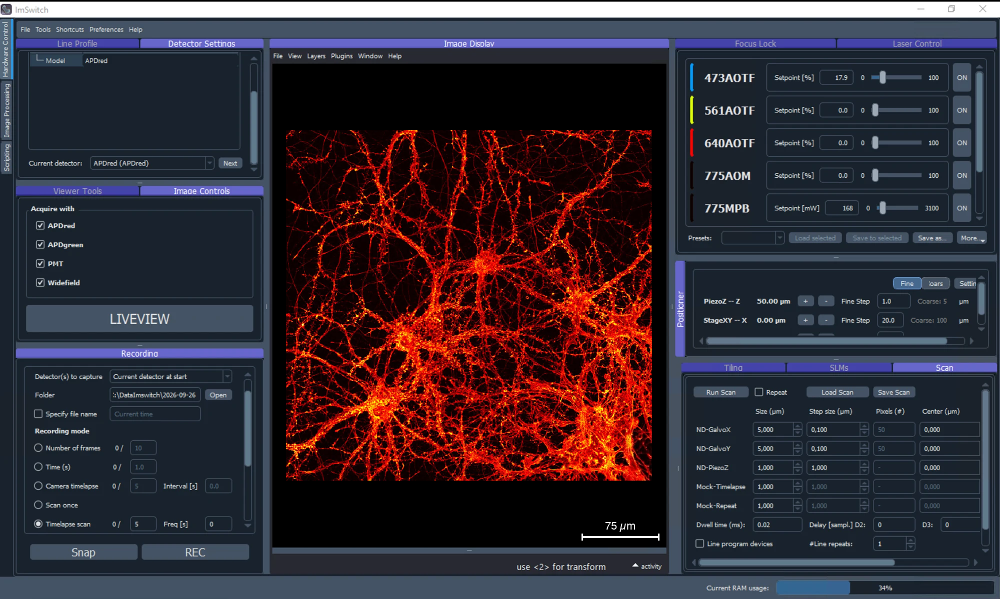

*********
ImControl
*********

``ImControl`` is the acquisition side of ImSwitch2: lasers, stages,
detectors, DAQ, scanning and recording.  It is the module that talks to
the microscope, and the one driven by a hardware setup file — see
:doc:`imcontrol-setups` and :doc:`setupinfo-reference` for the JSON
configuration behind it.

         showing an image recorded on it
   :align: center

ImControl on a point-scanning microscope, showing an image recorded on it:
detector settings, the detectors to acquire with and recording on the left,
the napari image display in the middle, and the lasers, the positioners and
the scan widget on the right.  Which panels appear, and where, follows the
hardware setup file.

The pages below cover that interface panel by panel, and the scanning,
tiling and z-stack acquisitions ImControl can run.  Driving the same
hardware from a script is covered under :doc:`scripting`.

.. toctree::
    :maxdepth: 1

    gui
    advanced-scanning
    tiling
    zstack-workflow
