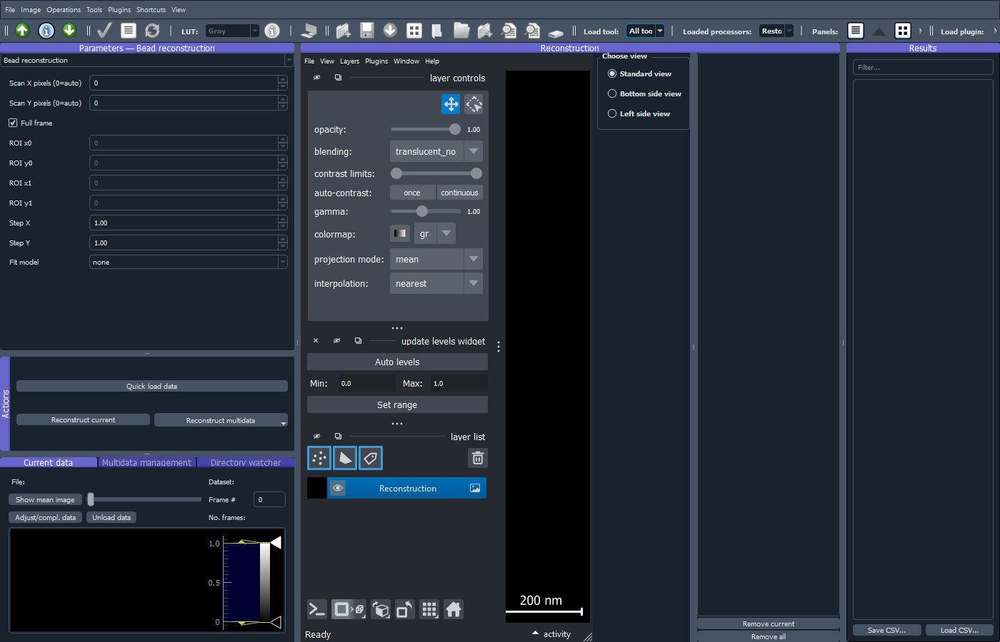

*********
ImProcess
*********

``ImProcess`` is ImSwitch2's post-acquisition processing module.  It is the
generalized successor of the older ``ImReconstruct`` module: where
``ImReconstruct`` was hard-wired to MoNaLISA SIM reconstruction,
``ImProcess`` exposes a small plugin system so that every acquisition
ImSwitch2 can produce — MoNaLISA, STED, FLIM, confocal, widefield,
WidefieldSTARSS, SNOUTY lightsheet — can be opened, viewed and
post-processed with the same shell.

The ImProcess window: the reconstructor's parameters and the raw-data
pane on the left, the napari viewer holding the produced results in the
middle, and the results list on the right.

.. toctree::
    :hidden:

    improcess-workflows
    improcess-napari-plugins

Launching ImProcess
===================

ImProcess can run in three modes:

1. **As an ImSwitch2 module** — alongside ``imcontrol``, started by the
   main ImSwitch2 launcher.  This is the default when ``modules.json``
   lists ``"improcess"`` in the ``enabled`` array.
2. **Stand-alone** — direct entry point, useful when you only want a
   viewer / post-processor on your laptop with no microscope attached::

       python -m imswitch.improcess

   It still reads the ``processing`` block of the setup file selected in
   ``imcontrol_options.json``, so the same setup decides which plugins are
   loaded.  Only when no setup file can be read, or the block lists no
   ``reconstructors``/``processors``, does the registry fall back to the
   ``view-only`` reconstructor + the ``drift-correct`` processor.
3. **With a processing-only setup** — either way, selecting one of the
   processing-only setup files in ``imcontrol_options.json`` makes ImProcess
   load exactly the plugins you want (e.g. MoNaLISA).  See
   :ref:`improcess-processing-presets` below.

Data ingest
===========

Any file ImSwitch2 / ImControl can write is native to ImProcess:

* **HDF5** (``.h5``, ``.hdf5``) — the default ImSwitch2 recording format
* **Zarr** (``.zarr`` directories)
* **TIFF** (``.tif``, ``.tiff``)

There are three ways to open data:

* **Drag and drop.** Drag one or more ``.h5``/``.hdf5``/``.hdf``,
  ``.tif``/``.tiff`` or ``.zarr`` files onto the main window; other files
  are rejected with a status-bar message.  Files with multiple datasets
  prompt a dataset picker.
* **Directory watcher.** Point the watcher pane at a root folder and
  tick *"Start monitoring"* — new timelapse sub-folders are picked up as
  they appear and streamed through the active reconstructor.
* **Manual load.** *File → Quick load data…* (also on the File toolbar and
  as the *Quick load data* button in the Actions dock) opens a file as the
  current data; *Virtual load data…* opens it lazily.  *Add data* in the
  Multidata dock adds files to the multidata list.  Localization tables
  (CSV/TSV, see `Importing localization tables`_) and tiling manifests open
  only through *Quick load data…*, not by drag and drop.

When a recording is opened, ImProcess works out its **acquisition layout**
— which frame belongs to which scan position, time point or condition.  A
user override stored beside the file as ``<file>.imswitch-layout.json``
wins (it is tied to the file's fingerprint, and there is no GUI to write
one yet); otherwise the layout the recording itself declares is used, and an
invalid declared layout is an error rather than a reason to guess.  Only a
file that declares none falls back to reading older metadata (advanced scan,
SNOUTY, MoNaLISA, TriggerScope raster, stage positions), then OME axis
labels, then the array shape.  Whatever the active reconstructor finds
wrong with the source — a scan stopped early, a loop it cannot place — is
shown as a warning in the Parameters dock.

Plugin architecture
===================

ImProcess defines two plugin shapes:

* ``Reconstructor`` (``imswitch.improcess.reconstructors.base``)
  Turns a raw ``DataObj`` into a ``ProcessingResult``.  One per
  dataset.  Examples: ``monalisa``, ``view-only`` (the no-op
  pass-through), ``widefield-starss`` and the SNOUTY reconstructors.
* ``Processor`` (``imswitch.improcess.processors.base``)
  Operates on a ``ProcessingResult`` and returns one or more new results.
  Stackable.
  Modality-agnostic by design — a single ``drift-correct`` works for
  any plugin output that has a time axis, and ``frc`` works on 2D image
  planes.  ``projection`` collapses any selected axis with max / mean /
  sum / median / standard-deviation modes.  ``stack-split`` and
  ``channel-split`` can publish several results from one source result.
  ``segmentation`` thresholds a
  2D plane and extracts connected regions.  Future processors include lifetime
  overlays.

Both shapes are registered with a ``PluginRegistry``.  The
registry is populated at startup, either from a config block or from
standalone defaults.

Menus and toolbars
==================

The main window has the menus **File**, **Image**, **Operations**,
**Tools**, **Plugins**, **Shortcuts** and **View**, and five always-visible
toolbars — *File tools*, *Image*, *Image operations*, *Tools* and
*Plugins* — for operations that should be available regardless of the
active reconstructor.

The **File** menu loads data (*Quick load data…*, *Virtual load data…*),
saves results (see :ref:`improcess-saving`), sets the default data and save
folders, and exports and runs workflows (*Export workflow of current
result…*, *Run workflow…*, *Run workflow on selected results…*, *Run
workflow over files…*; see :doc:`improcess-workflows`).  The *File tools*
toolbar carries quick load, virtual load and *Save reconstruction…*.
*Virtual load data* opens the selected TIFF/OME-TIFF, HDF5 or Zarr dataset
as a lazy current-data source so the raw-data panel can show the mean image
and individual frames without materializing the whole stack first.  Normal
*Quick load data* keeps the eager behaviour.

The *Image* toolbar and the matching **Image** menu change only how the
active result is displayed:

* *Auto contrast* — percentile-based display-level stretch on the active image
  layer.
* *Brightness/Contrast...* — a modeless histogram dialog with numeric minimum
  and maximum controls, sliders, saturated-pixel auto contrast and whole-stack
  versus current-view histogram scope.
* *Reset contrast* — reset the active layer to the finite data range.
* *LUT* — set the colormap, including ``hot``, for the active image layer and
  persist it on the active result or display-layer component.
* *Channels...* — show display-layer channel controls with per-layer
  visibility and LUT settings.
* *Reset view* — restore the reconstruction viewer camera.

The *Image operations* toolbar and the matching **Operations** menu publish
new results:

* *Duplicate* — create a new array-backed result from each selected result.
* *Crop/Substack...* — create a ranged subset with first/last/step controls for
  every result axis.  *Crop from* fills the Y and X ranges from the bounding
  box of an area ROI in the ROI manager (clipped to the image); the ranges
  stay editable, and editing one returns the chooser to *Manual*.  The same
  table appears in the ``stack-subset`` processor panel.
* *Max projection* — create a max projection using the projection processor's
  default stack-axis choice.  The **Projection** panel exposes the rest of
  ImageJ's *Z Project*: the axis, the statistic (max / mean / sum / median /
  standard deviation) and a *First slice* / *Last slice* range, 1-based and
  inclusive, defaulting to the whole axis.  Projecting one axis of a
  hyperstack keeps the others, so a ``TZYX`` stack projected on ``Z`` stays a
  ``T`` series.
* *Split stack* — split each selected stack into one result per plane along the
  selected stack axis.
* *Split channels* — split a ``C``, ``Channel`` or ``Base`` axis into one
  result per channel.
* *Merge channels...* — merge loaded results into a new ``C``-axis channel
  stack. The dialog lists every loaded result (and the components of
  multi-layer results), pre-checks the reconstruction-list selection, and
  merges in the listed order, which is the channel order. *Create composite*
  publishes the merge as coloured display layers instead of a greyscale stack
  with a channel slider. Inputs are whole results or named components, so the
  channels of one multi-layer result can be merged among themselves; the
  planes of a plain stack are not listed individually — split it first with
  *Split stack*, which the dialog says when a single stack is checked.
* *Stack/Combine...* — stack same-shaped selected results along a new axis, or
  concatenate compatible results along an existing axis. Axis labels, pixel
  scales and scale units must agree.
* *Image calculator...* — combine exactly two loaded results with pixel-wise
  add, subtract, multiply, divide, minimum, maximum, average or absolute
  difference operations.  A label mask published by the ROI manager's
  *Create Mask* can be one of the two, so a mask can be applied to the image
  it was drawn on.
* *Make composite* — create a composite result that renders a channel-like axis
  as independently-scaled colored display layers.
* *Make RGB* — bake a channel-like axis into a channel-last RGB visualization
  result for display/export.

The contrast, LUT and channel-visibility operations are display-only: they
update the Napari image layer and the active ``ProcessingResult`` display
settings, including per-display-layer settings for composite outputs, but do
not alter pixel data.  Duplicate, crop/substack, max projection, merge
channels, stack/combine, image calculator, make composite and make RGB
publish new ``ProcessingResult`` objects into the reconstruction list. Split
stack and split channels publish multiple ``ProcessingResult`` objects and
make the final split result current.

The *Tools* toolbar and **Tools** menu hold Fiji-like panel buttons for
Graph, Profile, ROI manager, ROI stats, Projection, Segmentation, Metadata
and Results.  The toolbar's *Load tool* list offers every built-in analysis
tool that is not open yet — FRC, PSF resolution, Colocalization,
Multicolor, Drift correction, Denoise and a generic parameter panel for each
remaining processor — and *Loaded processors* shows what is registered.
Opening a panel registers its processor when needed, raises the dock when it
already exists and keeps the panel in the saved dock layout.  **Every
analysis panel described on this page can be opened this way at any time**
(the SMLM render controls excepted); the ``…Panel`` keys of the setup file
(see `Config schema`_) only decide which ones are open at startup.

Each *Load tool* entry runs one processor at a time and publishes its output
back to the reconstruction list.  To keep a sequence of steps and run it
again — on the same data or on other files — export it with *File → Export
workflow of current result…* and run it from the File menu or with
``python -m imswitch.improcess.workflows`` (see :doc:`improcess-workflows`).

Reconstructors have the same runtime path.  The reconstructor picker at the
top of the Parameters dock offers only the reconstructors that are registered,
and the setup file's ``processing.reconstructors`` list decides which
built-ins those are — so a setup that names only MoNaLISA never shows the
others.  **Tools → Load reconstructor** lists every reconstructor ImProcess
knows about but has not loaded (in practice the built-ins the setup file did
not name, since drop-ins are registered whenever they are present) with a
one-line description; picking one registers it for the session, adds it to
the picker and makes it active.  Nothing is written to the setup file: to
keep a reconstructor across sessions, add it to ``processing.reconstructors``
(the config editor offers every known id, drop-ins included).

The *Plugins* toolbar's *Load plugin* list does for drop-in processors what
*Load tool* does for built-ins (see `Drop-in analysis plugins`_).  The
**Plugins** menu has *Browse online plugins...*, *Open plugins folder...*,
*Add plugin file...*, *Reload plugins* and a *napari plugins* submenu, which
sends the current result to installed napari plugins and takes their layers
back (see :doc:`improcess-napari-plugins`).

The **View** menu shows or hides each dock, shows or hides the
*Reconstructions list* pane, and *Reset layout* restores the default dock
arrangement.

The **Shortcuts** menu lists the current key bindings and opens the editor
(*Configure shortcuts…*).  The defaults follow Fiji: ``Ctrl+O`` quick load,
``Ctrl+Shift+O`` virtual load, ``Ctrl+S`` save reconstruction,
``Ctrl+Shift+S`` save all reconstructions, ``Ctrl+Shift+C``
brightness/contrast, ``Ctrl+Shift+Z`` channels, ``Ctrl+Shift+D`` duplicate,
``Ctrl+Shift+X`` crop/substack, ``Ctrl+H`` graph, ``Ctrl+K`` profile,
``Ctrl+T`` ROI manager and ``Ctrl+M`` ROI stats; the ROI manager adds its
own (see `ROI manager panel`_).  Every other action is unbound but can be
bound.  Changes are saved to ``improcess_shortcuts.json`` in the
``ImSwitchConfig`` folder; see :doc:`working-in-imswitch2` for the editor.

Toolbar icons are selected through ImProcess semantic action IDs and rendered
with QtAwesome when available, with Qt standard icons as a fallback.  This
keeps icon choices centralized while allowing each action to retain its
existing text, tooltip and menu entry.

.. _improcess-multi-result-operations:

Operating on several reconstructions
------------------------------------

Two different things are meant by "several results", and ImProcess offers
both:

* **One operation consuming several results.** Merge channels, Stack/Combine
  and the Image calculator take two or more results and produce one output.
  They are enabled whenever at least two results are loaded — not only when a
  compatible multi-selection exists — and open a picker over everything
  loaded, with the reconstruction-list selection pre-checked. Inputs that
  cannot be combined disable OK and name the reason (differing shape, axis
  labels, pixel scales or scale unit) instead of leaving a silently dead
  button. Two-image FRC works the same way and can compare two separate
  reconstructions.
* **One operation applied to each of several results.** Duplicate, max
  projection, split stack, split channels and make composite run over every
  selected result, skipping the ones the operation does not apply to.
  Processor panels offer the same thing through their *Apply to* selector
  (*Current result* / *Selected results* / *All results*), so a denoise or a
  drift correction can sweep a whole session's reconstructions in one run.
  One input failing does not discard the outputs of the others; the panel
  reports how many failed and why. Crop/Substack and Make RGB stay
  single-result, because their dialogs are parameterised by one result's axes.

Both paths publish through the usual result pipeline, so the bulk-publish
confirmation still guards against flooding napari with layers.

.. _improcess-saving:

Saving results
==============

*File → Save reconstruction…* (``Ctrl+S``) saves the active result.  The file
suffix picks the format, and the dialog offers OME-TIFF (``.ome.tif``) first,
then HDF5 (``.h5``) and OME-Zarr (``.ome.zarr``); pixel size, axis labels and
units are written with the pixels.  *Save all reconstructions…* writes every
result in the list into one chosen folder as ``<name>.reconstruction.tiff``,
numbering a name that already exists.  *Save coefficients of
reconstruction…* and *Save all coefficients…* apply to MoNaLISA results
only.  *Set default data folder…* and *Set default save folder…* choose
where the open and save dialogs start.

A save is planned before anything is written: every file is written beside
the target first and then moved into place, the main file last, so a failed
save leaves the folder as it was.

Every result carries its **provenance**: the source file and its
fingerprint, the reconstruction and every processing step with their
parameters, and the ROI set (and its revision) of a run restricted to a
region.  A saved file keeps it — in the OME-XML description of an OME-TIFF,
in the attributes of an HDF5 file or Zarr group, and in a
``<name>.provenance.json`` companion for formats with no metadata slot, such
as CSV.  The Metadata panel shows it for the selected result, including the
step list recorded as ``processing_history``, and ``python -m
imswitch.improcess.workflows replay`` turns a saved file's record back into
a workflow (see :doc:`improcess-workflows`).

Results list vs. napari layers
===============================

The reconstruction viewer has two visible lists — the **reconstruction list** (right
pane) and the **napari layer list** (napari's built-in layer controls, shown by
default and hidden by setting ``"napariLayerControls": false`` in the
``processing:`` config block).  They serve complementary purposes:

* The **reconstruction list** is the *registry* of processing results.  Each
  entry holds:
  
  - The result data and metadata (axis labels, scales, units)
  - Per-result display settings (contrast levels, colormap)
  - The result's view modes (standard / bottom side / left side / custom XY/XZ/YZ)
  
  These settings are persisted when you adjust contrast or LUT, and restored
  when you click back to that result.

* The **napari layer list** is the *presentation* of the currently selected
  result.  It contains:
  
  - The main image layer, now named after the selected result (not the generic
    ``Reconstruction``)
  - Derived overlays: per-component display layers (composite results with
    independent channel scaling), segmentation mask layers, multicolor preview
    layers, and so on

**Single source of truth: the active napari layer.** Tool panels (Profile, ROI
Manager, FRC, etc.) operate on the *active* (highlighted) napari layer.  When
you select a result from the reconstruction list, the viewer automatically:

1. Loads the result's data into the main image layer
2. Renames the layer to match the result's name
3. Re-activates the main layer so it becomes the target for tool operations

This keeps "which image am I processing?" unambiguous: it's always the active
napari layer, and the reconstruction list keeps that layer aligned with your
selection.

**The producer/tool rule.** Every panel is one of two things:

* *Producing panels* create new ``ProcessingResult`` entries in the
  reconstruction list, never floating napari layers.  Projection, FRC,
  Segmentation, PSF resolution and Colocalization run through the generic
  run→publish pipeline (``sigRunRequested`` →
  ``ResultProcessorController`` → ``sigResultProduced``), operating on the
  *selected result*; Multicolor's Register/Apply publish
  registration/aligned results through its own producing-panel bridge.
* *Interacting/measuring tools* (ROI Manager, ROI stats, Profile) operate on
  the *active napari layer* and display their measurements in place; they do
  not create results.  All of them resolve their source layer through the
  shared ``imswitch.improcess.layer_selection`` helper, so what counts as an
  image source cannot drift between tools.  They also re-measure when the
  selected result changes: the ROI stays where it is and the numbers follow
  the result now under it, rather than lingering from the previous one.

The Profile tool can draw line and rectangle ROIs, plot the sampled profile,
and optionally overlay fitted curves.  Available profile fits are no fit,
single Gaussian, two independent Gaussians with center-distance reporting,
and a single exponential decay/rise model.  Fit metrics are included when the
profile is pushed to the results table or saved as CSV.

The *Source* list chooses between the shape drawn in the panel (*Drawn*) and
a named ROI from the ROI manager, which is re-plotted when the selected
result changes, so one region can be compared across reconstructions.  A
line ROI plots along the line; an ROI with an interior offers *Outline*
(intensity round its edge), *Mean along X* or *Mean along Y*, taken over the
ROI's own pixels.  An ROI that misses the image is reported rather than
plotted as zeros.

*Z profile* answers the other question a stack raises — how intensity varies
*through* it rather than across the field, ImageJ's *Plot Z-axis Profile*.  It
plots mean intensity over a drawn rectangle against the stack axis, or over
the whole frame when no rectangle is drawn.  The axis is chosen from the
result's own labels (``Z``, else ``T``, else the first non-spatial axis with
more than one plane) and is plotted in that axis' physical units when it has a
scale, falling back to slice number.  On a hyperstack the other axes stay
where the viewer is, so profiling ``Z`` on a ``TZYX`` result profiles the
timepoint on screen.  Fits, *Measure Δx*, *Push to table* and *Push to graph*
all work on it exactly as they do on the in-plane profiles — an exponential
fit over a ``T`` profile is a bleaching curve.

*Push to graph* sends the profile and its fit to the Graph panel, opening it
if needed.  Pushed plots are **pinned**: they stay when the selected result
changes, where the Graph's own content is replaced by each result's plots.
That is what makes two profiles comparable — measure one reconstruction, push,
select the next, measure, push — and the Graph's *Overlay* button then draws
every plot it holds in one set of axes.  *Clear pushed* forgets them again.
Rows pushed to the Results table carry a ``source`` column naming the result
they were measured on, since that table accumulates across results.

Ephemeral preview layers (the segmentation preview, multicolor's
split-boundary and detected-bead overlays) are the exception: they are
tuning/diagnostic overlays, restore the previously active layer and are
excluded from tool source resolution, so a preview can never become its own
input.

To see which result produced the current image, check the main layer's name or
the highlighted item in the reconstruction list — after clicking a result, those
two always agree.

Built-in plugins
----------------

======================= ============== ====================================================
ID                      Type           Purpose
======================= ============== ====================================================
monalisa                Reconstructor  MoNaLISA point-scanning SIM (the full method needs Windows + CUDA DLL)
monalisa-legacy         Reconstructor  Internal adapter behind MoNaLISA's full method; not for direct use
view-only               Reconstructor  Pass-through; raw frames wrapped as a result
widefield-starss        Reconstructor  H/V WidefieldSTARSS anisotropy maps and region metrics
snouty                  Reconstructor  SNOUTY / OPM / MS-RESOLFT lightsheet deskew
snouty-projections      Reconstructor  Fast SNOUTY projection-preview stack
smlm-localizer          Reconstructor  SMLM localization table from camera frame stacks
beadrec                 Reconstructor  Raster bead reconstruction from a camera frame stream
tiling-mosaic           Reconstructor  Offline assembly and refinement of saved tiling datasets
drift-correct           Processor      FFT cross-correlation drift correction with drift trace plots
projection              Processor      Generic max/mean/sum/median/std axis projections
stack-subset            Processor      Crop/substack by labeled axis ranges
stack-split             Processor      Split a stack axis into one result per plane
stack-combine           Processor      Stack results on a new axis or concatenate an existing axis
channel-split           Processor      Split a channel-like C/Channel/Base axis into one result per channel
channel-merge           Processor      Merge compatible grayscale results into a C-axis channel stack
make-composite          Processor      Render a channel-like axis as colored display layers
make-rgb                Processor      Bake a channel-like axis into channel-last RGB visualization data
resize                  Processor      Resize Y/X while preserving calibrated physical extent
convert-type            Processor      Convert to 8-bit, 16-bit or 32-bit float, optionally rescaled
transform               Processor      Rotate or flip every Y/X plane
filter                  Processor      Gaussian, median, mean and unsharp spatial filtering
subtract-background     Processor      Rolling-ball background removal, optionally returning the background
math                    Processor      Constant arithmetic and unary transforms on one image
image-calculator        Processor      Pixel-wise arithmetic between two compatible results
segmentation            Processor      Threshold + connected-component labels and ROI export
label-morphology        Processor      Fill, erode, dilate, open, close or watershed 2D label masks
psf-resolution          Processor      2D Gaussian bead/PSF FWHM and sigma measurements
colocalization          Processor      Pearson, Manders and overlap channel colocalization metrics
frc                     Processor      Fourier ring correlation and single-image FRC resolution estimates
multicolor-registration Processor      Three-color X-strip bead calibration and alignment HDF5 export
multicolor-apply        Processor      Apply saved three-color X-strip alignment to deskewed sample volumes
denoise                 Processor      UNet / UNet+RCAN neural-network denoising (requires torch)
smlm-render             Processor      Render a localization table into a super-resolved image/volume
smlm-filter             Processor      Filter localizations by photons, lateral sigma and frame range
smlm-drift              Processor      Segment cross-correlation drift correction with drift trace plots
smlm-group              Processor      Link blinking repeats into photon-weighted merged localizations
table-to-localizations  Processor      Promote a points table to localizations with an explicit column mapping
======================= ============== ====================================================

*Tools → Load reconstructor* also lists ``monalisa-legacy``, as *MoNaLISA
(classic)*.  It has no parameter panel of its own: it is what ``monalisa``
runs when its *Reconstruction method* is ``MoNaLISA``, so pick ``monalisa``
instead.

Processor categories and compatibility
======================================

Built-in processors carry a category label used by the runtime tool loader,
and compatibility is decided by ``Processor.accepts(result)``, which checks
two things in order:

1. **Semantic kind.** Every ``ProcessingResult`` declares a ``kind`` — one of
   ``image`` (the default), ``labels``, ``table``, ``curve``,
   ``localization``, ``rgb`` or ``composite`` — and every processor declares
   the ``kinds`` it accepts (default ``("image",)``).  This is what keeps a
   colocalization *table* (a 2D array of metric values) from being offered to
   the segmentation processor just because its shape fits.  Component inputs
   derived from display layers inherit the layer's semantics: a
   segmentation's labels layer is a ``labels`` input, a composite's channel
   is an ``image`` input.
2. **Shape/axis contract**, encoded in each processor's ``applies_to()``.

UI code (the image toolbar, the generic result-processor panels) must gate on
``accepts()``; ``applies_to()`` alone cannot tell a metrics table from an
image.  The table below documents the shape/axis contracts as implemented by
``applies_to()`` and ``apply()``.  "Image-like" means a
``ProcessingResult.data`` array whose last two axes are treated as spatial
``Y, X`` unless the processor documents a stricter axis contract.  Processors
accept kind ``image`` unless noted; ``stack-subset``, ``projection``,
``stack-split``, ``channel-split``, ``make-rgb``, ``drift-correct`` and
``colocalization`` also accept ``composite`` (composite data is the source
intensity stack), and the SMLM processors (``smlm-render``, ``smlm-filter``,
``smlm-drift``, ``smlm-group``) accept only ``localization``.
``label-morphology`` accepts only ``labels``, ``image-calculator`` accepts
``image`` and ``labels``, and ``table-to-localizations`` accepts only
``table``.

.. list-table::
   :header-rows: 1
   :widths: 18 18 30 34

   * - Processor
     - Category
     - Accepts
     - Output and chaining notes
   * - ``stack-subset``
     - Dimensions and channels
     - Any rank >= 2 result; ranges are addressed by axis label or index.
     - ``ArrayProcessingResult`` with the same rank and sliced data.  Lazy
       sources stay lazy when possible; stepped axes get scaled axis spacing.
   * - ``projection``
     - Dimensions and channels
     - A stack: rank >= 3, as ImageJ's *Z Project* requires.  Auto prefers
       ``Z``, then ``T``, then ``C``.
     - ``ProjectionResult`` with the projected axis removed and a histogram
       plot payload.
   * - ``stack-split``
     - Dimensions and channels
     - Rank > 2 image-like stacks; auto prefers ``Z``, then ``T``, then a
       remaining non-spatial axis.
     - Multiple ``ArrayProcessingResult`` objects, one per plane, with the
       split axis removed.
   * - ``channel-split``
     - Dimensions and channels
     - Rank >= 3 result with a ``C``, ``Channel``, ``Channels`` or ``Base``
       axis containing more than one plane.
     - Multiple ``ArrayProcessingResult`` objects, one per channel/base, with
       the channel-like axis removed.
   * - ``channel-merge``
     - Dimensions and channels
     - Two or more selected rank >= 2 results with identical shape, axis
       labels and compatible axis scales.
     - ``ArrayProcessingResult`` with a new leading channel axis, default
       label ``C``.
   * - ``stack-combine``
     - Dimensions and channels
     - Two or more rank >= 2 results. Stacking requires identical shape;
       concatenation permits different lengths only on the chosen join axis.
       Axis labels, pixel scales and scale units must agree.
     - ``ArrayProcessingResult`` with either a new leading axis or an enlarged
       existing axis. A new axis label may not duplicate an existing label.
   * - ``make-composite``
     - Visualization
     - Rank >= 3 result with a multi-plane ``C``, ``Channel``, ``Channels``
       or ``Base`` axis.
     - ``CompositeResult`` retaining source data but exposing one independently
       scaled display layer per channel.  Component layers can be selected as
       explicit processor inputs.
   * - ``make-rgb``
     - Visualization
     - Rank >= 3 result with a multi-plane channel-like axis.  More than three
       channels require explicit channel selection.
     - ``RGBResult`` with channel-last ``uint8`` RGB visualization data.  This
       is a display/export product, not a quantitative intensity result.
   * - ``resize``
     - Transform
     - Any rank >= 2 image-like result.
     - ``ArrayProcessingResult`` with every Y/X plane resized by nearest,
       bilinear or cubic interpolation. Pixel scales change inversely so the
       calibrated physical extent remains constant.
   * - ``convert-type``
     - Transform
     - Any rank >= 2 image-like result.
     - ``ArrayProcessingResult`` stored as 8-bit, 16-bit or 32-bit float.
       Integer conversion can rescale the finite data range or clip it.
   * - ``transform``
     - Transform
     - Any rank >= 2 image-like result.
     - ``ArrayProcessingResult`` rotated 90 degrees or flipped in Y/X. A
       rotation also swaps the Y/X pixel scales.
   * - ``filter``
     - Filters
     - Any rank >= 2 image-like result.
     - ``ArrayProcessingResult`` after Gaussian, median, mean or unsharp
       filtering in each Y/X plane; leading stack axes are not blurred.
   * - ``subtract-background``
     - Restoration
     - Any rank >= 2 image-like result.
     - One background-subtracted ``ArrayProcessingResult`` and, optionally, a
       second result containing the rolling-ball background estimate.
   * - ``math``
     - Math
     - Any rank >= 2 image-like result.
     - Float32 ``ArrayProcessingResult`` after constant add/subtract/multiply/
       divide/gamma or invert/log/exp/square-root.
   * - ``image-calculator``
     - Math
     - Exactly two ``image`` or ``labels`` results that line up element-wise
       (numpy broadcasting, as long as the output has the shape of one of the
       inputs).  Axis labels and pixel scales must agree on the axes both
       have; a ``px`` result combines with a calibrated one.
     - ``ArrayProcessingResult`` from pixel-wise arithmetic; division by zero
       yields zero. The toolbar dialog is the normal two-input entry point.
   * - ``drift-correct``
     - Restoration
     - Any result whose ``axis_labels`` contain ``T``.
     - ``DriftCorrectedResult`` with the same shape and axes plus drift trace
       plots.  Shift estimation uses a 2D ``Y, X`` plane and first index of
       intermediate axes, then applies the same shift to every slice.
   * - ``denoise``
     - Restoration
     - Any rank >= 2 image-like result; requires an installed denoising model
       and torch/torchvision.
     - ``DenoisedResult``.  With padding enabled the original shape is
       preserved; without padding the output can become a cropped plane or
       frame stack depending on the selected frame-like axis.
   * - ``segmentation``
     - Segmentation
     - Any rank >= 2 image-like result.  Extra axes are collapsed to selected
       indices or ``0``.
     - ``SegmentationResult`` with ``Y, X`` integer labels, a context source
       image layer, and region-area plot payload.
   * - ``label-morphology``
     - Segmentation
     - A 2D ``labels``-kind result.
     - Relabelled ``LabelsResult`` after fill holes, erosion, dilation,
       opening, closing or watershed splitting.
   * - ``psf-resolution``
     - Measurement
     - Any rank >= 2 image-like result.  Extra axes collapse to index ``0``.
     - ``PSFResolutionResult`` table with axes ``ROI, Metric`` and FWHM plot
       payload.  Intended as an analysis output, not an image-stack input.
   * - ``colocalization``
     - Measurement
     - Rank >= 3 image-like result with a compare axis containing at least two
       planes; auto prefers ``C``, then ``T``, then ``Z``.
     - ``ColocalizationResult`` table with axes ``ROI, Metric`` and intensity
       scatter plot payload.
   * - ``frc``
     - Measurement
     - Rank >= 2 image-like result for single-image FRC; two-image mode also
       needs a compare axis with at least two planes.
     - ``FRCResult`` curve data with axes ``C, Frequency`` and graph payload.
       This is a curve/table result, not an image-stack input.
   * - ``multicolor-registration``
     - Registration
     - Strictly ``["Z", "Y", "X"]`` or ``["T", "Z", "Y", "X"]`` deskewed
       volumes containing color strips along the configured split axis.
     - ``MulticolorRegistrationResult`` with aligned ``C, Z, Y, X`` preview
       data plus a reusable alignment transform, optionally saved to HDF5.
   * - ``multicolor-apply``
     - Registration
     - Strictly ``["Z", "Y", "X"]`` or ``["T", "Z", "Y", "X"]`` deskewed
       sample volumes and a saved multicolor alignment HDF5.
     - ``MulticolorApplyResult`` with ``C, Z, Y, X`` or ``T, C, Z, Y, X`` data.
   * - ``smlm-render``
     - Localization
     - ``LocalizationResult`` only.
     - ``ArrayProcessingResult`` render with ``Y, X`` or ``Z, Y, X`` axes,
       nanometer axis scales and image display levels.
   * - ``smlm-filter``
     - Localization
     - ``LocalizationResult`` only.  Bounds set to 0 are disabled; the
       results-table histograms are the intended way to choose cutoffs.
     - ``LocalizationResult`` with rows outside the photon/sigma/frame ranges
       removed; kept/total counts recorded in name and metadata.  Chains with
       ``smlm-drift``/``smlm-group``/``smlm-render``.
   * - ``smlm-drift``
     - Localization
     - ``LocalizationResult`` only; needs a frame span of at least the
       segment count and 2+ non-empty temporal segments.
     - ``DriftCorrectedLocalizationResult`` with positions minus the
       estimated per-frame drift, plus an X/Y drift-trace graph payload.
   * - ``smlm-group``
     - Localization
     - ``LocalizationResult`` only.
     - ``LocalizationResult`` with blinking repeats within the link radius
       merged: photon-weighted mean position/sigmas, summed photons, first
       frame; optional dark-frame gap tolerance.
   * - ``table-to-localizations``
     - SMLM
     - Any ``table`` result with named columns (a ``PointsTableResult``
       imported from a napari Points layer, a CSV). The x/y (optionally
       z, frame, photons, sigma) columns and their unit are given
       explicitly; a missing column is an error, never a guess.
     - ``LocalizationResult`` in nanometres, per-axis converted (``px``:
       lateral pixel size and Z step; ``table``: the table's own per-axis
       scale and unit). The only path from a points table to emitters.

Kinds the axis processors do not take
-------------------------------------

Cropping or splitting a result does not carry its kind over, so a ``labels``
or ``rgb`` result would come out as a plain ``image``.  The axis processors
are therefore not offered for those two kinds.  RGB results are
visualization and export artifacts (autoscaled ``uint8`` display values, not
calibrated intensities), so no analysis processor accepts them either.

Result graph panel
==================

ImProcess can show a generic graph panel below the reconstruction viewer.  It
opens from **Tools → Graph** (``Ctrl+H``), or at startup when
``"graphPanel": true`` is set.  It renders optional plot payloads
exposed by the currently selected ``ProcessingResult``.

Use *Measure Δx* to place a draggable horizontal interval between two graph
features.  The live readout reports both marker positions and their distance.
*Push to table* appends what the plot says to the shared Results dock: the
payload's own parameters (a fit's coefficients travel in
``PlotPayload.metadata``) with one row per curve, plus the Δx row when markers
are shown.  It no longer requires a measurement to exist — pressing it on a
plot of fitted data reports the fit.  The Profile panel offers the same
*Measure Δx* interaction; its *Push to table* and *Save CSV...* actions include
the manual distance together with the profile statistics and optional fit
results.

.. _improcess-result-parameters:

Curves and their parameters
---------------------------

An analysis that fits something produces two outputs — the curve, and the
parameters of the fit — and the parameters are usually the answer.  A
``ProcessingResult`` can therefore render into more than one panel at once:
``plot_payloads()`` draws the curve in this panel while
``table_columns()``/``table_records()`` contribute rows to the Results dock.

Rows are published automatically for ``kind == "table"`` results.  Any other
kind opts in by setting ``publishes_table_rows = True``, which keeps bulk rows
out of the dock by default — a ``localization`` result's ``table_records()``
can run to six figures.  ``frc`` results publish their resolution and cutoff
frequency this way, and the photophysics drop-in publishes its fitted
amplitudes, time constants and R².  Without the opt-in the numbers exist only
inside the result, drawn but unreadable.

Built-in graph producers include ``drift-correct`` and ``widefield-starss``.
Drift-corrected results expose Y and X drift traces over frame number.
WidefieldSTARSS results expose an anisotropy histogram and region
area-vs-anisotropy scatter plot.  ``frc`` results expose the FRC curve,
threshold curve and cutoff marker.  The same graph contract is intended for
future processing units such as batch summaries, FLIM traces and line-profile
tools.

Metadata panel
==============

Set ``"metadataPanel": true`` in the ``processing`` block to show the
metadata panel, or open it at any time from the **Tools** toolbar / menu
(``panel.metadata``, unbound by default).  It shows the complete metadata
hierarchy of a measurement file — or of the result selected in the
reconstruction list, provenance included — as a collapsible tree with
*Name*, *Value* and *Type* columns.

The reader is deliberately **layout-agnostic**: it walks whatever hierarchy the
container actually has and reports every attribute it finds on the way down.
Nothing in it encodes the ImSwitch2 recording layout, so files written by a
future storer — or by another program entirely — display without any code
change:

* **HDF5** — every group and dataset is descended recursively; group and
  dataset attributes appear as leaves, arrays additionally show shape and
  dtype.
* **Zarr / OME-NGFF** — the same walk over Zarr groups and arrays, including
  ``.zattrs`` content such as ``multiscales``.
* **TIFF / OME-TIFF** — the format flags tifffile detected, every
  ``*_metadata`` block it exposes (OME, ImageJ, ScanImage, and any vendor
  block a newer tifffile learns about), plus per-series axes/shape/dtype and
  the TIFF tags of each series' first page.

Structured values are opened up rather than shown as one unreadable line:
nested dicts and lists become subtrees, and string attributes that actually
carry a JSON document or an XML document (OME-XML, for example) are parsed and
expanded, with the raw string kept on the parent node.

The panel follows the current data item, so loading a file shows its metadata,
and it follows the selection in the reconstruction list: a result made in the
session (a duplicate, a crop, a processor's output) shows its identity, its
metadata and its provenance -- every step done to it so far, and the source
file it came from -- in the same tree.  *Reload* rebuilds that view after
further processing.
*Open file...* reads the metadata of any supported file without loading its
pixels, and *Reload* re-reads the current one — useful while a recording is
still being written.  The filter box matches names, values and types, keeping
the ancestors of each match visible so a hit deep in the hierarchy stays
readable in context.  *Copy* and the right-click menu copy a row, a value, a
path or a whole subtree as JSON; *Export...* writes the tree as JSON or as a
flat ``path``/``value``/``type`` CSV; *To Results* sends the currently visible
entries to the shared Results dock, where they can be accumulated across files.

Pathological containers cannot freeze the GUI: depth, per-node child count and
total node count are bounded, and every limit that trips inserts a visible
"… not shown" marker instead of silently dropping content.  Attribute values
are materialized during the walk, so the tree stays readable after the file is
closed.

Projection panel
================

Set ``"projectionPanel": true`` in the ``processing`` block to show an
interactive projection panel below the reconstruction viewer.  It operates on the
currently selected reconstruction result and produces a new projection result in
the reconstruction list.  The panel supports projection along ``T``, ``Z``, ``C``
or another selected axis using max, mean, sum, median or standard-deviation modes.
The projection panel uses the generic result-processor infrastructure — committed
projections are published as ``ProcessingResult`` entries in the reconstruction
list, not floating napari layers.  Like ImageJ's *Z Project*, it needs a
stack: a 2D image is not offered.  If the panel is enabled at startup,
ImProcess auto-registers the ``projection`` processor when it is not already
listed under ``processing.processors``.

FRC panel
=========

Set ``"frcPanel": true`` in the ``processing`` block to show a Fourier ring
correlation panel below the reconstruction viewer.  The panel is the generic
result-processor panel for the ``frc`` processor: it runs on the currently
selected reconstruction result and publishes an ``FRCResult`` into the
reconstruction list.  Two-image FRC across an image axis and single-image FRC
with checkerboard / odd-even splitting are both supported; selecting the
result shows the FRC curve, threshold curve and cutoff marker in the graph
panel.  (The former custom FRC panel duplicated the processor's parameters
and plotted only locally; it was retired in the result-unification tool
audit.)  If the panel is enabled at startup, ImProcess auto-registers the
``frc`` processor when it is not already listed under ``processing.processors``.

ROI statistics panel
====================

Set ``"roiStatsPanel": true`` in the ``processing`` block to show a compact
ROI statistics panel at startup, or open it with **Tools → ROI stats**
(``Ctrl+M``).  It reports area, finite-pixel count, mean, median,
standard deviation, min, max and sum for either the full active image layer or
a rectangle ROI drawn in the reconstruction viewer.  The standard deviation
here and in the ROI manager is the sample standard deviation (``n - 1``), as
in ImageJ, so a single-pixel ROI reports ``NaN``.

ROI manager panel
=================

The ROI manager follows ImageJ's ROI Manager: ROIs are drawn in the viewer,
kept in a named list, measured on the image on screen and saved between
sessions.  Open it with **Tools → ROI manager** (``Ctrl+T``), or at startup
with ``"roiManagerPanel": true``.  The ROI statistics panel above remains a
single-rectangle quick view.

Captured ROIs are drawn in a read-only overlay, and clicking one there
selects its row.  Actions apply to the selected ROIs; with nothing selected,
*Measure* and *Create Mask* use every visible ROI.

**Drawing and editing**

* Pick a shape — Rectangle, Ellipse, Polygon, Freehand, Line or Points — and
  press **Draw**; **Add Shape** (``T``) adds everything drawn on the layer.
  Points drawn together become one multipoint ROI.
* **Update** replaces the selected ROI's geometry with the shape now drawn,
  keeping its identity; **Specify…** creates an ROI at exact coordinates,
  optionally centred; **Properties…** sets name, group and style for one ROI
  or a whole selection, and has no geometry fields.
* **Rename** (``F2``), **Duplicate**, **Delete** (``Del``), **Clear**,
  **Sort** (by name), **Deselect** (``Ctrl+D``) and the name filter work as in
  ImageJ.  The right-click menu offers Rename…, Properties…, Duplicate,
  Delete, Measure and Deselect.
* **Undo** and **Redo** (``Ctrl+Z``, ``Ctrl+Y``) cover every edit; an import
  counts as one step.  Switching to another set clears the history.
* **Show All** draws every visible ROI, **Labels** names them.  **Associate
  with slices** records the slice each new ROI is drawn on (off by default,
  so an ROI applies to every slice, as in ImageJ); **Remove Slice Info**
  detaches them again.

**Measuring**

* The table shows the measurements chosen in **Measurements…** (ImageJ's *Set
  Measurements*) for each ROI on the plane on screen, and follows slice and
  result changes; **Refresh Stats** recomputes it.  Point ROIs report count,
  coordinates and nearest-neighbour distances; the intensity at a point is
  the pixel it lands in, and area-like values are left blank.
* **Measure** pushes rows to the Results dock.  **Multi Measure** measures
  every ROI on every slice of a stack axis, and **Multi Plot** draws that run
  as one curve per ROI in the Graph panel.
* **Across Results** measures the set on every loaded result.  An ROI is
  measured on another result only when that result's pixel grid matches the
  one it was drawn on; an ROI that would be clipped is measured only after
  you confirm it, and everything else is refused.  **More → Rescale to this
  result…** maps ROIs into the result on screen first.  Long runs show
  progress and can be cancelled.
* **Export CSV** and **Export JSON** write the ROI and statistics table.

**Sets** (the set chooser and the **Sets** menu)

A panel holds several named ROI sets, each with its own image frames and
measurement choices, so regions drawn on two results do not mix.  The menu
offers **New set…**, **Duplicate set** (the copy keeps ROI identities, so the
two can be compared), **Rename set…**, **Delete set**, **Merge from…** (asks
for a policy only when the same ROI was edited two ways), **Compare with…**
and **Default appearance…**, the style for ROIs that have none of their own.

**Shape operations** (the **More** menu)

AND (intersection), OR (union), XOR, Subtract, Split, Enlarge…, Make Band…,
To Bounding Box, Convex Hull, Make Inverse, Translate… and Rescale to this
result… act on the selected ROIs.  **Create Selection from labels** turns the
label image on screen into ROIs; **Create Mask** publishes the ROIs as a
label result in the reconstruction list, where the Image calculator can apply
it to its image.

**Files** (the **File** menu)

* **Save ROI set…** and **Open ROI set…** write and read the manager's own
  versioned JSON format; an opened file becomes a new set.  A file written by
  a newer ImSwitch2 is refused.
* **Import ImageJ ROIs…** and **Export ImageJ ROIs…** read and write
  ImageJ/Fiji ``.roi`` and ``RoiSet.zip`` files.  They need the optional
  ``roifile`` package (``pip install "imswitch[imagej]"``); without it both
  entries are disabled.  Each conversion reports what it could not carry
  across (styles, extra properties, positions on axes other than C/Z/T), and
  imported names that collide are renamed.

The sets are kept between sessions and autosaved a few seconds after each
edit.  They live in the saved widget state; very large sets (over about
2000 ROIs or 1 MB) are written to ``improcess_roi_sets.json`` in the
``ImSwitchConfig`` folder instead.

.. _improcess-region:

Restricting a processor to a region
===================================

The Filter, Denoise, Subtract background, Math and Segmentation panels have
a *Region* chooser fed by the ROI manager's active set: *Whole image*, all
ROIs, or one named ROI.  **Crop to the region** gives a smaller result on a
pixel grid of its own; **Mask outside the region** keeps the frame, so the
output stays pixel-aligned with the input, and sets the pixels outside to
*not a number* rather than zero.  The result records which ROI set, at which
revision, it was restricted to.  PSF resolution and Colocalization take ROIs
their own way (below).

Segmentation panel
==================

Set ``"segmentationPanel": true`` in the ``processing`` block to show a
threshold and connected-component segmentation panel at startup, or open it
from **Tools → Segmentation**.  It operates on the currently selected
reconstruction result and produces a new ``SegmentationResult`` in the
reconstruction list when you click **Segment**.  The *Method* list offers
``otsu``, ``manual``, ``triangle``, ``yen``, ``local`` and ``watershed``,
with minimum-area filtering, optional Gaussian smoothing, a top-hat
background radius, morphological opening/closing, hole filling and border
clearing.  Region tables can be exported as CSV/JSON, and **Add ROIs** pushes
the exact segmented component masks into the ROI manager.

*Region* restricts the run to an ROI from the ROI manager (see
:ref:`improcess-region`); the threshold is then computed from that region's
pixels alone, so a bright structure elsewhere cannot set the level.

**Preview** segments the active layer with the current settings and shows
the result as an ephemeral layer, either as *Segmentation labels* (at 50 %
opacity) or as a green *Binarization mask* (*Preview mode*), next to an
intensity histogram of the pixels it considered with a marker at the
threshold found.  Nothing recomputes until **Preview** is pressed again;
changing the slice or the active layer removes the preview with a note
instead of leaving it over the wrong image, and **Hide preview** removes it
by hand.  Clicking **Segment** commits the final segmentation as a
reconstruction-list result (not a floating napari layer), allowing you to
save, reload, and reprocess segmentations alongside other processing
results.

PSF resolution panel
====================

Set ``"psfResolutionPanel": true`` in the ``processing`` block to show a
bead/PSF resolution panel.  It fits a non-rotated 2D Gaussian to the
currently selected reconstruction result — full-frame or per ROI Manager
entry — and publishes a ``PSFResolutionResult`` into the reconstruction list.
Selecting the result shows center, sigma, FWHM, amplitude, background and RMS
fit error in the results table (with CSV export) and the FWHM plot in the
graph panel.  The panel's ROI Manager sourcing is forwarded to the
``psf-resolution`` processor via the ``rois`` parameter.

Colocalization panel
====================

Set ``"colocalizationPanel": true`` in the ``processing`` block to show a
channel colocalization panel.  It compares two planes from a selected stack
axis of the currently selected reconstruction result — full-image or ROI
Manager batched — and publishes a ``ColocalizationResult`` into the
reconstruction list.  Selecting the result shows Pearson correlation, Manders
M1/M2, overlap coefficient and mean intensities in the results table (with
CSV export) and the intensity scatter in the graph panel.  The panel's ROI
Manager sourcing is forwarded to the ``colocalization`` processor via the
``rois`` parameter.

Multicolor panel
================

Set ``"multicolorPanel": true`` in the ``processing`` block to show a
three-color strip registration panel.  It is intended for SNOUTY / OPM /
MS-RESOLFT measurements where a deskewed bead volume contains three color
channels as adjacent X-axis strips.  The panel operates on the currently
selected ``ZYX`` or ``TZYX`` reconstruction result (falling back to the active
image layer in standalone use), splits it into channel ROIs, estimates
transforms in ``maxproj``, ``volume`` or ``descriptor_3d`` mode, and saves the
calibration as an HDF5 alignment file.  **Register** publishes the aligned
calibration preview and **Apply** publishes the aligned sample stack as
results in the reconstruction list (the same result types the
``multicolor-registration`` / ``multicolor-apply`` processors return).  The
split-boundary rectangles and detected-bead markers are ephemeral
tuning/diagnostic overlays, like the segmentation preview.

The usual workflow is:

1. Deskew a bead sample that contains signal in all three color strips.
2. Run ``multicolor-registration`` from the panel and save the alignment HDF5.
3. Deskew a sample acquisition with the same optical/channel layout.
4. Load the alignment HDF5 and run ``multicolor-apply`` to produce a
   ``CZYX`` or ``TCZYX`` aligned color result.

The same functionality is available as registered processors:
``multicolor-registration`` extracts and optionally saves the transform, while
``multicolor-apply`` applies a saved HDF5 transform to later data.

Active reconstructor
====================

A combo box at the top of the Parameters dock lists the registered
reconstructors that can open the current data, and shows which one will run
when *Reconstruct current* fires (a tiling manifest, for instance, is not
image data, and only ``tiling-mosaic`` reads it).  Picking a different
entry swaps the parameter widget below the picker (with the dock title
following along: ``Parameters — WidefieldSTARSS analysis``) and — for
pass-through plugins — re-renders the currently loaded ``DataObj`` in the
viewer immediately.

Which built-ins are registered comes from the ``processing:`` config block
at startup; if you list ``["view-only", "widefield-starss"]`` under
``reconstructors``, those are the two built-ins the combo can offer.
Drop-in reconstructors from the plugins folder are always registered, and
*Tools → Load reconstructor* adds any other built-in for the session.

Bead-scan reconstruction
========================

The ``beadrec`` reconstructor turns a recorded camera frame stream into a 2D
raster image. Each input frame represents one scan position; the reconstructed
pixel value is the mean intensity inside the selected camera ROI. It accepts
HDF5, TIFF/OME-TIFF and Zarr input.

A recording that carries its acquisition layout (see `Data ingest`_)
defines the raster: its scan size and step sizes are used, and a scan with
condition loops (line steps, for example) gives one image per condition.
Leave **Scan X pixels (0=auto)** and **Scan Y pixels (0=auto)** at ``0`` for
such a file; a manual size that disagrees with the recorded one is refused
rather than applied.  For a source without a recorded layout, enter the
raster size: one of the two is enough, the other is derived from the frame
count, but with both at ``0`` BeadRec refuses instead of guessing.
**Full frame** uses the entire camera image as the detection ROI; untick it
to enter ``x0, y0, x1, y1`` bounds. **Step X** and **Step Y** (used when the
recording declares no steps) correct anisotropic scan sampling by rescaling
the reconstructed image to equal pixel spacing.

**Fit model** can be left at ``none`` or set to one of ``gaussian2d``,
``donut_r2_gaussian``, ``exponential2d`` (an isotropic 2D exponential
decay), ``sine1d`` (a one-dimensional sine with fitted wavelength, phase and
angle) and ``sine2d``. A successful fit is stored in the result metadata with
the model, centre, fitted parameters and :math:`R^2`; a fit failure is
reported in the metadata without discarding the reconstructed image.

For saved tiling folders, use the separate ``tiling-mosaic`` reconstructor
described in :doc:`tiling`.

MoNaLISA fast-Gauss mode
========================

The public config-editor and setup-file ID for MoNaLISA is still
``monalisa``. There is no separate ``gauss-monalisa`` plugin ID to list in
``processing.reconstructors``. The same registered ``MonalisaReconstructor``
(``imswitch.improcess.reconstructors.monalisa.reconstructor``) handles both
paths:

* *Reconstruct current* uses the parameter widget's ``Reconstruction method``
  selector. ``Fast Gauss MoNaLISA``, the default, runs the low-latency
  Gaussian reassignment algorithm of the live path on the loaded stack;
  ``MoNaLISA`` runs the full coefficient-based post-acquisition pipeline,
  which is the one that needs Windows and the CUDA DLL.
* Live reconstruction always calls ``MonalisaReconstructor.make_session()``
  and uses the fast-Gauss streaming session under
  ``imswitch/improcess/reconstructors/monalisa/live_session.py`` regardless
  of the offline selector.

The MoNaLISA parameter widget's ``Bleaching correction`` checkbox applies to
the full offline path, the fast-Gauss offline path, and live fast-Gauss. When
enabled, each raw frame is scaled by the frame-energy ratio ``E_0 / E_i`` (the
first frame's total intensity over this frame's) before reconstruction. The
option is off by default.

Fast-Gauss uses a Gaussian footprint: concentric rectangular shells
around each localized focus, followed by a least-squares
fit of Gaussian amplitude plus optional constant background. The parameter
widget exposes the fit and footprint options that used to be hard-coded:
``Fast Gauss options -> Footprint rectangles`` defaults to ``3`` shells,
``Fast Gauss options -> Gaussian sigma`` defaults to ``2.0`` pixels, and
``Fast Gauss options -> Pinhole radius`` defaults to ``1.5`` times sigma.
``Fast Gauss options -> Footprint mode`` controls which footprint is active:
``Rectangular shells`` keeps the shell footprint described above, while
``Circular pinhole`` replaces it with a circular detection footprint using the
pinhole radius.
The shared ``BG modelling`` option controls whether the fast path fits a
constant background term; ``No background`` uses a pure Gaussian matched
filter.
Automatic scan-orientation detection is also used for fast-Gauss by trying
the eight possible fast/slow-axis and direction combinations and choosing the
one with the lowest total variation.

The fast-Gauss offline mode intentionally has the same geometry scope as the
live path: a 2D Right-Left / Up-Down scan, one Z slice, and optional
timepoints. Use the ``MoNaLISA`` method for the full coefficient-based
pipeline.

.. admonition:: Documentation TODO — scrub the remaining external references
   :class: danger

   These pages no longer name the private post-processing program that the
   fast-Gauss footprint and the SNOUTY deskew were originally ported from, but
   the application still does.  Two parameter tooltips of the MoNaLISA
   parameter panel name it — *Footprint mode* under *Fast Gauss options*
   (in both copies of the panel) and *Auto-detect scan orientation* — and so
   do attribution headers in the SNOUTY deskew and restack modules, a handful
   of source comments, and one test name.  The tooltips are the urgent ones:
   users read those.

   The name is deliberately not repeated here, since keeping it out of the
   published pages is the point.  ``git grep`` in the repository finds it.

Pass-through reconstructors
===========================

Some reconstructors don't actually run any signal processing — they wrap raw
frames as a ``ProcessingResult`` so
the viewer and the analysis panels can work with the data uniformly.  These
plugins set ``is_pass_through = True`` on the class (``view-only`` is the
canonical example).

When a pass-through plugin is active:

* dropping a single file with one dataset goes **straight to the napari
  viewer** — no need to click *Set as current data* and then *Reconstruct
  current*;
* loading via *Quick load* or *Set as current data* in the Multidata dock
  routes through the auto-render path the moment ``sigCurrentDataChanged``
  fires;
* the *Reconstruct current* button is hidden, since the result is the data
  itself.

To opt a plugin into pass-through routing, just set the class attribute::

    class MyPassThroughReconstructor(Reconstructor):
        id = "my-pass-through"
        name = "My pass-through"
        is_pass_through = True

A contract test (``test_pass_through_contract.py``) keeps every modality
reconstructor in the built-in registry at ``is_pass_through = False`` so a
real-compute plugin can't silently trigger the auto-route on every dataset
load.

SMLM localization
=================

The SMLM localizer reconstructor (id ``smlm-localizer``) performs
single-molecule localization microscopy (SMLM) on raw data. It detects and
fits bright spots in each frame, outputting a table of localizations with
sub-pixel coordinates, photon counts, and fit widths.

The SMLM parameter widget exposes:

* **Detection** threshold, smoothing sigma, and ROI size for the net-gradient
  spot detection algorithm.
* **Fitting** method — ``gausslq`` (centroid + Gaussian moments) or ``mle``
  (Poisson Gaussian maximum-likelihood).
* **Calibration → Pixel size**, which converts pixel coordinates to
  nanometres.  The default, *From the recording*, uses the recording's own
  calibration; *Enter below* with **Pixel size (nm)** supplies a value.  An
  offline run uses the recording's calibration whenever it has one, even over
  an entered value (which is then only noted in the result's metadata); the
  entered value applies when the recording has no calibration (with neither,
  1 nm pixels are assumed), and is required when it is calibrated
  differently along Y and X.
* **Preview detection** toggle — when enabled, candidate spots from the
  detection step (before fitting) appear as a live scatter overlay on the
  raw-data frame viewer. The overlay updates automatically whenever detection
  parameters change or when the displayed frame changes (via the frame slider
  or "show mean"). This preview is essential for tuning the detection threshold
  before running the full reconstruction stack, since an incorrect threshold
  often results in zero localizations.

The preview uses only the detection step (no fitting) to stay responsive, and
recomputes with a short debounce (~250 ms). The scatter markers appear as open
red circles on the pyqtgraph frame viewer, distinct from the MoNaLISA pattern
overlay.

If the reconstructor returns zero localizations, it logs a warning suggesting
that the user tune the detection threshold using the preview toggle. The
warning message directs users to enable the preview checkbox to visualize
which pixels meet the detection criteria before running the full processing
pipeline.

The SMLM localizer is **streaming-capable**: during a live recording,
localizations accumulate incrementally as frames arrive, and the preview
histogram in the viewer updates in real time to show the growing point cloud.
Live localization does not read the recording's calibration: it uses the
value entered under *Enter below*, and with *From the recording* it works in
1 nm pixels.  Enter the pixel size for live runs, or re-run the batch
reconstruction on the saved data afterwards.

Importing localization tables
=============================

Coordinate tables written by other SMLM software open straight into the
reconstruction list.  A localization table is a *result*, not raw data to
reconstruct, so it bypasses the data loader and is published the same way a
reconstructor publishes its output: filter, drift-correct, group, render and
view it exactly as if the ``smlm-localizer`` had produced it.

Two formats are recognised by content and need no interaction:

* **ThunderSTORM CSV** — units are read from the ``name [unit]`` header
  rather than assumed, and the 1-based frame numbers become 0-based to match
  Picasso and ImProcess.  A file whose positions are in pixels cannot be
  converted without a pixel size and says so instead of guessing.
* **Picasso HDF5** — recognised by its ``locs`` dataset, so it opens even
  though it shares the ``.hdf5`` suffix with image stacks.  The pixel size is
  taken from the ``.yaml`` sidecar Picasso writes next to it.

Any other ``.csv``/``.tsv`` is offered as a localization table only while the
``smlm-localizer`` reconstructor is active (its accepted sources include
``localizations``), because a generic table could be anything.  A column
mapping dialog then asks what each column means, with the mapping pre-filled
from the header names, plus the position unit, the camera pixel size and the
first frame number.  X and Y are mandatory; everything else is optional and
left empty when the file has nothing to put there.

Files that declare no pixel size fall back to an assumed 100 nm, which is
recorded in ``metadata["pixel_size_assumed"]`` and logged.  The coordinates
themselves are exact either way — the pixel size only sets the preview
histogram's bin floor and the scale of a later Picasso export — but nothing
downstream should report the assumed value as measured.

Localization precision versus PSF width
---------------------------------------

The localization table carries two different widths on purpose, because they
are different physical quantities:

* ``sigma_x_nm`` / ``sigma_y_nm`` / ``sigma_z_nm`` — the **PSF width**, how
  broad the spot was on the camera.  Useful for rejecting bad fits.  Picasso
  calls these ``sx``/``sy``, ThunderSTORM ``sigma``.
* ``lp_x_nm`` / ``lp_y_nm`` / ``lp_z_nm`` — the **localization precision**,
  how well the emitter's position is known.  Picasso calls these
  ``lpx``/``lpy``, ThunderSTORM ``uncertainty``.

Precision is what an SMLM reconstruction should be rendered with; drawing
every molecule at its PSF width merely reproduces a diffraction-limited image.
Import keeps both columns apart, and the ``smlm-localizer`` fills the precision
columns itself from the Thompson/Larson/Webb closed form with Mortensen's
correction, using the fitted width, photons, background and pixel size.  Note
that ImProcess does not yet apply camera gain and offset, so for a camera
without unit gain that estimate is correct in shape but scaled: good for
filtering localizations against each other, not for quoting an absolute
nanometre precision.

.. _improcess-napari-storm:

Localization point clouds (napari-storm)
========================================

A ``LocalizationResult`` displays by default as a low-resolution histogram
preview.  Set ``"napariStormViewer": true`` in the ``processing`` block to draw
localization results instead as GPU-rendered summed Gaussians through the
optional `napari-storm <https://pypi.org/project/napari-storm/>`_ package,
which is installed by the ``storm`` extra::

    pip install "imswitch2[storm]"

Everything about this backend is best-effort.  Without the package, on a GL
session without instancing support, or for a table napari-storm refuses, the
flag does nothing and the result keeps its preview; nothing else in the viewer
changes.  napari-storm pins ``zarr<3`` for its own MINFLUX reader, so
resolving the extra moves an environment onto zarr 2.x.  ImSwitch2 runs on
either zarr major; to stay on zarr 3, install the package itself with
``pip install --no-deps napari-storm`` instead of the extra.

The viewer reads the result's nanometre table in place, without a copy or unit
conversion, and declares the columns to napari-storm rather than renaming
them.  Each molecule is drawn as a Gaussian of its localization precision
where the table has one (variable-width mode); a table without usable
precision falls back to the fitted PSF width, and one with neither to a fixed
20 nm width.  A 2D result is drawn on the 2D canvas and a 3D one switches the
canvas to 3D, framed on the cloud.

Point clouds are *retained*: a result is opened in the renderer once, updated
in place when its settings change, hidden while another kind of result is
selected, and closed only when it leaves the reconstruction list.  This is
deliberately not the stateless rebuild-on-click path the other display layers
take, because opening and closing GPU datasets on every selection is the churn
napari-storm's architecture exists to avoid.  The remaining napari layers work
as before; the contrast and layer-control widgets skip point-cloud layers,
which hold geometry rather than an intensity array.

Render controls
---------------

Set ``"smlmRenderPanel": true`` in the ``processing`` block to show a panel
driving the point-cloud renderer for the selected localization result.  It is
only useful together with ``napariStormViewer``.

* **Gaussian** — *Width mode* chooses between the precision of each
  localization (variable, available only when the table has one) and a fixed
  sigma; the fixed XY and Z sigmas are entered in nanometres with the
  corresponding FWHM shown alongside, since papers quote FWHM while the
  renderer takes sigma.  *Colour by depth* encodes Z on a hue-sweeping
  colormap and is available for 3D results in fixed-width mode.
* **Render range** — per-axis lower and upper bounds, as fractions of the
  dataset extent, restricting the drawn sub-volume without copying the data.
* **Appearance** — colormap and opacity, which recolour the cloud without
  rebuilding any geometry.

Until a control is touched the renderer decides from the data, so an untouched
panel never overrides what a result would draw on its own.

Directory watcher
=================

The watcher pane reconstructs timelapse folders as they appear on disk.
Point it at a **root folder** — one level above the ``.zarr`` stores
themselves — and tick **Start monitoring**.  Each new immediate
sub-directory is treated as one timelapse and streamed through the active
reconstructor, one run at a time.

The panel is offered only while the active reconstructor can stream (a
``StreamingReconstructor``, which MoNaLISA is).  Switching to one that
cannot hides the panel and stops a watch that is running;
``"fileWatcherPanel": false`` in the setup file hides it for every
reconstructor.

Discovery is two steps (``improcess/live/discovery.py``):
``DirectoryWatcher`` reports each new sub-directory of the root, and
``JobQueue`` waits until that folder's timepoint-0 store appears before
queueing it.  Whether a store is ready to open is not decided in advance —
the stream worker opens it with bounded retry, and following the later
timepoints inside a folder is the ``LiveSource``'s job.

Before a reader is built the recording is classified
(``improcess/live/source_type.py``): its container format, on-disk layout
and shape decide which ``LiveSource`` to use, and whether the selected
reconstructor can work on that shape at all.  MoNaLISA needs stacks of
frames per timepoint; a pass-through viewer does not.  Classification is
deliberately separate from construction, so the compatibility gate can be
consulted without building a reader first.

Controls
--------

**Save reconstruction(s) (.tif)**
    Off by default.  When on, a finished or skipped timelapse is written to
    ``<watched folder>_recon/<name>_recon.tif`` — a *sibling* of the
    watched folder, not a subdirectory of it.

**Skip directory**
    Stop reconstructing the current timelapse and move on to the next.
    What has already been reconstructed is kept, and the timepoint in
    progress is finished first.

**Reset**
    Forget which folders have been processed, so the root is reconstructed
    again from the start.  Re-runs are indexed, and the two spellings
    differ deliberately::

        run 0:  timelapse_00      ->  timelapse_00_recon.tif
        run 1:  timelapse_00.1    ->  timelapse_00_recon_1.tif

    The results list keeps the folder name with a ``.1`` suffix; the file
    puts the index last, which reads better as a filename.

Turning monitoring off and on again for the *same* root keeps its seen-set,
so nothing is reprocessed.  Choosing a different root starts fresh.

.. note::

   The panel is called **Directory watcher** in the interface, but the
   setup-file key that shows or hides it is still ``fileWatcherPanel``.

Result flow
===========

Producers of processing results — the classic MoNaLISA reconstruct path,
the plugin reconstruct path, the processor panels and workflows run from the
File menu — publish their output via the
``sigResultProduced(result, displayName)`` signal on ImProcess's
``CommunicationChannel`` (``imswitch.improcess.controller``).  The canonical
listener, ``ReconstructionViewController.resultProduced``, folds the result
into the reconstruction list and updates the napari layer.

Producers therefore don't need to know which widget holds the napari list;
emit the signal and forget.

WidefieldSTARSS pairing
=======================

The ``widefield-starss`` reconstructor analyzes one H/V TIFF pair.  When the
current file name ends in ``_h.tif`` or ``_v.tif`` it auto-loads the matching
counterpart next to it.  Otherwise, set the current file role and select the
counterpart path in the parameter panel.  The parameter panel includes presets
for standard widefield-cell analysis and line-PSF split-detection analysis.

In standard four-pixel polarization-mosaic mode, anisotropy can be computed
two ways.  The default ``stokes`` mode uses all four analyzer pixels:
``S0`` is estimated from both ``I0 + I90`` and ``I45 + I135``, ``S1`` is
``I0 - I90``, and virtual H/V detection intensities are constructed as
``IH = (S0 + S1) / 2`` and ``IV = (S0 - S1) / 2``.  The alternative
``direct_0_90`` mode uses only the raw ``I0`` and ``I90`` analyzer pixels for
H/V detection.  ``stokes`` is the default because it keeps the current behavior
and uses the full four-pixel measurement; ``direct_0_90`` is available as an
explicit comparison path.

For segmentation, WFS ``otsu`` uses the same shared ImProcess segmentation
kernel as the ``segmentation`` processor.  WFS-specific controls such as
threshold scaling and bounded hole filling are passed into that shared helper
instead of being implemented separately.  Older saved parameters that contain
``generic_otsu`` are still accepted as a compatibility alias for ``otsu``, but
new UI presets expose only the single ``otsu`` mode.

WidefieldSTARSS batch helpers
=============================

The WFS analysis package also includes backend helpers for folder-scale
processing.  ``discover_widefield_starss_pairs_in_folder`` matches
``*_h.tif[f]`` and ``*_v.tif[f]`` files, and
``run_widefield_starss_batch_from_folder`` runs the same single-pair analysis
on every matched pair with one shared parameter set.  The batch result exposes
two consolidated tables:

* ``regions`` — one row per segmented nucleus/region, including sample ID,
  source H/V paths, anisotropy values, area, centroid, bounding box,
  ellipticity, channel means and signal variances.
* ``summary`` — one row per H/V pair, including region count, total area,
  mean/median anisotropy and mean intensity summaries.

The backend can export ``batch_regions.csv``, ``batch_summary.csv`` and a
combined HDF5 file.  The WidefieldSTARSS parameter widget exposes a first
batch UI pass with input/output folder fields, a *Run WFS batch* button,
progress reporting and cancellation between file pairs.  Batch execution runs
in a Qt worker thread so the ImProcess UI remains responsive while the
consolidated CSV/HDF5 exports are written.  Completed runs populate in-panel
summary and capped region-preview tables, plus an unmatched-file list.  A
shared filter field searches the visible batch tables and unmatched paths, and
the widget can open the selected output folder directly.  When the graph panel
is enabled, completed batches also publish aggregate plots for region
anisotropy, area-vs-anisotropy and per-sample summaries.

.. _improcess-memory-limits:

Memory limits
=============

How much RAM ImSwitch may spend on buffering and on automatic work is a
property of the computer, so it lives in the per-machine options file
``imcontrol_options.json`` (under the user config directory) rather than in
the setup file, which travels between machines. The ``memory`` group holds
three limits in MiB, each named for the one thing it bounds; the values
shown are the defaults. Edit them in ImControl under **Tools → Memory
limits…**, which saves this file and applies the new limits at once, or edit
the file by hand and restart::

    {
        "setupFileName": "example_sted.json",
        "memory": {
            "writerQueueMB": 512,
            "perDetectorQueueMB": 256,
            "processingWorkingSetMB": 1024
        }
    }

``writerQueueMB``
    The backlog the recording writer may hold before the acquisition loop
    blocks. Blocking is graceful backpressure: frames wait in the detector's
    chunk queue meanwhile, and the log says the moment it starts.

``perDetectorQueueMB``
    The backlog any one *(detector, consumer)* chunk queue may hold before
    that consumer's stream is declared incomplete -- for a recording, the
    point at which it fails. It is per queue: a rig with several detectors
    and several consumers (the recording, BeadRec, a workflow) can hold this
    much in each. A recording's stall tolerance is roughly the two numbers
    added: a smaller writer queue backed by a larger detector queue absorbs a
    short stall as well, but only the writer's share is graceful.

    One delivery larger than this -- a scan-driven detector's whole volume,
    or a burst of camera frames after a late poll -- is still admitted when
    the queue is empty, and warned about once, because refusing it would
    refuse the measurement rather than bound a backlog; nothing further fits
    behind it until it is read.

``processingWorkingSetMB``
    The working set ImProcess may spend on work nobody asked for: contrast
    sampling (the sample size follows it) and the mean preview computed when
    data is loaded. It defaults to 1 GiB, a transient working set sized for
    a typical workstation; lower it on a small machine. Above it, the current-data panel shows the first plane
    instead of the mean and says so; *Show mean* still computes the mean on
    request. Opening a dataset whose decoded size exceeds it is announced in
    the status bar before decoding starts, naming the size and whether
    *Open virtual* offers a lazy path for that source. Nothing is refused.

None of these is a process limit and ImSwitch claims none: camera drivers
allocate their own buffers, datasets and results are as large as the data.
A value that is not a positive whole number is reported at startup and the
default stands; the dialog shows such a value as the default in force and
replaces it when saved. Every message that quotes a limit names the setting
that moves it, so the line in the log is the line to act on. Saving is
refused while a recording runs: every queue check reads the limit in force,
so a smaller queue would fail the recording in progress.

Config schema
=============

To configure which plugins ImProcess loads, add a ``processing`` block
to your ImControl setup file (the same JSON you select via
``imcontrol_options.json``)::

    {
        "processing": {
            "parameterPanel": true,
            "napariLayerControls": true,
            "reconstructionPanel": true,
            "actionsPanel": true,
            "fileWatcherPanel": true,
            "multiDataPanel": true,
            "currentDataPanel": true,
            "resultsPanel": true,
            "graphPanel": true,
            "profilePanel": true,
            "metadataPanel": true,
            "projectionPanel": true,
            "segmentationPanel": true,
            "psfResolutionPanel": true,
            "colocalizationPanel": true,
            "multicolorPanel": true,
            "frcPanel": true,
            "roiManagerPanel": true,
            "roiStatsPanel": true,
            "smlmRenderPanel": true,
            "napariStormViewer": true,
            "reconstructors": ["monalisa", "smlm-localizer", "view-only"],
            "processors":     ["drift-correct", "projection", "segmentation", "psf-resolution", "colocalization", "frc", "multicolor-registration", "multicolor-apply"]
        }
    }

The block is optional.  When it is absent, names neither ``reconstructors``
nor ``processors``, or no setup file can be read at all, the registry falls
back to::

    reconstructors: ["view-only"]
    processors:     ["drift-correct"]

The defaults differ when a setup starts an explicit plugin list but supplies
only one side of it. If either ``reconstructors`` or ``processors`` is present,
an omitted ``reconstructors`` key defaults to ``["monalisa"]`` and an omitted
``processors`` key defaults to ``["drift-correct"]``. Use an explicit empty
list when that side should load nothing.

Of the built-ins, only the IDs you list are instantiated during initial
registry setup; drop-in plugins from the plugins folder are always
registered.  An ID ImProcess does not know stops it from starting: its tab
shows the ``KeyError``, which lists the valid IDs.  Runtime-loaded tools, and
registry-backed startup panels such as ``projectionPanel`` and ``frcPanel``,
may register their required processors later.  List processor IDs explicitly
when you want them preloaded without opening the corresponding panel.

The analysis-panel keys — ``graphPanel``, ``profilePanel``,
``metadataPanel``, ``projectionPanel``, ``segmentationPanel``,
``psfResolutionPanel``, ``colocalizationPanel``, ``multicolorPanel``,
``frcPanel``, ``roiManagerPanel`` and ``roiStatsPanel`` — default to
``false`` and only decide which panels are open at startup; each panel can
still be opened later from the Tools menu or toolbar (see `Menus and
toolbars`_).  ``smlmRenderPanel`` is the exception: that panel exists only
when the key is set.

The core GUI layout can also be made more minimal from the same block.
``"parameterPanel": false``, ``"actionsPanel": false``,
``"fileWatcherPanel": false``, ``"multiDataPanel": false``,
``"currentDataPanel": false`` and ``"resultsPanel": false`` hide the
corresponding startup docks.  ``"napariLayerControls": false`` hides napari's
built-in layer-controls dock, and ``"reconstructionPanel": false`` hides the
Reconstruction dock until the first result is displayed.  These keys default to
``true`` so existing setups keep the full ImProcess window.

.. _improcess-processing-presets:

Processing-only setup presets
=============================

Ready-to-use minimal configs ship under
``imswitch/_data/user_defaults/imcontrol_setups/``:

.. list-table::
   :header-rows: 1

   * - Setup file
     - Intended use
   * - ``fiji_processor.json``
     - Ultimate minimal Fiji/ImageJ-like processor: view-only loading, no startup docks, no napari layer controls and no Reconstruction dock until data is loaded
   * - ``monalisa_processor.json``
     - MoNaLISA reconstruction plus view-only fallback
   * - ``snouty_processor.json``
     - SNOUTY deskew, SNOUTY projection previews and multicolor strip alignment
   * - ``widefieldstarss_processor.json``
     - WidefieldSTARSS H/V-pair analysis
   * - ``general_image_processing.json``
     - View-only display, drift correction, projections, segmentation, PSF, colocalization, FRC and ROI tools, with the multicolor processors registered (the Multicolor panel opens from *Load tool*)

The Fiji preset is intentionally sparse: it starts with ``view-only`` and no
registered processors, then lets the *Image operations* and *Tools* toolbars register
processor-backed tools only when the user opens them.

The MoNaLISA preset's block, as shipped in ``monalisa_processor.json``::

    {
        "processing": {
            "graphPanel": true,
            "profilePanel": true,
            "projectionPanel": true,
            "segmentationPanel": true,
            "psfResolutionPanel": true,
            "colocalizationPanel": true,
            "frcPanel": true,
            "roiManagerPanel": true,
            "roiStatsPanel": true,
            "reconstructors": ["monalisa", "view-only"],
            "processors": ["drift-correct", "projection", "segmentation", "psf-resolution", "colocalization", "frc"]
        }
    }

The ``processing:`` block also accepts:

* **liveStallTimeoutS** (numeric, optional) — timeout in seconds for detecting
  crashed recording writers during live reconstruction. When a live-reconstruction
  reader waits this long without receiving new frames and without seeing a
  completion marker, it assumes the writer has crashed and finalizes the session
  with the partial data received so far. Defaults to 300 seconds (5 minutes).
  Set to ``0``, ``null`` or ``false`` to disable the watchdog. Timelapse
  sources — both single-file (``scan{N}`` groups in one store) and per-file
  (one store per timepoint) — legitimately idle between timepoints while the
  recorder prepares the next one; the reader automatically disables the
  watchdog for these lapse sources unless you explicitly set a value in this
  config key (an explicit value then applies everywhere).
* **napariStormViewer** (bool, default ``false``) — draw localization results
  as GPU point clouds through the optional napari-storm package instead of
  their histogram preview.  Needs the ``storm`` extra; without it the key has
  no effect.  See :ref:`improcess-napari-storm`.
* **smlmRenderPanel** (bool, default ``false``) — show the panel controlling
  the point-cloud renderer (Gaussian width, colour by depth, render range,
  appearance).  Only useful together with ``napariStormViewer``.

To launch ImSwitch2 with *only* ImProcess (no ImControl GUI) and *only*
the plugins from one of these setup presets:

1. Set ``modules.json`` to::

       {"enabled": ["improcess"]}

2. Set ``imcontrol_options.json`` to::

       {"setupFileName": "fiji_processor.json"}

3. Launch the app normally.  At startup the registry is populated with
   the reconstructors and processors listed in the selected setup file;
   the corresponding plugin objects are reachable from the controllers
   and can be inspected programmatically.

.. note::

   The reconstructor picker UI is now wired into the Parameters dock and
   the live reconstruction button dispatches through the registry. For
   ``monalisa``, live mode uses the fast-Gauss streaming session described
   above. The ``processing:`` block continues to control which plugins are
   *registered and offered in the picker*.

These are the recommended setups for users who treat ImSwitch2 as a
post-processing tool only — e.g. opening acquisitions taken on a different
machine for reconstruction, preview, or quantitative analysis.

Writing a new plugin
====================

A minimal ``Reconstructor`` looks like this::

    from imswitch.improcess.reconstructors.base import Reconstructor
    from imswitch.improcess.model.array_result import ArrayProcessingResult

    class MyReconstructor(Reconstructor):
        name = "My modality"
        id = "my-modality"
        file_extensions = ["hdf5", "tiff"]

        @classmethod
        def default_params(cls):
            return {"iterations": 10}   # what a fresh widget hands process()

        def make_param_widget(self, parent):
            ...  # return a QWidget exposing get_values() -> dict (same keys/defaults)

        def make_metadata_dialog(self, parent):
            return None  # or a QDialog for acquisition metadata

        def process(self, data_obj, params, context=None):
            data_obj.checkAndLoadData()
            ...
            return ArrayProcessingResult(name=data_obj.name, data=..., axis_labels=[...])

Return one of the existing result classes (``ArrayProcessingResult``,
``LabelsResult``, ``LocalizationResult``, …) unless the modality really
needs its own on-disk layout; the existing classes come with saving,
provenance embedding and napari conversion already done.  Register the
reconstructor by adding the class to ``_AVAILABLE_RECONSTRUCTOR_CLASSES``
in ``imswitch/improcess/reconstructors/__init__.py``.  Processors use the
analogous ``_AVAILABLE_PROCESSOR_CLASSES`` map in
``imswitch/improcess/processors/__init__.py``.  Or skip the source tree
altogether: a ``.py`` file in the plugins folder defining the class is a
drop-in plugin (below), for reconstructors and processors alike.

.. _improcess-headless-contract:

What a plugin gets for free, and what it must declare
-----------------------------------------------------

Every plugin that goes through the shared run path — the GUI, a workflow, a
batch, live streaming — gets without any hook of its own: a provenance graph
on each result it produces, a version stamp (the ImSwitch2 version for
built-ins, a digest of the file for drop-ins), the staged save protocol with
the provenance carried in the file, napari endpoints for every layerable
result kind, batch runs, the command line, and replay.  Those live in the
run path and the result classes, not in the plugin.

What the run path cannot invent is the plugin's **parameter contract**:

``default_params()`` (required)
    A class method returning exactly what a freshly opened parameter widget
    hands ``apply``/``process``: the same keys, the same defaults.  It is the
    root of everything headless — the keys a workflow may set, the values a
    headless run starts from, and what the provenance records as the
    effective parameters.  Declare it even when it returns ``{}``: a plugin
    that only *inherits* the empty framework default has declared nothing
    and is treated as **GUI-only** — workflow validation refuses it,
    ``python -m imswitch.improcess.workflows list`` marks it, and the
    provenance of results made with it in the GUI says the step cannot be
    replayed and why.  Declaring it on an intermediate base class of your
    own is fine; any override above the framework base counts.
    A fallback ``apply`` reads (``params.get("tail", 500)``) *is* a
    parameter: put it in the defaults (and return it from ``get_values``),
    or the recorded parameters are not the effective ones.

Widget agreement (checked)
    When the GUI builds the widget it compares ``get_values()`` with
    ``default_params()`` — identical key sets, identical non-volatile
    values, and a lossless codec round trip.  A mismatch is logged as a
    warning and remembered on the class: results made with the plugin from
    then on are recorded non-replayable with the reason, and workflows
    refuse it.  Built-ins and the shipped examples are pinned by a test; for
    your own plugin's tests use the helper::

        from imswitch.improcess.model.plugin_contract import check_plugin_contract

        def test_contract(qapp):
            assert check_plugin_contract(MyProcessor) == []

    Machine-dependent widget defaults (a model path found at import time)
    go in ``default_params_volatile`` so the value comparison skips them.

``extra_param_keys`` (optional)
    Keys a workflow may set beyond the defaults, for a setting no widget
    default names (MoNaLISA's ``scan_params``).  It only *permits* a key; it
    injects and records nothing.

``output_spec()`` (optional)
    One port ``out`` unless you say otherwise: named ports when ``apply``
    returns a ``ProcessorOutput`` with ``keys``, a pattern when the ports
    depend on the data.

``params_version`` / ``migrate_params`` / ``encode_params`` / ``decode_params`` (optional)
    Only when the parameter schema changes over time, or parameters carry
    objects rather than JSON scalars.

``prepare_params(data_obj, params)`` (reconstructors, optional)
    Complete parameters from the file before a headless run, as the GUI does
    behind the user's back.

Beyond parameters, the checklist an author should walk through:

* **Inputs**: ``min_inputs``/``max_inputs`` and ``check_inputs`` for a
  processor that consumes several results (see the next section).
* **ROIs are opt-in**: ``accepts_roi = True`` (and ``roi_modes``) lets the
  region chooser restrict a run (:ref:`improcess-region`);
  ``preserves_grid = True`` says the output is
  pixel-aligned with its input, which is what lets ROIs and imported napari
  layers share its coordinate space.
* **Custom result types**: never override ``save()`` — that is the protocol
  itself, and overriding it skips staging, the provenance companion and the
  receipt.  Set ``kind``, ``supported_formats``, and implement ``plan_save``
  (name every file, companions included) and ``write_files`` (write them
  into the staging paths given, embedding the document where the container
  allows).  The photophysics example does this for a CSV curve with a
  ``.provenance.json`` companion.  napari conversion is automatic only for
  the known layerable kinds (``image``, ``composite``, ``rgb``, ``labels``,
  ``localization``); a new kind needs its own adapter.
* **Registration**: built-ins go in the class maps above; drop-ins
  (processors and reconstructors) are discovered from the plugins folder.

Two optional class attributes refine the UX without any extra method:

* ``is_pass_through = True`` opts the plugin into the auto-render path
  (see *Pass-through reconstructors* above).  Use only when
  ``process()`` performs no real signal processing — otherwise every
  dataset load would silently trigger your compute step.
* ``default_save_subdir = "deskew"`` (or another short folder name) is
  declared by ``Reconstructor`` and overridden by a few built-ins, but see
  the note below before relying on it.

.. admonition:: Documentation TODO — ``default_save_subdir`` is unused
   :class: danger

   Nothing reads ``default_save_subdir``.  It is declared on
   ``Reconstructor`` (default ``"rec"``) and overridden by ``beadrec``,
   ``smlm-localizer`` (``smlm``) and ``tiling-mosaic`` (``mosaic``), and
   contract tests pin those values — but no controller consults it.  The
   directory watcher writes to ``<watched folder>_recon/`` regardless of
   which reconstructor ran.

   Either the save path should honour it again or the attribute and its
   tests should go.  Until then, setting it in a new plugin has no effect.

A ``Processor`` follows the same pattern but its ``apply(result, params)``
takes a ``ProcessingResult`` and returns a new one — see
``imswitch.improcess.processors.drift_correct`` as a reference.
Declare the semantic result kinds your processor handles with the ``kinds``
class attribute (default ``("image",)``), and keep ``applies_to()`` about
shapes and axis labels — UI compatibility is decided by ``accepts()``, which
checks both.  Likewise, if your result subclass is not a calibrated intensity
image, set its ``kind`` class attribute (``labels``, ``table``, ``curve``,
``localization``, ``rgb`` or ``composite``) so image processors are not
offered on it.

To publish plots in the graph panel, implement ``plot_payloads()`` on the
returned ``ProcessingResult`` and return ``PlotPayload`` objects from
``imswitch.improcess.model``.

Drop-in analysis plugins
========================

Adding a plugin by editing the ImProcess source tree is fine for built-ins,
but ImProcess also supports **Picasso-style drop-in plugins**: a single ``.py``
file dropped into a user folder is discovered at startup and becomes a fully
integrated plugin with no packaging and no UI code.  A ``Processor`` in the
file becomes an analysis tool — parameter panel, result-kind gating and
results-table / graph integration; a ``Reconstructor`` appears in the
reconstructor picker of the Parameters dock, with its parameter widget,
multidata runs and workflows behind it (and the Directory watcher, if it
is a ``StreamingReconstructor``).

This is deliberately separate from the *device* plugin system
(:doc:`devices/plugins`), which uses pip-installed packages and entry points for
hardware.  Analysis processors are the low-friction case and get a low-friction
path.

Using a plugin
--------------

#. In any ImProcess window, choose **Plugins → Add plugin file...** and pick
   the ``.py`` file: it is copied into the plugins folder and the plugins are
   reloaded in one step.  Or choose **Plugins → Open plugins folder...** and
   drop the file in yourself.  The folder is ``improcess_plugins`` in the
   ``ImSwitchConfig`` folder — ``~/ImSwitchConfig/improcess_plugins/`` on
   macOS and Linux, ``Documents\ImSwitchConfig\improcess_plugins`` on
   Windows — and is created on first use with an inert
   ``_example_plugin.py`` template (underscore-prefixed files are ignored by
   discovery).  Ready-to-copy examples live in
   ``examples/improcess_plugins/`` (``invert.py``, ``gaussian_blur.py``, the
   photophysics analysis ``photophysics_suite.py``, and the reconstructor
   ``frame_average.py``).
#. If you copied the file by hand, choose **Plugins → Reload plugins** (or
   restart ImProcess).
#. A processor appears in the **Load plugin** dropdown in the Plugins toolbar;
   load it, select a compatible result and run it.  A reconstructor appears in
   the reconstructor picker at the top of the Parameters dock; pick it and use
   *Reconstruct current* (or the multidata actions) as with any built-in.

Reloading re-scans the folder, so newly added or removed plugins take effect
immediately.  An edited processor's new code is used the next time its panel
is opened (an already-open panel keeps the version it was built with until it
is closed and reopened).  An edited reconstructor takes effect at once: if it
is the active one it is swapped in and its parameter widget rebuilt; a plugin
whose file did not change keeps its instance and its widget state; a removed
active reconstructor hands over to the first registered one.  While a
reconstruction is running the reconstructors are left untouched and the
status bar says so — reload again when it has finished — so a running job
never straddles two versions of one plugin.

Installing from the online store
--------------------------------

**Plugins → Browse online plugins...** opens a store that lists
plugins from the ImProcess plugin registry.  The registry is not public yet,
so until it is, the store cannot fetch its list.  Each entry can be
installed, updated (when the registry offers a newer version) or uninstalled;
installing downloads the plugin's ``.py`` into the plugins folder and records
the version in a hidden ``.installed.json`` sidecar.  A one-time confirmation
precedes the first install, because installed plugins run arbitrary Python at
ImProcess startup — install only plugins you trust.  Plugins that require a
newer ImProcess than you are running are shown but not installable.  The store
re-scans the folder after any change, so an installed plugin is available
immediately.

Writing a plugin
----------------

A plugin file defines an ordinary ``Processor`` subclass:

.. code-block:: python

    import numpy as np

    from imswitch.improcess.processors.base import Processor
    from imswitch.improcess.model.array_result import ArrayProcessingResult

    class InvertProcessor(Processor):
        name = "Invert"
        id = "example.invert"        # unique, dotted, user-namespaced
        category = "User"
        kinds = ("image",)           # result kinds this accepts

        @classmethod
        def default_params(cls):
            return {}                # what a fresh widget hands apply(); see below

        @property
        def applies_to(self):
            return lambda result: getattr(result.data, "ndim", 0) >= 2

        def make_param_widget(self, parent):
            from qtpy import QtWidgets

            widget = QtWidgets.QWidget(parent)
            widget.get_values = lambda: {}       # -> params passed to apply()
            return widget

        def apply(self, result, params):
            data = np.asarray(result.data)       # may be a lazy view over the file
            return ArrayProcessingResult(
                name=f"{result.name} (inverted)",
                data=data.max() - data,
                axis_labels=list(result.axis_labels),
            )

The contract is the same as a built-in processor: a unique dotted ``id``,
``kinds`` (one or more of ``image``, ``labels``, ``table``, ``curve``,
``localization``, ``rgb``, ``composite``), an ``applies_to`` shape/axis gate,
``make_param_widget`` returning a widget with ``get_values() -> dict``, a
pure ``apply(result, params)`` returning a new ``ProcessingResult``, and
``default_params()`` declaring the parameters (see
:ref:`improcess-headless-contract`).  Built-in ids always win a collision,
so a stray file cannot shadow a core processor.

A drop-in reconstructor is the same file shape around a ``Reconstructor``
subclass, with the contract of *Writing a new plugin* above: ``name``, ``id``,
``file_extensions``, ``default_params()``, ``make_param_widget``,
``make_metadata_dialog`` (``None`` when there is no acquisition metadata to
ask for) and ``process(data_obj, params, context=None)`` turning the raw
``DataObj`` into a result.  ``examples/improcess_plugins/frame_average.py``
is a complete one, with a parameter.  One file may define both kinds.

Processors that consume several results
~~~~~~~~~~~~~~~~~~~~~~~~~~~~~~~~~~~~~~~

``Processor`` declares how many results one run consumes:

.. code-block:: python

    class BlendProcessor(Processor):
        min_inputs = 2
        max_inputs = None            # None = unbounded; the default is 1..1

        def check_inputs(self, results):
            """(ok, reason) — the reason is shown to the user."""
            ok, reason = super().check_inputs(results)   # count + accepts()
            if not ok:
                return ok, reason
            return combine_compatibility(results, mode="stack")

        def apply(self, result, params):
            inputs = params["results"]   # ordered, as picked in the UI
            ...

When ``max_inputs != 1`` the UI hands the ordered inputs to ``apply`` as
``params["results"]`` (with ``result`` being ``results[0]``), and the generic
processor panel shows the multi-result picker instead of a single input combo.
``check_inputs`` is what the picker calls to decide whether *Run* is enabled;
returning a reason is how the panel explains a refusal, so return one instead
of a bare ``False``.  Keep the check metadata-only — it runs on every
selection change, and materializing a lazily-backed result would read it from
disk.

Single-input processors need no opt-in to run over several reconstructions:
because ``apply`` is a pure function of one result, the panel's *Apply to*
scope simply calls it once per result.

.. warning::

   Drop-in plugins run arbitrary Python at ImProcess startup.  Only add files
   from sources you trust.  Loading is tolerant — a broken plugin is logged and
   skipped, never blocking startup — but a malicious plugin has full access to
   your machine, exactly as any Python you run.

See also
========

* :doc:`improcess-napari-plugins` — sending results to installed napari
  plugins (dock widgets and readers), and taking layers back
* :doc:`improcess-workflows` — reconstructing and processing without the
  GUI: batch workflows, ports, saves, binding, replay
* :doc:`imcontrol` — the ImControl module (hardware control)
* :doc:`modules` — list of ImSwitch2 modules
