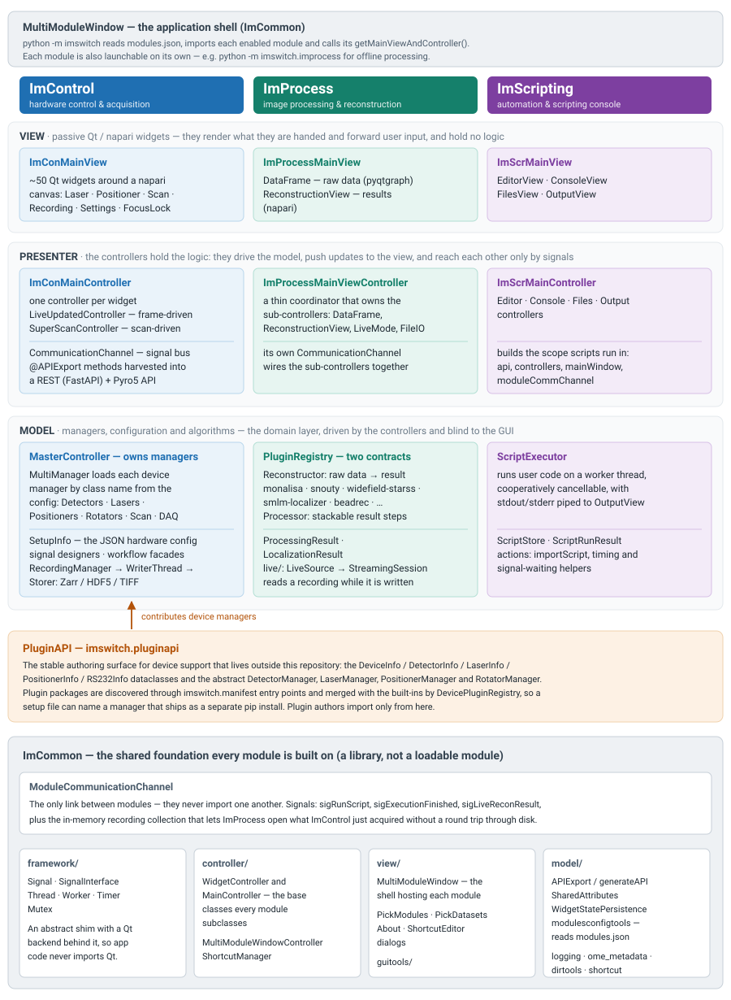

*********
ImSwitch2
*********

.. image:: https://joss.theoj.org/papers/10.21105/joss.03394/status.svg
   :target: https://doi.org/10.21105/joss.03394

``ImSwitch2`` is a Python application for flexible, modular microscope
control.  It is a clean-slate continuation of the original
`ImSwitch <https://github.com/ImSwitch/ImSwitch>`_ project, built
around a model-view-presenter (MVP) architecture and a
configuration-driven manager system: **switching hardware means
editing a JSON file, not the code.**

The constant development of novel microscopy methods with an increased
number of dedicated hardware devices poses significant challenges to
software development.  ImSwitch2 is designed to be compatible with
many different microscope modalities and customizable to the specific
design of individual custom-built microscopes, all while using the
same software.  We would like to involve the community in further
developing ImSwitch2 in this direction, believing that it is possible
to integrate current state-of-the-art solutions into one unified
piece of software.

This documentation covers installing ImSwitch2; using it, module by
module (ImControl to run the microscope, ImProcess to work with the
data, ImScripting to automate both); the hardware reference for the
JSON setup files; and extending ImSwitch2 with new devices and
plugins.

.. _architecture-at-a-glance:

Architecture at a glance
========================

ImSwitch2 is built as a set of **modules** that the application shell
discovers and loads at start-up, and each module is organised the same
way, following the model-view-presenter (MVP) pattern:

* **Model** — managers, configuration and algorithms.  This is the
  domain layer: it drives hardware or data and knows nothing about the
  GUI.
* **View** — passive Qt and napari widgets.  A view renders what it is
  handed and forwards user input; it contains no hardware or algorithm
  logic and holds no authoritative state of its own.
* **Presenter** — the controllers.  They hold the logic: they drive the
  model, push updates back to the view, and reach one another only
  through a ``CommunicationChannel`` signal bus rather than by calling
  each other directly.

Keeping those three apart is what makes the configuration-driven design
work in practice.  Swapping a camera replaces a manager in the model
layer, and neither the widgets nor the controllers above it have to
change.

         ImScripting — shown as columns split into view, presenter and
         model layers, with the PluginAPI device authoring surface below
         them and the shared ImCommon foundation underneath.
   :width: 100%
   :target: _images/architecture-overview.svg

   The parts of ImSwitch2 and how they map onto MVP.  Click the diagram
   to open it at full size.

The parts
---------

**ImControl** — ``imswitch.imcontrol``
    The acquisition side of the application: lasers, stages, detectors,
    DAQ, scanning and recording.  Its model layer is a tree of *managers*
    owned by ``MasterController``, where ``MultiManager`` instantiates
    each device manager by class name taken from the setup's JSON file —
    this is what makes "switching hardware means editing a JSON file"
    true in practice.  Its presenter layer runs one controller per
    widget, and the controller methods marked with ``@APIExport`` are
    harvested into the ``api.imcontrol`` object that scripts call and,
    when ``pyroServerInfo.active`` is set in the setup file, into a REST
    and Pyro5 server for external clients.

**ImProcess** — ``imswitch.improcess``
    Image processing and reconstruction.  ``python -m imswitch.improcess``
    starts it standalone for offline work.  Its model layer is a registry
    of two plugin contracts — a *Reconstructor* turns raw data into a
    result, and *Processors* are stackable steps that turn results into
    further results.  Its live pipeline can read a recording while
    ImControl is still writing it.

**ImScripting** — ``imswitch.imscripting``
    The editor and console for automating the microscope.  Its model
    layer runs user code on a worker thread, so a long script never
    freezes the GUI and can be cancelled cooperatively.  Its presenter
    layer assembles the scope that scripts see: ``api`` (the
    ``@APIExport`` surface of each module that has one; today that is
    ImControl, as ``api.imcontrol``), ``controllers`` (every module's main
    controller), ``mainWindow`` and ``moduleCommChannel``.

**ImCommon** — ``imswitch.imcommon``
    Not a loadable module but the library the others are built on: the
    ``framework`` shim (``Signal``, ``Thread``, ``Worker``, ``Timer``,
    ``Mutex``) that keeps Qt out of application code, the controller and
    widget base classes, the ``MultiModuleWindow`` shell, and shared
    model utilities such as ``APIExport``, widget-state persistence and
    the ``modules.json`` reader.  It also owns
    ``ModuleCommunicationChannel``, the only route between modules —
    they never import one another.

**PluginAPI** — ``imswitch.pluginapi``
    The stable surface for device support that lives outside this
    repository.  It re-exports the device info dataclasses and the
    abstract ``DetectorManager``, ``LaserManager``,
    ``PositionerManager`` and ``RotatorManager``, so a plugin package can
    implement a device without importing internal paths.  Packages are
    discovered through ``imswitch.manifest`` entry points and merged with
    the built-ins by ``DevicePluginRegistry``, which lets a setup file
    name a manager that ships as a separate pip install.  ImProcess keeps
    its own, separate registry for reconstructors and processors.

For the full dependency map — every manager, controller and signal —
see ``docs/design/ARCHITECTURE.md`` in the repository.

.. toctree::
    :hidden:
    :caption: General information

    Home <self>
    installation
    developer-onboarding
    agent-task-templates
    changelog
    contributing
    current-state-and-known-issues

.. toctree::
    :hidden:
    :caption: Usage

    working-in-imswitch2
    modules
    imcontrol
    improcess
    scripting

.. toctree::
    :hidden:
    :caption: Hardware reference

    imcontrol-setups
    setupinfo-reference
    devices/detectors
    TISCamera
    devices/lasers
    devices/positioners
    devices/rotators
    devices/stands
    Hdf5datafile

.. toctree::
    :hidden:
    :caption: Extending ImSwitch2

    adding-device-support
    scan-lifecycle
    mock-infrastructure
    no-hardware-validation
    how-to/wire-teensy
    how-to/add-pulse-generator-backend
    how-to/port-from-third-party
    how-to/auto-screenshots

.. toctree::
    :glob:
    :hidden:
    :caption: Scripting API reference

    api/*
