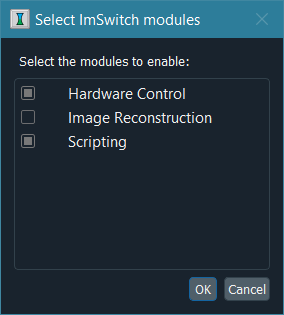

********************
Module configuration
********************

ImSwitch2 consists of three modules:

+----------------------+-------------------+
| Name                 | ID                |
+======================+===================+
| Hardware Control     | ``imcontrol``     |
+----------------------+-------------------+
| Image Processing     | ``improcess``     |
+----------------------+-------------------+
| Scripting            | ``imscripting``   |
+----------------------+-------------------+

Choose which modules load with **Preferences → Set active modules…**;
ImSwitch2 restarts to apply the choice.  A new installation loads all three.
The choice is stored in ``config/modules.json`` in ``ImSwitchConfig``, and an
existing file is never overwritten by an update, so a configuration folder
from an older version keeps the modules it names until you change them here.
Modules that are not enabled do not show up in the program.  Scripting is
always loaded last, so that its scripts can reach every other module.

