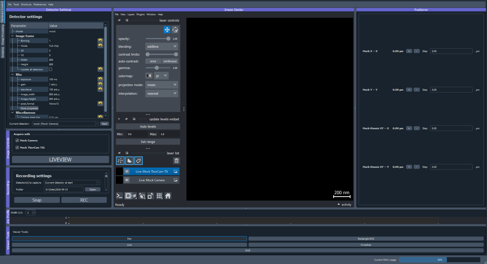

********************
Working in ImSwitch2
********************

This page is the starting point for using ImSwitch2: what each module is
for, and the behaviour that is the same wherever you happen to be working.
The module pages that follow carry the detail.

The modules
===========

ImSwitch2 presents its modules in one window, listed down the left-hand
side; the shell loads whichever are enabled in ``modules.json`` (see
:doc:`modules`).  Which one you want depends on what you are doing.

         Control, Image Processing and Scripting — running down the left
         edge, and the Hardware Control module open.
   :align: center

ImSwitch2 on launch, with a mock setup loaded.  The tabs down the left edge
switch between modules — **Hardware Control** (ImControl), **Image
Processing** (ImProcess) and **Scripting** (ImScripting) — and the module
that is open fills the rest of the window.  Here that is ImControl.

ImControl — running the microscope
----------------------------------

ImControl is the only module that touches hardware, so anything that moves
a stage, fires a laser or reads a detector happens here.  It owns every
device named in the setup file, which is also what decides the widgets you
see: change the JSON and the interface changes with it.

A session here usually means picking a hardware setup, setting detector
parameters and starting a live view, driving the positioners to find the
sample, then running a scan or a tiled acquisition and recording the
result to disk.  Alignment tools, focus lock and the laser controls sit
alongside for setting the instrument up in the first place.

See :doc:`imcontrol` for the interface and the acquisitions it can run.

ImProcess — working with the data
---------------------------------

ImProcess starts where a recording lands.  It needs no hardware at all, and
runs standalone with ``python -m imswitch.improcess`` when you only want to
process data — on a laptop, away from the microscope.

It works in two stages.  A **reconstructor** turns a raw recording into a
result: MoNaLISA, SMLM localization, SNOUTY, WidefieldSTARSS, BeadRec, a
tiled mosaic, or simply view-only to look at what was acquired.  **Processors** then stack on top
of a result — drift correction, projections, FRC, segmentation,
colocalization and the rest — each producing a new result rather than
overwriting the old one, so the chain that produced an image stays
inspectable.

See :doc:`improcess` for the panels, the plugins and the batch workflows.

ImScripting — automating both
-----------------------------

ImScripting is an editor and console for driving the other modules from
Python.  Scripts drive the microscope through ``api.imcontrol``, the
methods ImControl exports for scripting; the main controller of every
loaded module, ImProcess included, is also reachable as
``controllers.<module>``.  Scripts run on their own thread, so a long
routine does not freeze the interface and can be cancelled.

See :doc:`scripting`, which also points to the step-by-step tutorials
that run on the simulated setups.

Moving between modules
----------------------

The modules never import one another; everything shared travels over a
communication channel.  In practice a recording reaches ImProcess by one of
three routes:

* **From disk** — the ordinary case.  ImControl writes Zarr, HDF5 or TIFF,
  and ImProcess opens the file afterwards.
* **From memory** — a recording ImControl just acquired can be handed
  straight to ImProcess without a round trip through disk.
* **While it is still being written** — ImProcess's live pipeline can read
  a recording mid-acquisition, so a reconstruction builds up as the data
  arrives instead of waiting for the run to finish.

Working across the modules
==========================

The rest of this page covers behaviour that is not tied to one widget:
the menus, keyboard shortcuts, and saving and restoring widget state
independently of the hardware it describes.

Menus
=====

Two menus belong to the window rather than to a module:

* **Preferences** — *Set active modules…* chooses which modules load (see
  :doc:`modules`; ImSwitch2 restarts to apply it), and *Open user files
  folder* opens ``ImSwitchConfig``, where setup files, scripts, saved
  widget states and preferences live.
* **Help** — *Documentation*, *Check for updates…* and *About*.

ImControl adds its own:

* **File** — load the parameters stored in a saved HDF5 file or Zarr store
  back into the widgets, and *Save Widget States…* / *Load Widget
  States…* (see below).
* **Tools** — *Pick hardware setup…* (:doc:`imcontrol-setups`), *Session
  notes…* (:ref:`session-notes`), *Edit hardware configuration…* (the
  config editor, :doc:`imcontrol-setups`), *Memory limits…*
  (:ref:`improcess-memory-limits`) and *Reset panel layout*, which puts
  every panel back where the hardware setup places it, at the sizes its
  contents ask for.
* **Shortcuts** — *Configure Shortcuts…* and the current bindings.

ImProcess has its own File, Image, Operations, Tools, Plugins, Shortcuts
and View menus, described in :doc:`improcess`.

Keyboard shortcuts
==================

Keyboard shortcuts are **config-driven and rebindable** in ImControl and
ImProcess, each with its own **Shortcuts** menu. Each shortcut-able action
has a stable action ID; the tables below list ImControl's code defaults, but
any binding can be changed, disabled, or extended without editing code.

* **Edit interactively:** open *Shortcuts → Configure Shortcuts…* to view, edit,
  reset, or disable any binding via a key-sequence editor with live conflict
  detection. Changes apply immediately. ImControl saves them to the active
  setup file; ImProcess, which has no setup file of its own, saves them to
  ``improcess_shortcuts.json`` in ``ImSwitchConfig``.
* **Edit in the config:** add a ``shortcuts`` map to the setup config JSON
  (``{ "<actionId>": "Ctrl+...", ... }``; ``null`` disables an action, a list
  binds multiple sequences). See :doc:`setupinfo-reference`.

ImProcess's defaults follow Fiji where Fiji has an equivalent (``Ctrl+O``
open, ``Ctrl+S`` save, ``Ctrl+Shift+C`` brightness/contrast, ``Ctrl+T`` ROI
manager, ``Ctrl+M`` measure, …); its Shortcuts menu lists them all.
ImScripting's editor keys (``Ctrl+N``, ``Ctrl+O``, ``Ctrl+S``,
``Ctrl+Shift+S``) are fixed.

ImControl's default bindings for common operations:

.. list-table::
   :widths: 30 70
   :header-rows: 0

   * - ``Ctrl+R``
     - Record start/stop (``recording.toggleRecord``)
   * - ``Ctrl+L``
     - Liveview toggle (``view.toggleLiveView``)
   * - ``Ctrl+U``
     - Update image levels (``image.updateLevels``)
   * - ``Ctrl+N``
     - Next detector (``settings.nextDetector``)
   * - ``Ctrl+P``
     - Load parameters from HDF5 (``app.loadParams``)
   * - ``Ctrl+Alt+P``
     - Load parameters from Zarr (``app.loadParamsZarr``)
   * - ``Ctrl+Shift+S``
     - Save widget state (``app.saveWidgetStates``)
   * - ``Ctrl+Shift+L``
     - Load widget state (``app.loadWidgetStates``)

Positioner stepping
-------------------

Each positioner axis has its own rebindable jog actions
(``positioner.<name>.<axis>.plus`` / ``.minus``) that step by the amount
configured in the per-axis **Step** field of the Positioner widget. Default
bindings (when no ``shortcuts`` config overrides them):

.. list-table::
   :widths: 30 70
   :header-rows: 0

   * - ``Ctrl+Left`` / ``Ctrl+Right``
     - Step X − / +
   * - ``Ctrl+Up`` / ``Ctrl+Down``
     - Step Y + / −
   * - ``Ctrl+Y`` / ``Ctrl+A``
     - Step Z + / −

**Notes:**

* Defaults follow each positioner's ``shortcutModifier`` (``"ctrl"`` →
  ``Ctrl+`` arrows, ``"ctrl-shift"`` → ``Ctrl+Shift+`` arrows). A positioner
  without ``shortcutModifier`` claims the ``Ctrl+`` set on a first-come basis per
  axis (legacy behaviour). See :doc:`setupinfo-reference`.
* You can bind each jog action to any key via the ``shortcuts`` config map or the
  *Configure Shortcuts…* editor; conflicting bindings are reported rather than
  firing ambiguously.
* Step size for each press is the value in the per-axis Step field of the
  Positioner widget.

Saving state and setup modes
============================

ImSwitch2 has two related but distinct ways to capture and restore widget/hardware
state. They share one underlying mechanism but differ in *scope* and in *whether
applying them touches hardware*.

Widget state — general, passive restore
---------------------------------------

A **global snapshot of all widgets** (detector settings, laser values, scan
parameters, SLM configuration, positioner step sizes, GUI layout, …). Think of it
as "save/restore the whole setup's UI state".

* *File → Save Widget States* (``Ctrl+Shift+S``) writes a snapshot to a file;
  *Load Widget States* (``Ctrl+Shift+L``) restores one. On exit ImSwitch2 asks
  whether to save the current state as the default for the next launch, and
  restores that default when it starts.
* **Passive by design:** restoring widget state never activates hardware — it
  sets saved *parameters* (laser power values, ROI/binning, scan parameters, SLM
  config selection, …) but does **not** turn lasers on, start acquisition or
  scans, move stages, or push SLM patterns. You stay in control of when hardware
  is actuated.

Setup modes — fast runtime switching (can activate hardware)
------------------------------------------------------------

The **Setup Modes** widget (shown when the setup file lists ``SetupModes`` in
``availableWidgets``) stores named *modes* that each capture only a
**chosen subset** of components (e.g. a mode that sets the scan type + laser
powers + SLM configuration, leaving everything else untouched). Modes are for
**switching configurations quickly during an experiment**.

* Select a mode (or trigger its optional keyboard shortcut) to apply it; only the
  components included in that mode are affected.
* **Active by design:** applying a mode *does* drive hardware — it can enable
  lasers at saved powers, push SLM patterns, flip mirrors, etc. Because of this,
  applying a mode that would turn on high laser power prompts a safety
  confirmation (configurable threshold). Mode-switch shortcuts can be assigned
  per mode and are managed in the Setup Modes widget.

In short: **Widget States = restore the whole setup's parameters without touching
hardware; Setup Modes = quickly switch a selected subset and actuate the hardware
to match.**

